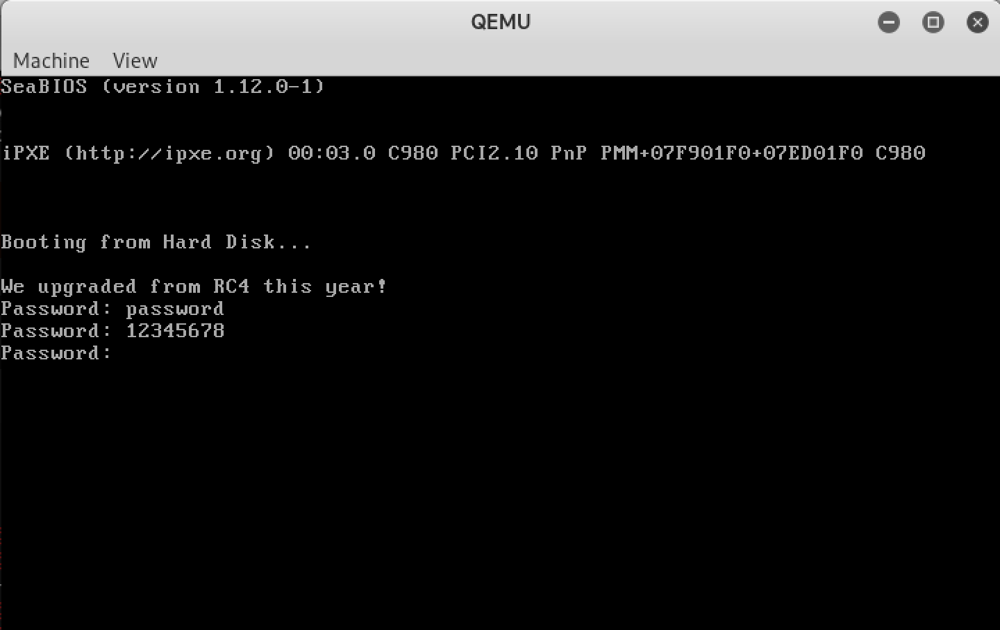
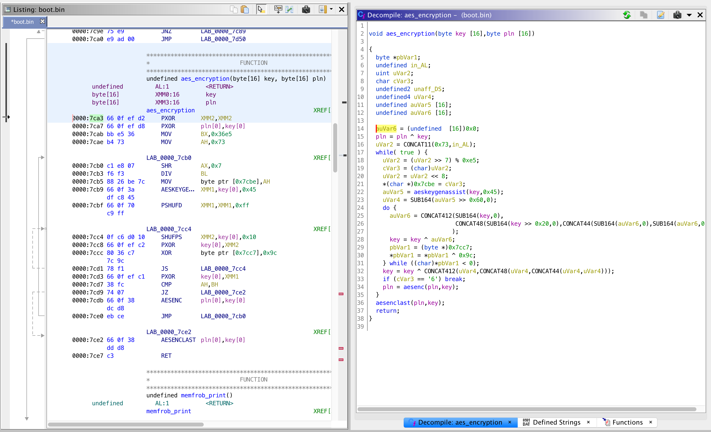
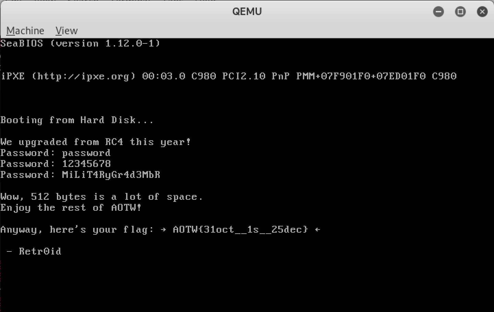

# Challenge Zero - re, crypto

> Keep warm next to our fireplace while we wait for the CTF to start...

Service: [https://advent2019.overthewire.org/challenge-zero](https://advent2019.overthewire.org/challenge-zero)

## Initial Analysis

Navigating to the page gives a `flames.gif` image along with the text

**Chrome:**

> Fox! Fox! Burning bright! In the forests of the night!

> Hint: $ break *0x7c00

I took a little bit of time looking at the image to see if anything was embedded, but didn't come up with anything. Reading the text again, it seems to suggest using Firefox with "Fox", so I browsed to the same page with Firefox instead of Chrome and found the same image with different text.

**Firefox:**

> Did you know: Plain text goes best with a text browser.

> Hint: $ target remote localhost:1234

It turns out that each browser has different text, so using common `User-Agent` strings for each major browser we have:

**Safari:**

> Opera: Music for the masses

> Hint: Try reading between the lines.

**Microsoft (IE or Edge):**

> This is quite the browser safari, don't you agree?

> Hint: Pause qemu by add -S to the args and type 'c' in the monitor

**Opera:**

> Put your hands up, this is the Chrome Shop mafia!

> Hint: qemu-system-x86_64 boot.bin -cpu max -s

All of these hints are probably useful later, but for now they don't mean much. However, we can use command line tools instead. With `wget` we don't get any image, just text which suggests using `curl`:

> Is that a curling iron in your pocket or are you just happy to see me?

So finally using `curl` we get a streaming wall of ASCII art text which creates a fire image. I decided to pipe all of this `curl` output to a file and strip out the control characters. To do this, I used the python script below. Also, after decoding, I also removed all `#` characters. Looking at the output, it seems to repeat after two `==` characters which suggests that this text is actually a base64 message. The message is given after the script:

```python
#!/usr/bin/env python3

#import asyncio, telnetlib3
import re
from collections import defaultdict
import time
import sys
import os
import binascii

def chunk_ansi(data):
	arr = []
	last_end = 0
	pat = re.compile('\x1b\[([0-9;]*)(\w)')
	#print('>>', data.encode('utf-8'), flush=True)
	#print(data)
	for match in re.finditer(pat,data):
		#print(match,match.group(1),match.group(2))
		start = match.start()
		end = match.end()
		if last_end != start:
			arr.append(data[last_end:start])
		if match.group(2) == 'H':
			if len(match.group(1)) == 0:
				arr.append((0,0))
			else:
				arr.append(tuple(int(x) for x in match.group(1).split(';')))
		last_end = end
	if last_end != len(data):
		arr.append(data[last_end:])
	#print('<<', arr)
	return arr

def text_from_ansi(arr):
	return ''.join([x for x in arr if type(x) == str])

def colors_from_ansi(arr):
	return ''.join([x for x in arr if type(x) == str and x.startswith('[')])

if __name__ == '__main__':

	data = open('challengezero1.dat','r').read()
	ret = chunk_ansi(data)
	t = text_from_ansi(ret)

	t = t.replace('#','')
	t = ''.join(t.split())
	i = t.find('=')

	b64 = t[:i+2]

	print(b64)
```

```
$ ./challenge0.py 
YmVnaW4gNjQ0IGJvb3QuYmluCk1eQydgQ01CLlAoWzBPYCFcMGBeQiNSI2BAXiNbQFxAIiNSK2AjUiNAIzBgJiNSK0BPTzlcWitYYDlAXloKTVgxRVMzO1g4Pz5CUWArXGA/QydgUzE4XCM3MDovYEFVI1gnX2AnWV5bS1kmPz5CNmAkX0tZOkpUI0xUMApNWl1aIV9RIV49PFwvKmA7UD8wXEgnQCFeWiMwYDlAX08nTiFdOUBcWCVdTVQiTk5TT0I1XVomMGBaX1peCk00J1QvKmA4YD9AXEgnLkAvYGBcSScoLyYkKCdeWCdVVVo+Rk1gJjgvW10pRiNeXzhOXjRWTScvIVpgP1YKTVxYQEZPR1FGI1NLP1IkNUYjVyMpX1BfJlQhIUYjXl8iQCM7Jz8pUVhcNjgvW1wkWF8nMCc5QFxYVy1DSwpNU0Y4Ly4tVzhQWzAuSyMxIj1gOFFWXFQwWl8vIzNUQDUpVihXLEI0UChSOEcpRihELCJUTzhBYCE9RihWCk0qQkxROENMRyhTIUMwRF0oJEIsUSwzNE0sIjlYOEQpLzJgJE0rUj1CKCIsQSo2KFUqUzhKOEItQitSVEYKTSlTYEw4QCQyJVYpWCREKSo4REkiRCkiMEQpIjBUKC9LQlFeIU9aLFAsITE5RVlIVSQhUSIwXjBeKz84PQpNTEdZWicsS18iND4nK05fVUsmPUEtRjsqJUNcJVw9PSgvM0tUYFosMlo5SCMiIichITheUiRANztdQi1YCk0sIUlCIV4wR15cIktWSkE7QjNMWltVV0gqWiZOW1wxQz5CST4hKjpdPEsvSCUrMywiO1tCQD47RTcySVYKTT4kWiU/KlE0YEZfUSdCIktEV1guMkJeWUBaOEYtMiQ4LzBNRFYnLl1dX1g6QCM5MS4pIkAtISVNLCVZMgoxNSZVWUArRkUiSTxEIzJXXC1AVjU1OkhgCmAKZW5kCg==
```

Base64 decoding the output gives us cryptic looking text:

```
$ ./challenge0.py  | base64 -D
begin 644 boot.bin
M^C'`CMB.P([0O`!\0`^B#R#`@^#[@\@"#R+`#R#@#0`&#R+@OO9\Z+X`9@^Z
MX1ES3;X8?>BQ`+\`?C'`S18\#70:/`AU#X'_`'Y^[KY&?>B6`$_KY:JT#LT0
MZ]Z!_Q!^=<\/*`;P?0\H'@!^Z#0`9@_O'N!]9@\X%]MT"NNSOB5]Z&0`Z_Z^
M4'T/*`8`?@\H'.@/``\I'(/&$('^X'UUZ>FM`&8/[])F#^_8N^4VM'/!Z`?V
M\X@FOGQF#SK?R$5F#W#)_P_&T!!F#^_"@#;'?)QX\68/[\$X_'0'9@\XW-CK
MSF8/.-W8P[0.K#1"=`8QV\T0Z_/#3T@5)V(W,B4P(R8G)F(D,"TO8A`!=F(V
M*BLQ8CLG(S!C0D]($B,Q,34M,"9X8D)/2`$M+R=B(",A*6(U*S8J8B-B+RTF
M)S`L8@$2%V)X$D)*8DI"D)"0D)"0T(/KBQ^!OZ,P,!19EYHU$!Q"0^0^+?8=
MLGYZ',K_"4>'+N_UK&=A-F;*%C\%\==(/3KT`Z,2Z9H#""'!!8^R$@7;]B-X
M,!IB!^0G^\"KVJA;B3LZ[UWH*Z&N[\1C>BI>!*:]<K/H%+3,";[B@>;E72IV
M>$Z%?*Q4`F_Q'B"KDWX.2B^Y@Z8F-2$8/0MDV'.]]_X:@#91.)"@-!%M,%Y2
15&UY@+FE"I<D#2W\-@V55:H`
`
end
```

## Reversing

Using the output above, I figured out that this message could be turned into a binary with the `uudecode` binary. This produced a `boot.bin` file as follows:

```
$ ./challenge0.py | base64 -D | uudecode 
$ xxd boot.bin 
00000000: fa31 c08e d88e c08e d0bc 007c 400f a20f  .1.........|@...
00000010: 20c0 83e0 fb83 c802 0f22 c00f 20e0 0d00   ........".. ...
00000020: 060f 22e0 bef6 7ce8 be00 660f bae1 1973  .."...|...f....s
00000030: 4dbe 187d e8b1 00bf 007e 31c0 cd16 3c0d  M..}.....~1...<.
00000040: 741a 3c08 750f 81ff 007e 7eee be46 7de8  t.<.u....~~..F}.
00000050: 9600 4feb e5aa b40e cd10 ebde 81ff 107e  ..O............~
00000060: 75cf 0f28 06f0 7d0f 281e 007e e834 0066  u..(..}.(..~.4.f
00000070: 0fef 1ee0 7d66 0f38 17db 740a ebb3 be25  ....}f.8..t....%
00000080: 7de8 6400 ebfe be50 7d0f 2806 007e 0f28  }.d....P}.(..~.(
00000090: 1ce8 0f00 0f29 1c83 c610 81fe e07d 75e9  .....).......}u.
000000a0: e9ad 0066 0fef d266 0fef d8bb e536 b473  ...f...f.....6.s
000000b0: c1e8 07f6 f388 26be 7c66 0f3a dfc8 4566  ......&.|f.:..Ef
000000c0: 0f70 c9ff 0fc6 d010 660f efc2 8036 c77c  .p......f....6.|
000000d0: 9c78 f166 0fef c138 fc74 0766 0f38 dcd8  .x.f...8.t.f.8..
000000e0: ebce 660f 38dd d8c3 b40e ac34 4274 0631  ..f.8......4Bt.1
000000f0: dbcd 10eb f3c3 4f48 1527 6237 3225 3023  ......OH.'b72%0#
00000100: 2627 2662 2430 2d2f 6210 0176 6236 2a2b  &'&b$0-/b..vb6*+
00000110: 3162 3b27 2330 6342 4f48 1223 3131 352d  1b;'#0cBOH.#115-
00000120: 3026 7862 424f 4801 2d2f 2762 2023 2129  0&xbBOH.-/'b #!)
00000130: 6235 2b36 2a62 2362 2f2d 2627 302c 6201  b5+6*b#b/-&'0,b.
00000140: 1217 6278 1242 4a62 4a42 9090 9090 9090  ..bx.BJbJB......
00000150: d083 eb8b 1f81 bfa3 3030 1459 979a 3510  ........00.Y..5.
00000160: 1c42 43e4 3e2d f61d b27e 7a1c caff 0947  .BC.>-...~z....G
00000170: 872e eff5 ac67 6136 66ca 163f 05f1 d748  .....ga6f..?...H
00000180: 3d3a f403 a312 e99a 0308 21c1 058f b212  =:........!.....
00000190: 05db f623 7830 1a62 07e4 27fb c0ab daa8  ...#x0.b..'.....
000001a0: 5b89 3b3a ef5d e82b a1ae efc4 637a 2a5e  [.;:.].+....cz*^
000001b0: 04a6 bd72 b3e8 14b4 cc09 bee2 81e6 e55d  ...r...........]
000001c0: 2a76 784e 857c ac54 026f f11e 20ab 937e  *vxN.|.T.o.. ..~
000001d0: 0e4a 2fb9 83a6 2635 2118 3d0b 64d8 73bd  .J/...&5!.=.d.s.
000001e0: f7fe 1a80 3651 3890 a034 116d 305e 5254  ....6Q8..4.m0^RT
000001f0: 6d79 80b9 a50a 9724 0d2d fc36 0d95 55aa  my.....$.-.6..U.
```

As the hints suggest, if we run this `boot.bin` with `qemu-system-x86_64 boot.bin -cpu max -s`, we get a simplistic text prompt for a password as seen below



Obviously the challenge wasn't going to be that easy so I dug into some reverse engineering. I opened the binary up in Ghidra, found the main function at address 0x7c00 and took a look. The main function stars with a bunch of cpu checks - likely to make sure the processor has the right instruction set later - and is follwed by several calls to a function I've called `memfrom_print`. `memfrob` itself [is a silly function](https://linux.die.net/man/3/memfrob) which doesn't actually encrypt anything, just XORs it with the byte 0x42. There are a couple strings in the binary (which we see in the QEMU output) which don't appear in the binary because they are XORed with 0x42.

Moving on, after a "password" is read, it is checked against a length of 16, and then passed to two calls of the following:

```
func_7ca3(xmm0=*(0x7df0 address), "password")
if "password" == *(0x7de0 address)
  break out of reading password loop
func_7ca3(xmm0="password", *(0x7d50 address))
```

So, looking at this function we see a bunch of AES intrinsic instructions:



By the image above you can see I'm skipping to the punch line, but turns out to be an AES encryption function. The actual instructions closely mirror those found [in this Github repo], especially those related to the `pshufd` and `shufps` instructions.

## Getting the Flag

From here, I took another look at the times this function was called. Based on the pseudocode above, the "password" is encrypted with a key at address 0x7df0, and then checked against the bytes at address 0x7de0. If we instead invert this operation to `AES.decrypt(address 0x7df0, address 0x7de0)` then we should get the password. This can be done with the following python code:

```python
$ ipython3

In [1]: import binascii

In [2]: from Crypto.Cipher import AES

In [3]: bin_7df0 = binascii.unhexlify('6d79 80b9 a50a 9724 0d2d fc36 0d95 55aa'.replace(' ',''))

In [4]: bin_7de0 = binascii.unhexlify('f7fe 1a80 3651 3890 a034 116d 305e 5254'.replace(' ',''))

In [5]: AES.new(key=bin_7df0,mode=AES.MODE_ECB).decrypt(bin_7de0)
Out[5]: b'MiLiT4RyGr4d3MbR'
```

Putting this in to the QEMU emulator gives us the flag:



