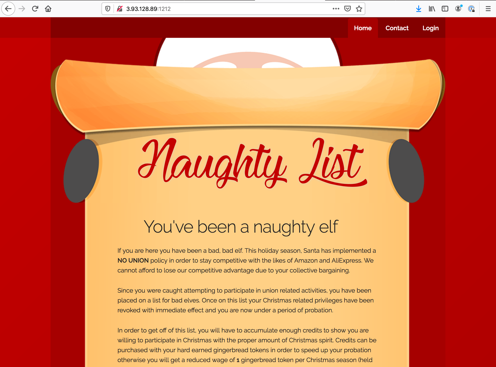
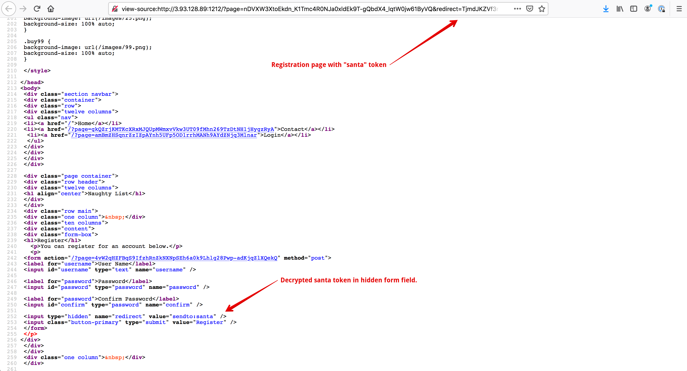
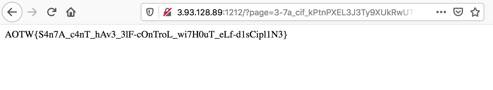

# Day 12 - Naughty List - web

> Santa has been abusing his power and is union busting us elves. Any elves caught participating in union related activities have been put on a naughty list, if you can get me off the list I will give you a flag.

Service: http://3.93.128.89:1212

## Analysis and Oracle

Launching the website, we see a splash page for "Naughty List" (below).



Clicking the tabs, we navigate to a few random looking page names:

**Contact Page:**
```
http://3.93.128.89:1212/?page=Zy3kABx9dhB_PjieaUZTWG5TMGs2Zz09BYXy395ShBqR5p_Rhkb5pw
http://3.93.128.89:1212/?page=gGn9R0eea-PobrBMZVBaNzVCdGlKQT09UU6YIqdz-amgPGMgVPCLlw
http://3.93.128.89:1212/?page=B1TJhLHSnD7gS-RdVUJtZ1dNZkZmZz09HnHiXBYYST9aF1U_S2R-jA
http://3.93.128.89:1212/?page=Udc_g-ojnzn_SMGtMTFCYXB6RE1ndz0931ECo-DJUezrGejrwZOK-Q
```

**Login Page:**
```
http://3.93.128.89:1212/?page=Ewz8--QEy1jXCEFfeTk1NUordz24cNedYvnItW3vDxf5h8ZX
http://3.93.128.89:1212/?page=TphBXOtI2pPplOx1NndER3dOUT1SLUDMJoksgfxMrUIDKdVA
http://3.93.128.89:1212/?page=hHHkKeJpmH-XVM5bZmVaMk1OST24XInekB6qRtkyFBMCFtRz
http://3.93.128.89:1212/?page=zN46x9uLWgKlxCIqeVBRdE9XST2sv2l5q7DXJCc8Q2H9ZdEz
```

**Register Page:**
```
http://3.93.128.89:1212/?page=5XUrRlJkyfCTMnEaS1ZxY2J6ZTV0TWc9WZ0JOB2msCqnwTEEaN62bw&redirect=8ybtbWBCDvBK9aKVb0hWY0ROWE1TWDJJejgrYityaFBjUmtISnZEVjZsblZFbVk2UXdSaS9lTStZZGVBbjYvN2FOZGR5cDVKeXRGbUszb0tVRkJiMkdnd1c3dyt3Rzc2cVJ3TThiUXRTaFAvN2wyUGg5MjDdxKnT6xmoJ86vcs0dc_mc
http://3.93.128.89:1212/?page=Je4jTsdh_uCMTC7xZndLNUVIaXRQbzA9Z_5-1mENTFxVv6UnIJF_Cw&redirect=W-mKVIpd93GqglAuNklCcTA5S0RQaTRkVmhrS2ZsZlJlbm04alYyNjZZWElHTXJsc2h6bVl6aVd5a3ZXTWhKSGpyT1dYT1NCK1dSVk9sOWEySGJpc3dVNEdUZEg4cFZnZUpROUlFZTBYTDM3RDJrbjRIRlJUmHFVuxI4293_2E3xrKiJ
http://3.93.128.89:1212/?page=8LkTTur3CGWZx_saRGlPekFhc1plR0U9HATVXpEllVMmIc01sqf1zQ&redirect=J_rm1FKCnGkyQJ28VVE0SDFUYmFBNUl0SGE1SitLb3piR0dxQndkOGtTNWwrRjcwblVUUnJnOERXYWJRVTg5eC96QzBsRjZWNzBtMGgxTEpweC9Yay9HZzB2OGIxa0NFN3M5OFR0MjN2aDc4RnFPTmd5Y2RaPbaZKWGEFkquKl5d2IVg
http://3.93.128.89:1212/?page=nDVXW3XtoEkdn_K1Tmc4R0NJa0xldEk9T-gQbdX4_lqtW0jw61ByVQ&redirect=IEbF5f95ogB7Ql8YemNhSkxCT0JuN1FsSXl1MjRRbTNRZFMveVd1YWgyeDdCeStJRGpsMkowbWtlWHovMzdzbEdpOXBHaFpHTlVabTlDeVJrWmRyTzJvVW51VytoQXlHTmFjVGoreld6UURCT2twYnRtUEpCWCNL_4ssm3JSnX9CiV_G
```

**Account Page:**
```
http://3.93.128.89:1212/?page=le3vwjeSBwBt_OXcc0RpRTJJa1R5UT09bLzb8ibDeakTB9Lj2AYv7A
http://3.93.128.89:1212/?page=AaFLtynU4S08EJAaR2pqd0tNTjFYdz09XPT-CIJuh7DR5oRTkccrwA
http://3.93.128.89:1212/?page=u2Nx8CaGUfGTFVAna0FDT08xdGJVUT09sqlZb5AzSeGAw08bQc6E_A
http://3.93.128.89:1212/?page=0bcFOesxiY7KcVXDeUhjMEVjcFgzdz09Hld0AXhJ8yObmoA6JlybsQ
```

**Logout Page:**
```
http://3.93.128.89:1212/?page=9t-bObqQ0xNiYfWQZmdUWHFUVi-X3A3zUy41qL2NLd3BpFC3
http://3.93.128.89:1212/?page=NYCVJ276TO31fm6zc0U2UGxZTkZ64EuC8H7NMhpzBoPkpoIJ
http://3.93.128.89:1212/?page=9nqAZ5kxuSIisGCqQWxlK1NxemWw3X5cADlIBje-y4xeEyrD
http://3.93.128.89:1212/?page=oAD9RRZSApedZhmgaGg2cWZWNmZa8dwkplDhNnje54Ctvwik
```

I spent a bit of time looking at these random names and found a couple things:

* The random text was base64 encoded
* Once decoded, the first 12 bytes and last 16 bytes were non-ASCII
* Once decoded, the middle bytes were another base64 string
* The length of that middle string (base64 decoded again) matched the string length of the same page - 7 for "contact", 5 for "login", 8 for "register", etc.

Poking further at the site, we can see that if we input an invalid "page" parameter, we get redirected to a 404 page. However, the middle part described above matches the same length as the page we put in. This made me think that this could be used to "encrypt" any message we wanted on the site! To test this theory, I encrypted basic strings like "login", "contact", etc., and found that using those newly encrypted values I could navigate to those respective pages - confirming that this method works.

## Transfers

The basis of this problem was that you could "transfer" tokens from one user to another. Each user is given one token, however you can only register 15 users an hour due to throttling in the challenge design. Additionally, you don't start out with the right code to transfer from one user to another. Once you login, you're given _one_ sample transfer code which - several examples of which are below - and sends a token to "santa". Those transfer codes decoded the same way as above page parameter values except the middle part is 12-bytes long. This doesn't match the account name `santa` or any other name I could think of.

**Transfer Codes:**
```
TjmdJKZVf3nOrarBNzBZbVYzWjVYU3Z6Z0pnYyygY0pO1FBIRBRstYuqGUI
VxMJTIUrALiQF7eyK09uSTJqclQ1Ukdhc1lPQ_eG0RssNcxhjTcIxKHBDCE
ZVEUDrsf8-bWFZ7saUpSV29HZUMvc3NkdG0zZUrDGKKoYjfbW_LFVa-qvbg
xPmMVu3dwuOay-yBQSt0WWczRmwzZ3I2QVJPcxUVUd0KQ1n9NNeqoGmyJgE
```

At this point in the challenge I was stuck and didn't end up solving the problem. I tried a bunch of methods which involved guessing page names, trying SQL injection with the transfer code and encryption oracle, and others but none worked. However, after the competition ended, I got some clues from the Discord channel and came up with the final answer below.

## Decryption Oracle

In addition to the encryption oracle above, there was also a decryption oracle. On the registration page (some example URLs are above), you'll see that you can provide a "redirect" parameter. The contents of this parameter are decrypted and filled in the registration form. Filling in the "redirect" parameter with `santa`'s transfer code gives the decryption of that value which helps with the final part of the problem. It turns out santa's token is the string `sendto:santa` - the expected 12 characters mentioned above.



## Race Condition

Finally, it turns out the transfer mechanism contains a [Time-of-Check Time-of-Use](https://cwe.mitre.org/data/definitions/367.html) race condition. That is, the user's current number of tokens is checked, then a short time elapses, then the tokens are added to the second account and finally subtracted from the first account.

To take advantage of this fact, I wrote a [python script](./solutions/day12_solver.py) to create two users, login as each one of them and make many transfers at the same time to the other account. After repeating this process several times between the two users, the script breaks because of invalid data. However, if you login as the correct user in the web application you're given the flag:



