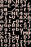

# Day 14 - tiny runes - game, reversing, asset files

> One of Santa's Little Helpers received an unusual Christmas wish, a copy of the yet to be released Deus Hex game. All they managed to find were fragments from the dialogue system. Can you decode the last one?

Download: [d4037209017d4730edc598fe62e6b17f5573ee259b6ad7c8723bac962cf0b328-tiny-runes.tar.gz](https://advent2019.s3.amazonaws.com/d4037209017d4730edc598fe62e6b17f5573ee259b6ad7c8723bac962cf0b328-tiny-runes.tar.gz)

Mirror: [tiny-runes.tar.gz](./static/d4037209017d4730edc598fe62e6b17f5573ee259b6ad7c8723bac962cf0b328-tiny-runes.tar.gz)

## Initial Analysis

The bundle included with this challenge contains the following files:

```
$ tar tzvf tiny-runes.tar.gz 
-rw-r--r--  0 wasa   wasa      965 Nov 28 18:17 lines1.bin
-rw-r--r--  0 wasa   wasa      399 Nov 29 14:55 lines1.png
-rw-r--r--  0 wasa   wasa       74 Nov 25 19:30 lines1.txt
-rw-r--r--  0 wasa   wasa     1161 Nov 28 18:45 lines2.bin
-rw-r--r--  0 wasa   wasa      834 Nov 29 14:55 lines2.png
-rw-r--r--  0 wasa   wasa      166 Nov 25 19:31 lines2.txt
-rw-r--r--  0 wasa   wasa     1033 Nov 28 18:45 lines3.bin
-rw-r--r--  0 wasa   wasa      616 Nov 29 14:55 lines3.png
-rw-r--r--  0 wasa   wasa      108 Nov 25 19:31 lines3.txt
-rw-r--r--  0 wasa   wasa      985 Nov 28 18:45 lines4.bin
```

The `linesX.png` and `linesX.txt` pairs contain the same text - some movie quotes, and the `linesX.bin` file seems to be a custom file format. Obviously since there are no corresponding `lines4.txt` or `lines4.png` files, the goal of this challenge is likely to reconstruct those from the `lines4.bin` file.

I took a look at `lines1.bin` to get a better look at the file format and began pulling apart several components. The file format seems fairly simple - there is a 4-byte header of `TiNy` followed by several different segments with a 4-byte name (`MeTa`, `TxTr`, and `LiNe`) followed by a 4-byte length value, followed by contents. The following hexdump has been labeled for `lines1.bin`:

```
00000000: 5469 4e79 4d65 5461
                              0000 0010 0000 0002  TiNyMeTa........		"TiNy", "MeTa", 0x10 size; 2 (dword) unknown
00000010: 0008 0008 080c 0048 0002 002a 								0x08, 0x08, 0xc08, 0x48, 0x0002, 0x002a
                                        5478 5472  .......H...*TxTr		"TxTr"
00000020: 0000 0301 													0x0301 long
                    8950 4e47 0d0a 1a0a 0000 000d  .....PNG........		
00000030: 4948 4452 0000 0040 0000 0060 0103 0000  IHDR...@...`....
00000040: 0097 0be6 ab00 0000 0650 4c54 4500 0000  .........PLTE...
00000050: f0d1 c563 8e08 7e00 0002 b649 4441 5478  ...c..~....IDATx
00000060: da25 5241 641c 6114 feb6 7da6 1123 62c5  .%RAd.a...}..#b.
00000070: fa0f 2b5d 6bc5 1a3d 8c88 556b b322 a71c  ..+]k..=..Uk."..
00000080: 6a45 2951 ca94 1a55 113d 5444 ac3d 8c3d  jE)Q...U.=TD.=.=
...
000002a0: ab23 a1f0 62e7 b32b 5da8 6bb1 7f2c a001  .#..b..+].k..,..
000002b0: d20b 6e6e d94a 0f63 4d99 e999 2155 62d3  ..nn.J.cM...!Ub.
000002c0: d606 0572 0b9c 7bf3 328c 4bec c2f0 c6a2  ...r..{.2.K.....
000002d0: 7c22 1f78 16b0 1295 c35b 3418 30cd 8c44  |".x.....[4.0..D
000002e0: 42ae 38b5 6f3f 9955 76d3 a0af c60a f64a  B.8.o?.Uv......J
000002f0: 69ee 66e6 4f3b 9da4 ee70 499d 6bc7 6603  i.f.O;...pI.k.f.
00000300: 443e ef4a 0e02 bd7b a59c 81fd e3dd 4cf9  D>.J...{......L.
00000310: 0707 9205 d0b7 2b6c e400 0000 0049 454e  ......+l.....IEN
00000320: 44ae 4260 82                             D.B`.
                      4c 694e 6500 0000 3c05 0103       LiNe...<...			"LiNe", 0x3c size
00000330: 0a04 0806 0903 0700 0500 0a01 0b00 0502  ................
00000340: 0704 0806 0700 0403 0b07 0a05 0b05 0905  ................
00000350: 0905 0904 0802 0505 0905 0905 0904 0802  ................
00000360: 0505 0905 0905 0906 07
                                4c 694e 6500 0000  .........LiNe... 		"LiNe", 0x54 siize
00000370: 5405 0103 0a04 0806 0903 0700 0500 0a01  T...............
00000380: 0b00 0502 0704 0806 0702 0504 0800 0a00  ................
00000390: 0901 0b07 0a01 0700 0900 0a04 0805 0701  ................
000003a0: 0b07 0a04 0800 0603 0707 0303 0704 0803  ................
000003b0: 0b04 0801 0604 0300 0404 0801 0707 0a00  ................
000003c0: 0505 0906 07                             .....


$ xxd lines1.txt 
00000000: 4a43 2044 656e 746f 6e3a 2022 5061 756c  JC Denton: "Paul
00000010: 2e2e 2e20 492e 2e2e 2049 2e2e 2e22 0a4a  ... I... I...".J 		0x1e long (2x above)
00000020: 4320 4465 6e74 6f6e 3a20 2249 2074 686f  C Denton: "I tho
00000030: 7567 6874 2079 6f75 2077 6572 6520 6120  ught you were a 
00000040: 4745 5020 6775 6e2e 220a                 GEP gun.". 				0x2a long (2x above)

```

## Solution

The basic sections are a metadata header (which I largely ignored), a PNG image shown below (this is the same for each `.bin` file), and then at least one line segment.



The number of "line" segments matches the number of lines in the corresponding text file, but the length of each line in the `bin` is twice the character count of the lines themselves.

After matching up the lines in the binary with the text lines, we can see that each pair of bytes in the binary corresponds to one character in the line based on character repetitions. Using this, we can create a lookup table and partially decode the lines from the last binary. I wrote [a python script](./solutions/day14_solver.py) to automate this process and have its output below. Despite there being a lot of characters in the given samples, there are still some pairs of numbers which I didn't have a mapping for yet (ex. `[1,9]` likely equals `{` for the flag format).

```
$ ./solver.py 
Jo[5,6][7,1]: "Oh my God! JC! A flag!"
JC Denton: "A flag! AOTW[1,9]wh[5,3]t[2,2][5,3][2,2]r[2,0]tt[1,5]n[2,2]fi[3,8][1,5][2,2]f[2,0]rm[5,3]t[7,9]"
```

Looking again at the embedded png file, we can see that the file has a table in it and the pairs of numbers in the binary lines correspond to coordinates in the table. Filling in the missing coordinates from my lookup table we can run the script again and solve for the flag:

```
$ ./solver.py 
Jo[5,6][7,1]: "Oh my God! JC! A flag!"
JC Denton: "A flag! AOTW[1,9]wh[5,3]t[2,2][5,3][2,2]r[2,0]tt[1,5]n[2,2]fi[3,8][1,5][2,2]f[2,0]rm[5,3]t[7,9]"
Jock: "Oh my God! JC! A flag!"
JC Denton: "A flag! AOTW{wh4t_4_r0tt3n_fi13_f0rm4t}"
```
