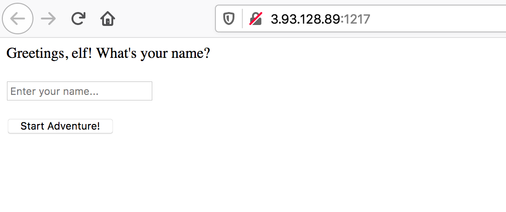
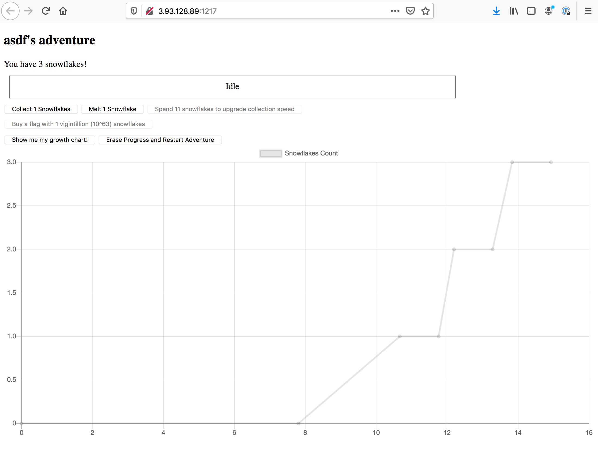

# Day 17 - Snowflake Idle - web, crypto

> It's not just leprechauns that hide their gold at the end of the rainbow, elves hide their candy there too.

Service: http://3.93.128.89:1217/

## Analysis

Navigating to the main page, we are greeted with a page with a simple text box prompting for a name.



Once you enter a name you're greeted with a game where you can collect a snowflake, melt a snowflake, upgrade, buy a flag, or show a growth chart. The flag costs a whole lot of snowflakes so after collecting and upgrading a little bit, we find that doing this is impractical.



Looking at the HTTP requests under the hood we see that the first login posts to `/control` as:

```
POST /control HTTP/1.1
Host: 3.93.128.89:1217
...

{"action":"new","name":"asdf"}
```

which returns a new `id` to be used as a cookie.

All of the other boxes send requests to the `/client` endpoint and vary the `"action"` parameter in posted JSON. For example, collecting a new snowflake sends:

```
POST /client HTTP/1.1
Host: 3.93.128.89:1217
...
Cookie: id=...

{"action":"collect","amount":1}
```

followed by a `state` action which receives the current game state.

Using all of this, I decided to try scripting a brute force to see how the server reacted, and apparently requests are throttled at one request per second.

The final endpoint that is hit is the `/history/client` endpoint. If you request the game's history, then that endpoint will turn the last 100 turn values in JSON.

At this point I tried a bunch of methods including trying a bunch of dictionary words for the `action` parameter, but all of this didn't really produce any positive results, so I was stuck. The remainder of this writeup I completed after the contest was over with a little hint to the hidden endpoint.

## Extra Endpoint

Looking at the endpoints that the game hits, we only have `/control`, `/client`, and `/history/client`. However, by taking a little minor leap, we can see that `/history/control` is a good guess for a fourth endpoint. After taking some actions in the game if we query this endpoint, we get a response like the following:

```
HTTP/1.0 200 OK
Content-Type: application/json
Content-Length: 6128
Server: Werkzeug/0.16.0 Python/2.7.17
Date: Fri, 27 Dec 2019 22:17:15 GMT

[[1577484944820,{"action":"load"}],[1577484944820,{"action":"save","data":"ZPndFWsM0ioUz8an0yfUmssOGAp7+YpaNEWLKkCOm+zBMdSa2Q0ZCT2m"}],[1577484958454,{"action":"load"}],[1577484958454,{"action":"save","data":"ZPndFWsM0ioUz8en0yfUmssOGAp7+YpaNEWLKkCOm+zBMdSa2Q0ZCT2m"}],[1577484959542,{"action":"load"}],[1577484959542,{"action":"save","data":"ZPndFWsM0ioUz8en0yfUmssOGAp7+YpaNEWLKkCOm+zBMdSa2Q0ZCT2m"}],[1577484960118,{"action":"load"}],[1577484960118,{"action":"save","data":"ZPndFWsM0ioUz8Sn0yfUmssOGAp7+YpaNEWLKkCOm+zBMdSa2Q0ZCT2m"}],[1577484961246,{"action":"load"}],[1577484961246,{"action":"save","data":"ZPndFWsM0ioUz8Sn0yfUmssOGAp7+YpaNEWLKkCOm+zBMdSa2Q0ZCT2m"}],[1577484961622,{"action":"load"}],[1577484961622,{"action":"save","data":"ZPndFWsM0ioUz8Wn0yfUmssOGAp7+YpaNEWLKkCOm+zBMdSa2Q0ZCT2m"}],[1577484962711,{"action":"load"}],[1577484962711,{"action":"save","data":"ZPndFWsM0ioUz8Wn0yfUmssOGAp7+YpaNEWLKkCOm+zBMdSa2Q0ZCT2m"}],[1577484963124,{"action":"load"}],[1577484963124,{"action":"save","data":"ZPndFWsM0ioUz8Kn0yfUmssOGAp7+YpaNEWLKkCOm+zBMdSa2Q0ZCT2m"}],[1577484964214,{"action":"load"}],[1577484964214,{"action":"save","data":"ZPndFWsM0ioUz8Kn0yfUmssOGAp7+YpaNEWLKkCOm+zBMdSa2Q0ZCT2m"}],[1577484964676,{"action":"load"}],[1577484964676,{"action":"save","data":"ZPndFWsM0ioUz8On0yfUmssOGAp7+YpaNEWLKkCOm+zBMdSa2Q0ZCT2m"}],[1577484965866,{"action":"load"}],[1577484965866,{"action":"save","data":"ZPndFWsM0ioUz8On0yfUmssOGAp7+YpaNEWLKkCOm+zBMdSa2Q0ZCT2m"}],[1577484966539,{"action":"load"}],[1577484966540,{"action":"save","data":"ZPndFWsM0ioUz8Cn0yfUmssOGAp7+YpaNEWLKkCOm+zBMdSa2Q0ZCT2m"}],[1577484967645,{"action":"load"}],[1577484967645,{"action":"save","data":"ZPndFWsM0ioUz8Cn0yfUmssOGAp7+YpaNEWLKkCOm+zBMdSa2Q0ZCT2m"}],[1577484968032,{"action":"load"}],[1577484968032,{"action":"save","data":"ZPndFWsM0ioUz8Gn0yfUmssOGAp7+YpaNEWLKkCOm+zBMdSa2Q0ZCT2m"}],[1577484969121,{"action":"load"}],[1577484969121,{"action":"save","data":"ZPndFWsM0ioUz8Gn0yfUmssOGAp7+YpaNEWLKkCOm+zBMdSa2Q0ZCT2m"}],[1577484969541,{"action":"load"}],[1577484969541,{"action":"save","data":"ZPndFWsM0ioUz86n0yfUmssOGAp7+YpaNEWLKkCOm+zBMdSa2Q0ZCT2m"}],[1577484970629,{"action":"load"}],[1577484970630,{"action":"save","data":"ZPndFWsM0ioUz86n0yfUmssOGAp7+YpaNEWLKkCOm+zBMdSa2Q0ZCT2m"}],[1577484971155,{"action":"load"}],[1577484971155,{"action":"save","data":"ZPndFWsM0ioUz8+n0yfUmssOGAp7+YpaNEWLKkCOm+zBMdSa2Q0ZCT2m"}],[1577484972235,{"action":"load"}],[1577484972236,{"action":"save","data":"ZPndFWsM0ioUz8+n0yfUmssOGAp7+YpaNEWLKkCOm+zBMdSa2Q0ZCT2m"}],[1577484972737,{"action":"load"}],[1577484972737,{"action":"save","data":"ZPndFWsM0ioUz8e5zTvYmJoNDQp6v5JAJViHKAyBl+SGKc6Ymh8OC3n5zQ=="}],[1577484973825,{"action":"load"}],[1577484973825,{"action":"save","data":"ZPndFWsM0ioUz8e5zTvYmJoNDQp6v5JAJViHKAyBl+SGKc6Ymh8OC3n5zQ=="}],[1577484974228,{"action":"load"}],[1577484974229,{"action":"save","data":"ZPndFWsM0ioUz8e4zTvYmJoNDQp6v5JAJViHKAyBl+SGKc6Ymh8OC3n5zQ=="}],[1577484975312,{"action":"load"}],[1577484975312,{"action":"save","data":"ZPndFWsM0ioUz8e4zTvYmJoNDQp6v5JAJViHKAyBl+SGKc6Ymh8OC3n5zQ=="}],[1577484976260,{"action":"load"}],[1577484976261,{"action":"save","data":"ZPndFWsM0ioUz8e5zTvYmJoNDQp6v5JAJViHKAyBl+SGKc6Ymh8OC3n5zQ=="}],[1577484977345,{"action":"load"}],[1577484977345,{"action":"save","data":"ZPndFWsM0ioUz8e5zTvYmJoNDQp6v5JAJViHKAyBl+SGKc6Ymh8OC3n5zQ=="}],[1577484978125,{"action":"load"}],[1577484978125,{"action":"save","data":"ZPndFWsM0ioUz8e4zTvYmJoNDQp6v5JAJViHKAyBl+SGKc6Ymh8OC3n5zQ=="}],[1577484979210,{"action":"load"}],[1577484979211,{"action":"save","data":"ZPndFWsM0ioUz8e4zTvYmJoNDQp6v5JAJViHKAyBl+SGKc6Ymh8OC3n5zQ=="}],[1577484979784,{"action":"load"}],[1577484979784,{"action":"save","data":"ZPndFWsM0ioUz8an0yfUmssOGAp7+YpaN0WLKkCOm+zBMdSa2Q0ZCT2m"}],[1577484980870,{"action":"load"}],[1577484980870,{"action":"save","data":"ZPndFWsM0ioUz8an0yfUmssOGAp7+YpaN0WLKkCOm+zBMdSa2Q0ZCT2m"}],[1577484981763,{"action":"load"}],[1577484981764,{"action":"save","data":"ZPndFWsM0ioUz8Sn0yfUmssOGAp7+YpaN0WLKkCOm+zBMdSa2Q0ZCT2m"}],[1577484982836,{"action":"load"}],[1577484982836,{"action":"save","data":"ZPndFWsM0ioUz8Sn0yfUmssOGAp7+YpaN0WLKkCOm+zBMdSa2Q0ZCT2m"}],[1577484983234,{"action":"load"}],[1577484983234,{"action":"save","data":"ZPndFWsM0ioUz8Kn0yfUmssOGAp7+YpaN0WLKkCOm+zBMdSa2Q0ZCT2m"}],[1577484984329,{"action":"load"}],[1577484984329,{"action":"save","data":"ZPndFWsM0ioUz8Kn0yfUmssOGAp7+YpaN0WLKkCOm+zBMdSa2Q0ZCT2m"}],[1577484984786,{"action":"load"}],[1577484984786,{"action":"save","data":"ZPndFWsM0ioUz8Cn0yfUmssOGAp7+YpaN0WLKkCOm+zBMdSa2Q0ZCT2m"}],[1577484985884,{"action":"load"}],[1577484985884,{"action":"save","data":"ZPndFWsM0ioUz8Cn0yfUmssOGAp7+YpaN0WLKkCOm+zBMdSa2Q0ZCT2m"}],[1577484986229,{"action":"load"}],[1577484986230,{"action":"save","data":"ZPndFWsM0ioUz86n0yfUmssOGAp7+YpaN0WLKkCOm+zBMdSa2Q0ZCT2m"}],[1577484987312,{"action":"load"}],[1577484987312,{"action":"save","data":"ZPndFWsM0ioUz86n0yfUmssOGAp7+YpaN0WLKkCOm+zBMdSa2Q0ZCT2m"}],[1577484987796,{"action":"load"}],[1577484987796,{"action":"save","data":"ZPndFWsM0ioUz8e5zTvYmJoNDQp6v5JAJVuHKAyBl+SGKc6Ymh8OC3n5zQ=="}],[1577484988884,{"action":"load"}],[1577484988884,{"action":"save","data":"ZPndFWsM0ioUz8e5zTvYmJoNDQp6v5JAJVuHKAyBl+SGKc6Ymh8OC3n5zQ=="}],[1577484989610,{"action":"load"}],[1577484989610,{"action":"save","data":"ZPndFWsM0ioUz8e7zTvYmJoNDQp6v5JAJVuHKAyBl+SGKc6Ymh8OC3n5zQ=="}],[1577484990718,{"action":"load"}],[1577484990718,{"action":"save","data":"ZPndFWsM0ioUz8e7zTvYmJoNDQp6v5JAJVuHKAyBl+SGKc6Ymh8OC3n5zQ=="}],[1577484991570,{"action":"load"}],[1577484991570,{"action":"save","data":"ZPndFWsM0ioUz8e9zTvYmJoNDQp6v5JAJVuHKAyBl+SGKc6Ymh8OC3n5zQ=="}],[1577484992649,{"action":"load"}],[1577484992649,{"action":"save","data":"ZPndFWsM0ioUz8e9zTvYmJoNDQp6v5JAJVuHKAyBl+SGKc6Ymh8OC3n5zQ=="}],[1577484993227,{"action":"load"}],[1577484993227,{"action":"save","data":"ZPndFWsM0ioUz8en2zLNgYFHRFYm4olDPFCTPgLP1PqTbpHcmkRdXDP7khRkBM4qFM/U6JBvkprF"}],[1577484994320,{"action":"load"}],[1577484994321,{"action":"save","data":"ZPndFWsM0ioUz8en2zLNgYFHRFYm4olDPFCTPgLP1PqTbpHcmkRdXDP7khRkBM4qFM/U6JBvkprF"}]]
```

## Crypto

Looking at the result above a bit closer, it appears that for each of the actions we've taking, this endpoint will return a timestamp and some encrypted game "data". Matching this up with the actions we've taken up to this point, I made a short chart:

```
Time	Data	Action
1577484944820	ZPndFWsM0ioUz8an0yfUmssOGAp7+YpaNEWLKkCOm+zBMdSa2Q0ZCT2m	start
1577484958454	ZPndFWsM0ioUz8en0yfUmssOGAp7+YpaNEWLKkCOm+zBMdSa2Q0ZCT2m	collect 1, total 1
1577484960118	ZPndFWsM0ioUz8Sn0yfUmssOGAp7+YpaNEWLKkCOm+zBMdSa2Q0ZCT2m	collect 1, total 2
1577484961622	ZPndFWsM0ioUz8Wn0yfUmssOGAp7+YpaNEWLKkCOm+zBMdSa2Q0ZCT2m	collect 1, total 3
1577484963124	ZPndFWsM0ioUz8Kn0yfUmssOGAp7+YpaNEWLKkCOm+zBMdSa2Q0ZCT2m	collect 1, total 4
1577484964676	ZPndFWsM0ioUz8On0yfUmssOGAp7+YpaNEWLKkCOm+zBMdSa2Q0ZCT2m	collect 1, total 5
1577484966539	ZPndFWsM0ioUz8Cn0yfUmssOGAp7+YpaNEWLKkCOm+zBMdSa2Q0ZCT2m	collect 1, total 6
1577484968032	ZPndFWsM0ioUz8Gn0yfUmssOGAp7+YpaNEWLKkCOm+zBMdSa2Q0ZCT2m	collect 1, total 7
1577484969541	ZPndFWsM0ioUz86n0yfUmssOGAp7+YpaNEWLKkCOm+zBMdSa2Q0ZCT2m	collect 1, total 8
1577484971155	ZPndFWsM0ioUz8+n0yfUmssOGAp7+YpaNEWLKkCOm+zBMdSa2Q0ZCT2m	collect 1, total 9
1577484972737	ZPndFWsM0ioUz8e5zTvYmJoNDQp6v5JAJViHKAyBl+SGKc6Ymh8OC3n5zQ==	collect 1, total 10
1577484974228	ZPndFWsM0ioUz8e4zTvYmJoNDQp6v5JAJViHKAyBl+SGKc6Ymh8OC3n5zQ==	collect 1, total 11
1577484976260	ZPndFWsM0ioUz8e5zTvYmJoNDQp6v5JAJViHKAyBl+SGKc6Ymh8OC3n5zQ==	melt, total 10
1577484978125	ZPndFWsM0ioUz8e4zTvYmJoNDQp6v5JAJViHKAyBl+SGKc6Ymh8OC3n5zQ==	collect 1, total 11
1577484979784	ZPndFWsM0ioUz8an0yfUmssOGAp7+YpaN0WLKkCOm+zBMdSa2Q0ZCT2m	upgrade, total 0
1577484981763	ZPndFWsM0ioUz8Sn0yfUmssOGAp7+YpaN0WLKkCOm+zBMdSa2Q0ZCT2m	collect 2, total 2
1577484983234	ZPndFWsM0ioUz8Kn0yfUmssOGAp7+YpaN0WLKkCOm+zBMdSa2Q0ZCT2m	collect 2, total 4
1577484984786	ZPndFWsM0ioUz8Cn0yfUmssOGAp7+YpaN0WLKkCOm+zBMdSa2Q0ZCT2m	collect 2, total 6
1577484986229	ZPndFWsM0ioUz86n0yfUmssOGAp7+YpaN0WLKkCOm+zBMdSa2Q0ZCT2m	collect 2, total 8
1577484987796	ZPndFWsM0ioUz8e5zTvYmJoNDQp6v5JAJVuHKAyBl+SGKc6Ymh8OC3n5zQ==	collect 2, total 10
1577484989610	ZPndFWsM0ioUz8e7zTvYmJoNDQp6v5JAJVuHKAyBl+SGKc6Ymh8OC3n5zQ==	collect 2, total 12
1577484991570	ZPndFWsM0ioUz8e9zTvYmJoNDQp6v5JAJVuHKAyBl+SGKc6Ymh8OC3n5zQ==	collect 2, total 14
1577484993227	ZPndFWsM0ioUz8en2zLNgYFHRFYm4olDPFCTPgLP1PqTbpHcmkRdXDP7khRkBM4qFM/U6JBvkprF	upgrade, total 1.8999999999999986
```

From this table, its pretty obvious that the "data" is likely encypting _something_, and that _something_ is likely the current game state. From here, I did a simple base64 decode and XOR of several pairs of "data" values. 

```
b'000000000000000000000100000000000000000000000000000000000000000000000000000000000000'	XOR of start and collect 1, total 1
b'00000000000000000000011e1e1c0c02510315000146181a111d0c024c0f0c0847181a0243121702445f'	XOR of start and collect 1, total 10
b'00000000000000000000011f1e1c0c02510315000146181a111d0c024c0f0c0847181a0243121702445f'	XOR of start and collect 1, total 11
b'000000000000000000000000000000000000000000000000030000000000000000000000000000000000'	XOR of start and upgrade, total 0
b'00000000000000000000011e1e1c0c02510315000146181a111e0c024c0f0c0847181a0243121702445f'	XOR of start and collect 2, total 10
b'0000000000000000000001000815191b4a495c5c5d1b03190815181442414f16525f4546434944550e5d'	XOR of start and upgrade, total 1.8999999999999986
```

I noticed that the XOR values for snowflake counts of similar values only different in a bit or two, but snowflake counts with a different number of digits were 1-character different in size and did XOR together cleanly.

At this point, my assumption was that the "start" data likely contained the string "0" at offset 10, and the "collect 1, total 10" data likely contained the string "10" at offset 10. But otherwise, the plaintext for these ciphertexts was likely the same. Since most of these ciphertexts are 1-off from each other, we can use this assumption to walk down the rest of the cipher, recover key, and then recover the plaintext for each. Doing this we find that the end of these "data" values decrypts to:

```
b'd\xf9\xdd\x15k\x0c\xd2*\x14\xcf0.0, "speed": 1, "name": "asdf"}'
b'd\xf9\xdd\x15k\x0c\xd2*\x14\xcf10.0, "speed": 1, "name": "asdf"'
```

This looks like JSON to me, but we don't quite know what the beginning of the plaintext is supposed to be. However, this doesn't really matter as we can construct a new JSON blob with the information we have. More specifically, we can craft a JSON blob that ends with `b'...1e+64,"speed":1,"name":"john"}'` which should give our player the right number of snowflakes to purchase the flag.

## Finishing Up

Going back to the endpoints, we can POST a `save` action with newly constructed base64 data to the `/control` endpoint. Doing this, sets the state for us, effectively gaming the system and letting us buy the flag. To wrap this entire process up, I wrote a [python script](./solutions/day17_solver.py) which prints out the flag at the end:

```
$ ./solutions/day17_solver.py
b'000000000000000000000100000000000000000000000000000000000000000000000000000000000000'
b'00000000000000000000011e1e1c0c02510315000146181a111d0c024c0f0c0847181a0243121702445f'
b'00000000000000000000011f1e1c0c02510315000146181a111d0c024c0f0c0847181a0243121702445f'
b'000000000000000000000000000000000000000000000000030000000000000000000000000000000000'
b'00000000000000000000011e1e1c0c02510315000146181a111e0c024c0f0c0847181a0243121702445f'
b'0000000000000000000001000815191b4a495c5c5d1b03190815181442414f16525f4546434944550e5d'
b'000000000000000000001d1f1e1c0c02510315000146181a111d0c024c0f0c0847181a0243121702445f'
b'00000000000000000000011e1e1c0c02510315000146181a111d0c024c0f0c0847181a0243121702445f'
b'000000000000000000001c0100000000000000000000000000000000000000000000000000000000000000'
b'd\xf9\xdd\x15k\x0c\xd2*\x14\xcf0.0, "speed": 1, "name": "asdf"}'
b'd\xf9\xdd\x15k\x0c\xd2*\x14\xcf10.0, "speed": 1, "name": "asdf"'
b'd\xf9\xdd\x15k\x0c\xd2*\x14\xcf1.8999999999999986, "speed": 3, '
OK {"id":"3/1N/FAgfZgYv/FO3LmIO6ddPbQH4LX0i21xVVVo+gQ="}

{'id': '3/1N/FAgfZgYv/FO3LmIO6ddPbQH4LX0i21xVVVo+gQ='}
{'action': 'state', 'snowflakes': 99999, 'speed_upgrade_cost': 3333.333, 'amount': 234567, 'collect_speed': -1}
{'collect_speed': 1, 'elf_name': 'john', 'snowflakes': 0.0, 'speed_upgrade_cost': 11.0}
[[1577502397756, {'action': 'state', 'amount': 234567, 'collect_speed': -1, 'snowflakes': 99999, 'speed_upgrade_cost': 3333.333}]]
[[1577502397756,{"action":"load"}],[1577502397756,{"action":"save","data":"kHah243W8s0kAJ44dgSgjOuXoSuPdvaU0p+rzXBBw3NkEqCM8oisIMkp"}]]

[[1577502397756, {'action': 'load'}], [1577502397756, {'action': 'save', 'data': 'kHah243W8s0kAJ44dgSgjOuXoSuPdvaU0p+rzXBBw3NkEqCM8oisIMkp'}]]
b'\x90v\xa1\xdb\x8d\xd6\xf2\xcd$\x00\xae\x16F(\x80\xae\x98\xe7\xc4N\xebT\xcc\xb4\xe3\xb3\x8b\xef\x1e \xae\x16F(\x80\xae\x98\xe7\xc4N\xebT'
[[1577502397756, {'action': 'load'}], [1577502397756, {'action': 'save', 'data': 'kHah243W8s0kAJ44dgSgjOuXoSuPdvaU0p+rzXBBw3NkEqCM8oisIMkp'}]]
{'action': 'state', 'snowflakes': 99999, 'speed_upgrade_cost': 3333.333, 'amount': 234567, 'collect_speed': -1}
{'collect_speed': 1, 'elf_name': 'john', 'snowflakes': 0.0, 'speed_upgrade_cost': 11.0}
{'action': 'save', 'data': 'kHah243W8s0kAJ9zbR60grqUtCuOMO6O0p+pgX9NyzR8CurB8InmMw=='}
{'action': 'state', 'snowflakes': 99999, 'speed_upgrade_cost': 3333.333, 'amount': 234567, 'collect_speed': -1}
{'collect_speed': 1, 'elf_name': 'john', 'snowflakes': 1e+64, 'speed_upgrade_cost': 11.0}
[[1577502397756, {'action': 'state', 'amount': 234567, 'collect_speed': -1, 'snowflakes': 99999, 'speed_upgrade_cost': 3333.333}], [1577502398943, {'action': 'state', 'amount': 234567, 'collect_speed': -1, 'snowflakes': 99999, 'speed_upgrade_cost': 3333.333}], [1577502400082, {'action': 'state', 'amount': 234567, 'collect_speed': -1, 'snowflakes': 99999, 'speed_upgrade_cost': 3333.333}]]
[[1577502397756,{"action":"load"}],[1577502397756,{"action":"save","data":"kHah243W8s0kAJ44dgSgjOuXoSuPdvaU0p+rzXBBw3NkEqCM8oisIMkp"}],[1577502398943,{"action":"load"}],[1577502398943,{"action":"save","data":"kHah243W8s0kAJ44dgSgjOuXoSuPdvaU0p+rzXBBw3NkEqCM8oisIMkp"}],[1577502400015,{"action":"save","data":"kHah243W8s0kAJ9zbR60grqUtCuOMO6O0p+pgX9NyzR8CurB8InmMw=="}],[1577502400082,{"action":"load"}],[1577502400082,{"action":"save","data":"kHah243W8s0kAJ9zbR60grjFtz6OMaiW2ZO6wz4CwHcrTaKUuMWuIYM67sk="}]]

[[1577502397756, {'action': 'load'}], [1577502397756, {'action': 'save', 'data': 'kHah243W8s0kAJ44dgSgjOuXoSuPdvaU0p+rzXBBw3NkEqCM8oisIMkp'}], [1577502398943, {'action': 'load'}], [1577502398943, {'action': 'save', 'data': 'kHah243W8s0kAJ44dgSgjOuXoSuPdvaU0p+rzXBBw3NkEqCM8oisIMkp'}], [1577502400015, {'action': 'save', 'data': 'kHah243W8s0kAJ9zbR60grqUtCuOMO6O0p+pgX9NyzR8CurB8InmMw=='}], [1577502400082, {'action': 'load'}], [1577502400082, {'action': 'save', 'data': 'kHah243W8s0kAJ9zbR60grjFtz6OMaiW2ZO6wz4CwHcrTaKUuMWuIYM67sk='}]]
{'action': 'buy_flag', 'amount': 1e+64, 'snowflakes': 99999, 'speed_upgrade_cost': 3333.333, 'collect_speed': -1}
{'action': 'state', 'snowflakes': 99999, 'speed_upgrade_cost': 3333.333, 'amount': 234567, 'collect_speed': -1}
{'collect_speed': 1, 'elf_name': 'john', 'flag': 'AOTW{leaKinG_3ndp0int5}', 'snowflakes': 9e+63, 'speed_upgrade_cost': 11.0}
```