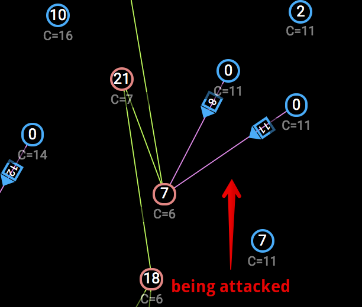

# Days 21-22 - Battle of the Galaxies - battle

> Welcome to the Battle of the Galaxies! This is a limited-time event, running until Dec 23 00:00 UTC! Download-mirror at https://drive.google.com/file/d/1Qv1HpeBGrnwJ-2lMDN1ynrs7g2kWQ7wF/view?usp=sharing

Service: [https://battle-advent2019.overthewire.org/](https://battle-advent2019.overthewire.org/)

Mirror: [aef5339eea9c9a08442dfc424c710ab37ad9a634520d84a71f0c72a3b07a7be8-dist.zip](./static/aef5339eea9c9a08442dfc424c710ab37ad9a634520d84a71f0c72a3b07a7be8-dist.zip) - note: this is the first version with a slight bug in the game logic.

## Description

The full description of this problem can be found in a Google Doc, but I'll give a quick synopsis of the game which might be helpful to understand my strategy below.

* There are 90 stars - starting out 10 belong to you, 10 to your opponent
* Each "AI" starts as one of the 10 stars and performs its strategy according to its "knowledge" - roughly stars close in proximity to its own and its "linked" stars
* Friendly stars can be linked by sending ships between them (at least 1)
* Unowned stars can be captured by sending ships to them (at least 6)
* Opponent stars can be captured by sending ships to them (at least 11)
* Each star generates a fixed number of ships per turn (ranging from 1-5) called "richness"
* You win if you capture at least 75% of all stars

## Strategy

My final AI program can be found [here](./solutions/day21_ai.cc) and can be compiled using the instructions in the bundle (using a Docker container worked for me). I steadily built my AI with a couple different components - some added before the competition started, some added after. It's _relatively_ well commented, typos and all, as I was writing it. There are also a bunch of `TODO` messages to myself where I took a computational shortcut. Some of these I intended to go back and fix but didn't have time, and others I just left as-is since they had little impact on the final result of each strategy. These strategies I employed are roughly described below.

### Greedy Unowned

What I'll call my first-tier strategy was to create an AI which would greedily capture unowned stars starting with those of highest "richness" in proximity to my stars. This costs about 5 ships (more if there is a conflict where two players try to capture at the same time) and is invaluable to building a collection of stars & ships for the competition. I started my AI by always sending 6 ships (the 5+1 needed to capture), but partway through the competition I started sending (5+richness). I thought the latter might be a marginal improvement in defense of "rich" stars what I captured.

### Greedy Linking

My second strategy was to link whenever possible. Linking doesn't cost any ships to perform, but rather only the short transit time where you cannot use a ship for attacking or defense. Linking also helps the AI immensely to coordinate and make decisions on a board-wide level.

### Attack on Turn

Moving into strategies which were more proactive, my first attack strategy was to pick certain turns to attack, and then coordinate all of my AIs to send ships to an enemy star at the same time. At each "attack turn" I pre-calculated, I picked my top-5 victim stars roughly scored by those in the closest proximity to my stars plus a richness value. Then, for those top-5 I computed which stars could attack each (say, n\_i stars for the top-i'th star) and sent about ((enemy star count + a little) / n\_i) ships to that star all coordinated to land on the exact same turn. The strategy looks something like the graphic below (as seen in the game visualizer).

When I first created my AI, I chose turns pretty sparingly and I think I used something like turns (49+13i for all i). This worked ok, but after seeing a couple rounds of competition I ratcheted this up considerably to about every four turns starting on turn 3.

### Defend

While this might not sound intuitive, I didn't even implement a defend strategy until after the competition started. My gut feeling that it was _good enough_ to focus primarily on strategies which would capture unowned and enemy stars, and if my own got captured in the process then I would just have to re-capture them later with the former strategy. But, in an effort to stop some losses, I implemented this strategy.

Basically, all this strategy does is see if any of my stars are being attacked, and if there is time to send enough support ships from a neighboring star before the enemy arrives, then do so. The before and after of this strategy are shown below. In this scenario, the enemy sent just enough (19) ships to capture my star (7), so I sent two support ships to stop the loss.

### Reallocate

Another strategy I employed after starting the competition was to reallocate ships. I noticed in certain matches where my AI had captured a large mass of stars that many of the stars not close to enemies (call these "internal") did not attack or send ships, but rather just increased in counts providing ships that were useless. This strategy aimed to fix that. The "best" way to do this might have been to send ships where they were needed on the perimeter, but as a shortcut I chose to just send all of the ships from an "internal" star to a random nearby neighbor. I figured that after enough steps on a random walk these would get to a perimeter star where they were needed. This strategy of minimizing "internal" ship counts is shown in the visualizer below.

### Attack on Capture

My final strategy I implemented before the competition ended only came in for the last round I participated in, and I'm not entirely convinced it helped that much. In an effort to attack more aggressively, I chose to find situations where I captured a star, and if I had sufficient ships at that star and was close to another enemy star, then I would immediately ping-pong to the next enemy star and try to capture it as well. Intuitively, this seemed like it might work _ok_, but again - YMMV. An example of this is shown below.

## Conclusion

I went down as 5th in the competition after round 7. There was a pretty wide margin on the scoreboard between 4th & 5th (the cutoff for the next round), so I honestly didn't have much of a chance, but was hopeful nonetheless. I did see that at least one of my competitors picked up the "Attack on Turn" strategy after I used it in some early rounds and modified it slightly to gain an edge (either over others or over my AI). I think the nature of ships from multiple stars leaving at different times but all arriving at the same time made it slightly difficult to account for and probably got me most of the way to 5th place.

While my adventures with this challenge were fun, I didn't have as much time as I wanted to work on the problem and might have done better had I studied others' strategies and adjusted more than I did. 

