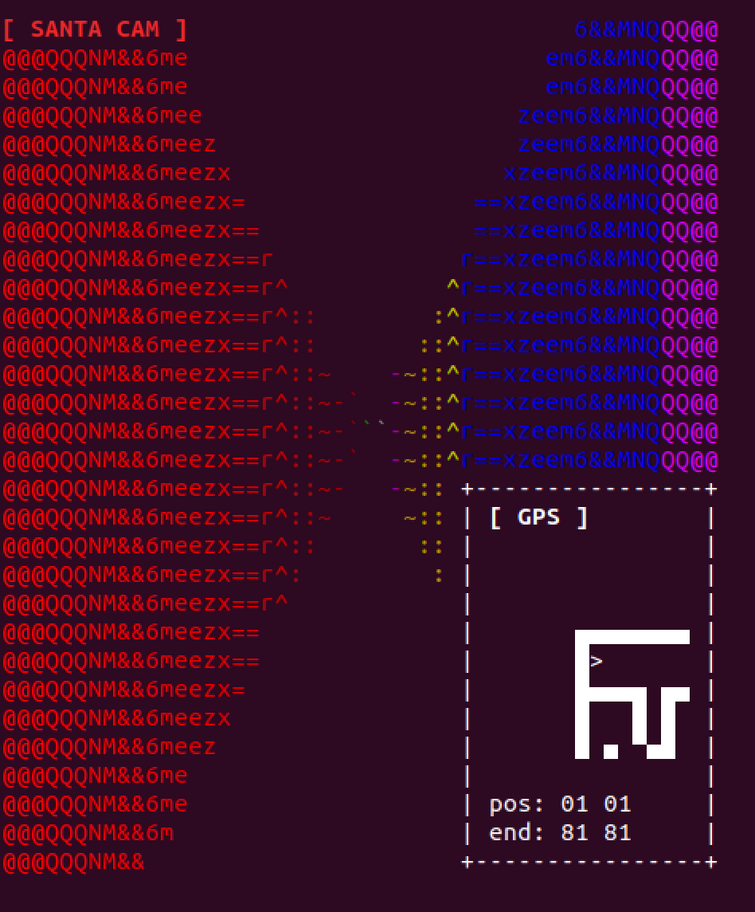

# Day 25 - Lost in Maze - misc, pwned!

> We have a code red ( and green, gold and white), we have lost Santa. While he was delivering gifts he seems to have gotten a bit tipsy and got lost somewhere over Europe. Luckily we saw this coming, we have a GPS and bodycam on him, but we need your help. Get him out of there and back on track to save Christmas.

Service: nc 3.93.128.89 1225

## Problem

This challenge was a rather simple maze solver. Connecting to the service gives a splash screen which prompts for a width and height. Setting sane values for these presents an ASCII art looking screen as shown below.



Experimenting with key presses reveals that only the characters W, A, S, D do anything and correspond to the standard forward, left turn, backward, and right turn. Annoyingly, with `nc` you have to press enter after each keypress. Furthermore, forward and backward do not advance you one grid square (if possible), and turning only gets you a little way toward the next direction. Turning also doesn't line up exactly right with the coordinates of the grid so you are often put into positions where you have to adjust left or right after pressing forward a bit.

Helpfully, the service does present a "GPS" view of local spaces in the grid. I mostly relied on this grid for navigation and if I had to look at the maze in ASCII art alone this would have been much harder.

As I describe later, the problem can be solved simply by walking the maze to position (81,81).

## Scripting

To ease the procoess of walking the maze I wrote up [a script](./solutions/day25_play.py) to do a couple things:

* read single keypresses and send them to the service (so I didn't have to press enter)
* change the "forward" (or "W" key) to go forward until I reached the next coordinate and then make two steps past that (each grid space was about six steps across)
* change the "turn" (or "A" and "D")  keys to make educated guesses about how far to turn my view so that I was facing roughly the right direction.
* parse the grid screen and consolodate with my entire maze walk to have a complete picture (not just the local GPS view)

With the script written I walked the maze and once I reached square (81,81) I got a flag. The end of my script's output is given below.

```

grid data: > 80 81
▄▄▄▄▄▄▄▄▄▄▄▄▄▄▄▄▄▄▄▄▄▄▄▄▄▄▄▄▄▄▄▄▄▄▄▄▄▄▄▄▄▄▄▄▄▄▄▄▄▄▄▄▄▄▄▄▄▄▄▄▄▄▄▄▄▄▄▄▄▄▄▄▄▄▄▄▄▄▄▄▄▄▄   ??????????????????????????????????????????????????????????????????????????  █   █ █
█s  █       █     █           █   █         █               █               █     █   ??????????????????????????????????????????????????????????????????????????▄▄▀▄▄▄█ █
█▄▄ ▀ ▄ ▄▄▄ █ ▄▄▄ ▀ ▄▄▄▄▄▄▄ ▄ █ ▄ ▀ ▄▄▄▄▄▄▄ ▀ ▄▄▄ ▄ ▄▄▄▄▄ ▄▄█ ▄ ▄▄▄▄▄▄▄▄▄▄▄ █ ▄ ▄ █   ??????????????????????????????????????????????????????????????????????????      █ █
█     █ █   █   █   █     █ █ █ █   █     █   █   █     █   █ █ █   █     █ █ █ █ █   ??????????????????????????????????????????????????????????????????????????▄▄▄▄▄ █ █
█ ▄▄▄▄▀ █ ▄▄▀▄▄ █ ▄▄▀▄▄▄▄ █ █ ▀ █▄▄▄▀ ▄ ▄ ▀▄▄▄▀ ▄▄▀▄▄▄▄ █▄▄ █ █ ▀ ▄ █ ▄▄▄ █ ▀ █ █ █   ??????????????????????????????????????????????????????????????????????????  █   █ █
█   █   █       █ █     █ █ █   █     █ █   █   █     █ █   █ █   █ █ █   █   █ █ █   ??????????????????????????????????????????????????????????????????????????▄ ▀ ▄▄█ █
█ ▄ █ ▄▄▀▄▄▄▄▄▄▄▀▄▀ ▄ ▄ ▀ █ ▀▄▄▄▀ ▄▄▄▄█ ▀▄▄ █ ▄▄█ ▄▄▄ █ █ ▄▄█ █ ▄▄▀ █ ▀▄▄▄▀▄▄▄▀ █ █   ??????????????????????????????????????????????????????????????????????????█   █ █ █
█ █ █ █     █       █ █   █   █   █   ????????????  █ █ █   █ █ █   █       █   █ █   ??????????????????????????????????????????????????????????????????????????▀▄▄▄▀ █ █
█ █ █ ▀ ▄▄▄ █ ▄▄▄▄▄▄█▄▀▄▄ ▀▄▄ ▀ ▄ █ ▄▄????????????▄▄▀ █ █▄▄ ▀ █ █ ▄▄█▄▄▄▄ ▄ █▄▄▄█ █   ??????????????????????????????????????????????????????????????????????????      █ █
█ █ █   █ █ █ █     █   █   █ ????????????????????█   █ █ █   █ █   ??  █ █ █   █ █   ????????????????????????????????????????????????????????????????????????█ ▄▄▄▄▄▄█ █
█ █ ▀▄▄▄▀ █ ▀ █ ▄▄▄▄█ ▄ ▀▄▄▄█ ????????????????????▀ ▄▄▀ █ █▄▄▄▀ █▄▄ ??▄ ▀▄█ █ ▄ ▀ █   ????????????????????????????????????????????????????????????????????????█ █     █ █
█ █       █   █     ????????????????????????????????█   █ █ █   █   ??█   █ █ █   █   ????????????????????????????????????????????????????????????????????????▀▄▀ ▄ ▄▄▀ █
█ ▀▄▄▄▄▄▄▄▀▄▄▄▀▄▄▄▄ ????????????????????????????????▀ ▄▄▀ █ ▀ ▄▄▀ ▄▄??█▄▄ █ █ ▀▄▄▄█   ????????????????????????????????????????????????????????????????????????    █ █   █
????              █ ??????????????????????????????????????????????????█   █ █     █   ????????????????????????????????????????????????????????????????????????▄▄▄▄▀ █ ▄▄█
????▄▄▄ ▄▄▄▄▄▄▄▄▄ █ ??????????????????????????????????????????????????█ ▄▄▀ █▄▄▄▄ █   ????????????????????????????????????????????????????????????????????????  █   █   █
??????????????????????????????????????????????????????????????????????█ █   █ █   █   ????????????????????????????????????????????????????????????????????????▄ ▀▄▄▄█ ▄ █
??????????????????????????????????????????????????????????????????????█ ▀ ▄▄▀ █ ▄▄█   ????????????????????????????????????????????????????????????????????????█     █ █ █
????????????????????????????????????????????????????????????????????????  █   █   █   ????????????????????????????????????????????????????????????????????????█ ▄▄▄ █ █ █
????????????????????????????????????????????????????????????????????????▄▄▀ ▄ █ ▄ █   ????????????????????????????????????????????????????????????????????????█   █ █ █ █
????????????????????????????????????????????????????????????????????????█   █ █ █ █   ????????????????????????????????????????????????????????????????????????█ ▄ █ █▄▀ █
????????????????????????????????????????????????????????????????????????▀ ▄ █ █▄▀ █   ????????????????????????????????????????????????????????????????????????█ █ █ █   █
????????????????????????????????????????????????????????????????????????  █ █ █   █   ????????????????????????????????????????????????????????????????????????▀▄█ █ █ ▄▄█
????????????????????????????????????????????????????????????????????????▄▄█ █ █ ▄▄█   ????????????????????????????????????????????????????????????????????????  █ █ █   █
????????????????????????????????????????????????????????????????????????  █ █ █   █   ????????????????????????????????????????????????????????????????????????▄ █▄▀ █ ▄ █
????????????????????????????????????????????????????????????????????????▄ ▀ █ ▀▄▄ █   ????????????????????????????????????????????????????????????????????????  █   █ █ █
????????????????????????????????????????????????????????????????????????█   █   █ █   ????????????????????????????????????????????????????????????????????????▄▄█ ▄ █▄▀ █
????????????????????????????????????????????????????????????????????????█ ▄▄▀▄▄ █ █   ????????????????????????????????????????????????????????????????????????  █ █ █   █
??????????????????????????????????????????????????????????????????????????█   █ █ █   ????????????????????????????????????????????????????????????????????????▄ █ █ █ ▄▄█
??????????????????????????????????????????????????????????????????????????█ ▄ ▀ █ █   ????????????????????????????????????????????????????????????????????????  █ █ █   █
??????????????????????????????????????????????????????????????????????????█ █   █ █   ????????????????????????????????????????????????????????????????????????▄▄▀ █ █▄▄ █
??????????????????????????????????????????????????????????????????????????█ ▀▄▄▄█ █   ????????????????????????????????????????????????????????????????????????█   █ █   █
??????????????????????????????????????????????????????????????????????????█     █ █   ????????????????????????????????????????????????????????????????????????▀ ▄▄▀ █ ▄▄█
??????????????????????????????????????????????????????????????????????????▀▄▄▄▄ █ █   ????????????????????????????????????????????????????????????????????????  █   █   █
??????????????????????????????????????????????????????????????????????????  █ █ █ █   ????????????????????????????????????????????????????????????????????????▄▄▀ ▄ ▀▄▄ █
??????????????????????????????????????????????????????????????????????????▄ ▀ █ █ █   ????????????????????????????????????????????????????????????????????????█   █   █ █
??????????????????????????????????????????????????????????????????????????█   █ █ █   ??????????????????????????????????????????????????????????????????█ █ █▄▀ ▄▄▀▄▄ █ █
??????????????????????????????????????????????????????????????????????????▀▄▄▄█ █ █   ??????????????????????????????????????????????????????????????????█ █ █   █     █ █
??????????????????????????????????????????????????????????????????????????    █ █ █   ??????????????????????????????????????????????????????????????????▀ █▄▀ ▄▄▀▄▄▄▄▄▀ █
??????????????????????????????????????????????????????????????????????????▄▄▄▄█ █ █   ??????????????????????????????????????????????????????????????????  █   █         █
??????????????????????????????????????????????????????????????????????????█   █ █ █   ??????????????????????????????????????????????????????????????????▄▄▀ ▄ █ ▄▄▄▄▄▄▄▄█
??????????????????????????????????????????????????????????????????????????▀ ▄ ▀ █ █   ??????????????????????????????????????????????????????????????????    █ █       >e█

grid data: > 80 81
going w ('>', 80, 81) (80, 81)
>> b'w'
b'\x1b[1mYou saved Christmas, here is your reward:\x1b[0m\n'
b'\x1b[1mYou saved Christmas, here is your reward:\x1b[0m\nAOTW{426573742077697368657320666F7220323032302121}\n'
b'\x1b[1mYou saved Christmas, here is your reward:\x1b[0m\nAOTW{426573742077697368657320666F7220323032302121}\n'
```
