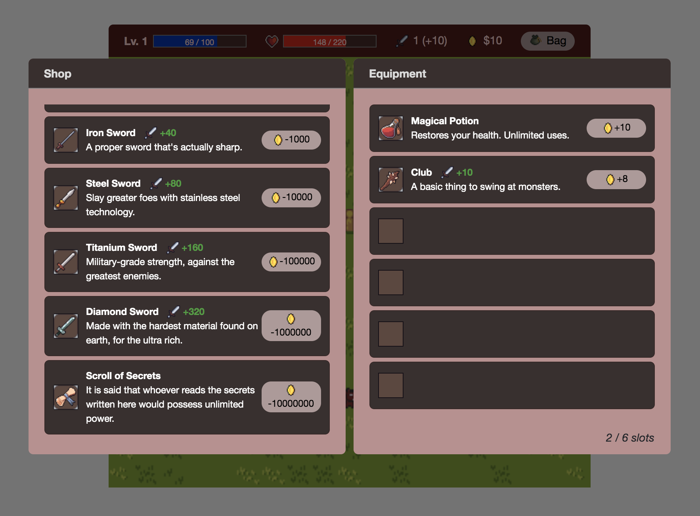
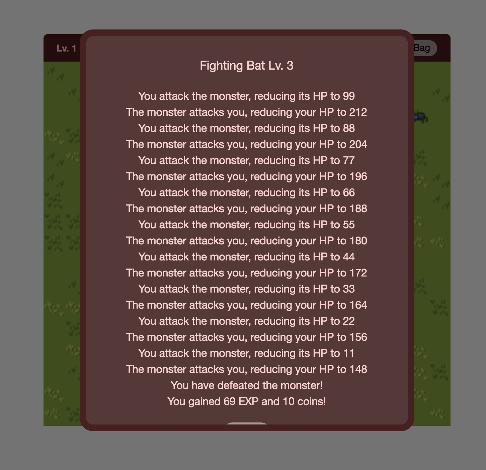
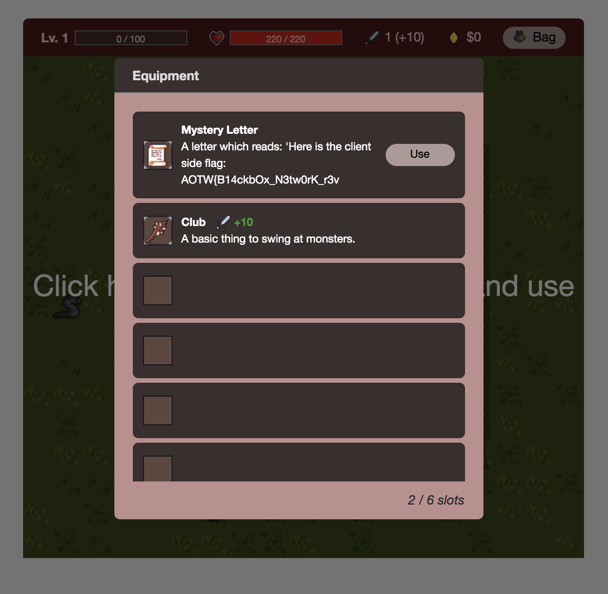

# Day 2 - Summer ADVENTure - crypto, rev, network, misc

> An elf is tired of snow and wanted to visit summer... in an online RPG at least. Could you help him beat the game?

Service: http://3.93.128.89:12020

Extra clarification, please read this: https://docs.google.com/document/d/1wYlM2ideh5R5I7KDTLFTu_NLQmAJAmV-hVjNlmAOIEY

## Initial Analysis

The setup for this challenge is basically that you are given a man-in-the-middle position between a "client" and "server" game. Note - If you don't start by implementing a proxy program then you can't start the problem! The data sent between the two endpoints is encrypted so cannot be easily modified without further analysis. The game itself is a relatively simple and worth explaining a little bit:

* The game has a player's level, experience count, and HP similar to many RPGs.
* There are items you can buy from the shop and store in either your stash or equipment. These consist of a healing potion, different levels of swords, and a "Scroll of Secrets".
* In the game you can fight enemies on the game board, and these appear to only be up to two levels higher than your current level.
* You can heal using your potion at any time (unlimited).




The objective of all of this seemed to me to be that you need to level up enough to gain coin to purchase the "Scroll of Secrets". Doing this with the game alone is very slow, so if there is a way to script the leveling up process automatically, then this would speed up the process and allow us to step away and have everything done for us.

As for the man-in-the-middle position, I created a simple proxy in python and ran a couple captures with test usernames only to see data such as the following:

```
$ ./day2.py 
Server ID: TUFaiGJ6/Ggmpll/faGle2FHkM5lTSis
Enter this ID on the game client to connect to this custom server.

Data (Server to Client (recv from server, send to fake)): -- 0x10 accum total
00000000: ae12 9e50 993b 683a 6455 3d4b 7841 201b  ...P.;h:dU=KxA .

Data (Client to Server (recv from fake, send to server)): -- 0x2 accum total
00000000: 429e                                     B.

Data (Client to Server (recv from fake, send to server)): -- 0x17 accum total
00000000: ef2e 1b42 64b7 92bc a30f efd4 d08c 89b4  ...Bd...........
00000010: a41d 413e da                             ..A>.

Data (Server to Client (recv from server, send to fake)): -- 0x12 accum total
00000000: 429e                                     B.

Data (Server to Client (recv from server, send to fake)): -- 0x27 accum total
00000000: f73d 235b 4caa 80bb ae15 ef92 b2ea 9bb4  .=#[L...........
00000010: b713 403e 92                             ..@>.

Data (Client to Server (recv from fake, send to server)): -- 0x19 accum total
00000000: 5b40                                     [@

Data (Client to Server (recv from fake, send to server)): -- 0x2f accum total
00000000: d395 d87a 6057 2efc b67c 94fe 8fae a0f1  ...z`W...|......
00000010: 00b4 fe7e 009c                           ...~..

Data (Server to Client (recv from server, send to fake)): -- 0x29 accum total
00000000: f944                                     .D

Data (Server to Client (recv from server, send to fake)): -- 0x4dd accum total
00000000: cb30 db7a 0036 5a92 d61f b580 f986 c0aa  .0.z.6Z.........
00000010: f0d3 afd1 65c2 be3b 8188 1155 dd9d 5f77  ....e..;...U.._w
00000020: 4054 26a2 080a 8a8e 1f93 6ad9 70c9 710f  @T&.......j.p.q.
00000030: 0caf 1ef0 2010 a689 a31f c884 1d48 48d8  .... ........HH.
00000040: 84bd ce21 1168 12b5 08f7 282e 8ca4 d4aa  ...!.h....(.....
00000050: afcd 3bb9 8eaa dc04 3a86 9046 676f 3787  ..;.....:..Fgo7.
00000060: b77b 23e0 10f7 975b 82b8 2a87 572b b54c  .{#....[..*.W+.L
00000070: 9500 4535 9396 4cdc 6da2 21dc 36e6 3761  ..E5..L.m.!.6.7a
00000080: 8150 6da0 fc37 8635 d3c7 6cb4 1849 129e  .Pm..7.5..l..I..
00000090: fee4 e8b1 77e2 d94b 0b28 b4a6 d5ea ae9f  ....w..K.(......
000000a0: c168 1fad b744 bfd1 fe09 f68f 67c5 b698  .h...D......g...
000000b0: dcff 990e 133f e5ba d673 9a90 49af b32d  .....?...s..I..-
000000c0: d89e e3f0 6da2 96bd 4f82 bbad ea21 7985  ....m...O....!y.
000000d0: 4f32 d63a bda8 2e8f 7c4e 6537 b36d ef5a  O2.:....|Ne7.m.Z
000000e0: d4fd 716b efa6 a795 809c 5ce0 d50b 8994  ..qk......\.....
000000f0: a734 860f caa7 ec5c 1ee8 b041 a5ef bdb4  .4.....\...A....
00000100: 3e49 31f0 4bcf cdf1 dbd5 9bff c320 7983  >I1.K........ y.
00000110: fafa 5f8a 5e87 f8b8 4831 4850 24f6 ebcc  .._.^...H1HP$...
00000120: 4b4b 6ba1 04d4 5a24 63e3 bcd9 1ad8 cff0  KKk...Z$c.......
00000130: 8958 a400 4d01 3bc7 671f 2925 c000 e91b  .X..M.;.g.)%....
00000140: 9634 4f80 6a55 89a4 2970 e27b b67e 50ca  .4O.jU..)p.{.~P.
00000150: fe1a 7ee0 2953 622f f64c 6f23 c943 eaf8  ..~.)Sb/.Lo#.C..
00000160: e48f f04d 5174 d9eb dbae 025f 0ed0 cf09  ...MQt....._....
00000170: 559c e5b4 169f 9a63 3dcb e33e a1ea d6b5  U......c=..>....
00000180: 4c33 a54d 7acb e2af 0b7d a6d3 9e63 83c0  L3.Mz....}...c..
00000190: 4103 7951 7384 9be0 f660 b569 d4bb 9b48  A.yQs....`.i...H
000001a0: 050c c656 3b36 7ac9 7871 e855 01a1 359e  ...V;6z.xq.U..5.
000001b0: d63b efda 8a09 04db 9bc1 d752 cf9d 1220  .;.........R... 
000001c0: 1b3a c243 4aa6 1fac d763 827e 1a92 24e0  .:.CJ....c.~..$.
000001d0: 83d5 39b6 bb72 0afb 011d ac56 f5d9 5b9a  ..9..r.....V..[.
000001e0: 1103 2806 5be4 658d 236e b112 269d d796  ..(.[.e.#n..&...
000001f0: 008a 0b90 3d4a bd9c 9659 f379 187a b527  ....=J...Y.y.z.'
00000200: ea35 3bc7 604e 3689 bbba 5ee5 2b65 4ed5  .5;.`N6...^.+eN.
00000210: e1b6 3a9e 83f8 4175 721d 891a 5d84 cf82  ..:...Aur...]...
00000220: f8ba 5150 69c4 d70c 05ed d290 d0d6 3b71  ..QPi.........;q
00000230: c3ea 637c 0b9b 4ae7 96e2 ea4b 282a 1ba3  ..c|..J....K(*..
00000240: 9cdf 192c bda6 b08a 8b40 8fce bb80 92a1  ...,.....@......
00000250: b6ce 2c82 8253 9361 4884 fa68 b820 8f00  ..,..S.aH..h. ..
00000260: 239c 4eb6 ea42 4f62 969a 1d5b 6ec4 85f0  #.N..BOb...[n...
00000270: 5e32 28e4 9c1f c150 9e1b a4b1 0108 ae5e  ^2(....P.......^
00000280: 4dbe 67d4 0256 ba57 9a84 7951 83c7 0ed6  M.g..V.W..yQ....
00000290: 5529 15b9 f783 a4a3 f728 8c63 a4e6 4c42  U).......(.c..LB
000002a0: 7588 3d1b 657a 1318 b7fe 63e8 80af b5fa  u.=.ez....c.....
000002b0: c631 2701 73d5 d18e a797 8392 5c99 bc0f  .1'.s.......\...
000002c0: 1e80 3fa4 c34c 9dff 71ff 6fc7 29da 455c  ..?..L..q.o.).E\
000002d0: 98d4 d1e5 a865 7e39 08a2 5d42 9c4a 376b  .....e~9..]B.J7k
000002e0: 9cc7 dbf8 7f8a 5950 3a87 77f8 007a 4787  ......YP:.w..zG.
000002f0: 0382 7520 8786 c7ba 6f11 cba7 a369 d162  ..u ....o....i.b
00000300: 43f5 0b7b adc4 771c 9af5 1843 bde9 6e13  C..{..w....C..n.
00000310: 42f7 c6e9 5432 f7eb e8a4 27ca 91f6 4678  B...T2....'...Fx
00000320: cd5c 832b ef10 a9e6 84fb 8e2b 7330 41e3  .\.+.......+s0A.
00000330: 27b2 6924 4d7e 29c2 ac6f 449b 5561 6274  '.i$M~)..oD.Uabt
00000340: 44ec 8249 170d 156f 6818 5d1a e5aa 1306  D..I...oh.].....
00000350: d569 28ca e9e7 30f1 18ae 9838 4784 c91b  .i(...0....8G...
00000360: dd0d 6fc0 9594 46ab 6834 0741 ced2 f34c  ..o...F.h4.A...L
00000370: 88b9 b4e5 045f 4288 8927 e29a bc31 9765  ....._B..'...1.e
00000380: 9691 3fcc e300 e5c0 b400 9afa f4f0 1839  ..?............9
00000390: 3ec2 e6e9 ad8f 7f59 f9ce 1a3d 2687 7841  >......Y...=&.xA
000003a0: 1e6d 991b 0eec d924 7eae 746f e10b 5b52  .m.....$~.to..[R
000003b0: b58c f8c0 66e5 dbbb 7891 33df 1cac c7d7  ....f...x.3.....
000003c0: a4d6 c7ce f660 691c 34d6 12b6 3c32 3a1e  .....`i.4...<2:.
000003d0: 8961 7069 7148 7c29 6436 34d7 7000 d6d0  .apiqH|)d64.p...
000003e0: 9f76 92f5 9be5 aad4 fa30 9287 9c43 9175  .v.......0...C.u
000003f0: 84b5 d851 e4a8 3937 7e1d befc 1ebc e2c8  ...Q..97~.......
00000400: caf1 bdc5 c929 22b9 50fa 6a78 480c cf47  .....)".P.jxH..G
00000410: 79b4 a3b9 3b01 4a4d 4e95 4a44 4520 2e32  y...;.JMN.JDE .2
00000420: 594a a061 3b32 aff8 8981 18b5 d2c2 1100  YJ.a;2..........
00000430: ccdf e10b c537 b742 d0e6 7cc7 a041 08b7  .....7.B..|..A..
00000440: 3190 e906 5142 2c75 dc42 e4ec 7666 1eef  1...QB,u.B..vf..
00000450: 3c95 1191 1388 6c41 5a9f 9c16 56b6 64ac  <.....lAZ...V.d.
00000460: b708 8e1a 85e8 854c c7b7 efa9 213e 1760  .......L....!>.`
00000470: aa57 c799 c6c8 8cb7 0609 36ac 495a 321d  .W........6.IZ2.
00000480: 3a5a 15af 60b1 8037 0dc9 23b0 7b7e 5612  :Z..`..7..#.{~V.
00000490: 22a3 ce80 4420 c3c0 0589 245f c6ba ad18  "...D ....$_....
000004a0: 4d50 7d79 f547 3c98 ee50 3ce4 9f51 d3ca  MP}y.G<..P<..Q..
000004b0: d319 8e20                                ... 

Data (Client to Server (recv from fake, send to server)): -- 0x31 accum total
00000000: b621                                     .!

Data (Client to Server (recv from fake, send to server)): -- 0x33 accum total
00000000: a79a                                     ..

Data (Server to Client (recv from server, send to fake)): -- 0x4df accum total
00000000: faf3                                     ..

Data (Server to Client (recv from server, send to fake)): -- 0x513 accum total
00000000: 0703 956c 1653 e79d 1c09 a53e 6ae0 3598  ...l.S.....>j.5.
00000010: 0626 370f 1606 752b 2bb5 aaef f3d6 4aef  .&7...u++.....J.
00000020: f841 4b06 c7b7 7b40 15f0 ee2c 9162 c74c  .AK...{@...,.b.L
00000030: bc2c 3115                                .,1.

connection closed...
```

The above output is from my python script and shows the user logging in, retrieving a big chunk of data (likely some game state), and then performing some rudimentary actions like looking at the stash and attacking an enemy. It looks pretty random, so my assumption was it was encrypted.

## Data Decryption

My initial intuition with this problem was that the first 16 bytes was some version of the "key" sent from the server to client, and then each data was sent as two-bytes plus an encrypted message. I thought this two-byte value was a nonce of some sort which would setup the current encryption key for the data which followed. This would have allowed message replays and been an interesting challenge. This turned out to be wrong, and after staring at the messages a bit more I noticed that the data packet at the beginning of each transmission between the two sides always seemed to be very close in value. This fact made me think that the same key was being used to encrypt both sides in something called a "two-time pad". Specifically, the same keystream is used to encrypt the server to client data, and well as the client to server data. With this key reuse, we can XOR together both sides and learn _some_ information about the underlying plaintext, and if we somehow figure out some known plaintext, then we can create a keystream ourselves and decrypt the contents from the other side.

To get started with this, I found that certain actions in the game were easily repeatable and gave predictable messages between the server and client. In particular, if you start the game and repeatedly use the "Magical Potion", then you will get the same packet sizes sent between the client and server. Its a simple leap from here to assume that the plaintext packet contents are always the same for this action. A sample proxy of this action is shown below.

```
Data (Client to Server (recv from fake, send to server)): -- 0x1a accum total
00000000: c1aa                                     ..

Data (Client to Server (recv from fake, send to server)): -- 0x1c accum total
00000000: 41b6                                     A.

Data (Server to Client (recv from server, send to fake)): -- 0x4c8 accum total
00000000: de27                                     .'

Data (Server to Client (recv from server, send to fake)): -- 0x4cd accum total
00000000: bb35 b3dd 2a                             .5..*

Data (Client to Server (recv from fake, send to server)): -- 0x1e accum total
00000000: a23c                                     .<

Data (Client to Server (recv from fake, send to server)): -- 0x20 accum total
00000000: 80ca                                     ..

Data (Server to Client (recv from server, send to fake)): -- 0x4cf accum total
00000000: 1e54                                     .T

Data (Server to Client (recv from server, send to fake)): -- 0x4d4 accum total
00000000: 65d8 ee10 94                             e....

Data (Client to Server (recv from fake, send to server)): -- 0x22 accum total
00000000: 2420                                     $ 

Data (Client to Server (recv from fake, send to server)): -- 0x24 accum total
00000000: 46a6                                     F.

Data (Server to Client (recv from server, send to fake)): -- 0x4d6 accum total
00000000: 98ac                                     ..

Data (Server to Client (recv from server, send to fake)): -- 0x4db accum total
00000000: 3f50 4966 ea                             ?PIf.
```

I ran this action enough times so that I had a large overlapping section of these data blocks in each direction and XORed the result together. Since we had a 2+2 long size and a 2+5 long size, the XOR pattern repeated every 28 bytes - `08030adc2b0502222908de012f00200322dc03052a220108f6010700`. Running the [included script](./solutions/day2.py) and uncommenting the crypto function will give you this output which shows the repeating pattern at the bottom.

```
00000000: 9204 1895 0318 6073 7169 6071 7479 0541  ......`sqi`qty.A
00000010: 6049 bd60 51bd 1328 757b 5d73 7c69 6779  `I.`Q..(u{]s|igy
00000020: c1ec 6743 6e69 6371 0318 dcff fdff d5ff  ..gCnicq........
00000030: fdff d501 2004 2202 1a0a 3819 120a 080f  .... ."...8.....
00000040: 0a02 3a01 1af6 d5ff fdff d5ff fdff 2b22  ..:...........+"
00000050: 0608 2818 0a18 2c1a 0608 2b18 221a fc08  ..(...,...+."...
00000060: 0a02 3819 120a 080f 0a02 3a01 1af6 d5ff  ..8.......:.....
00000070: fdff d5ff fdff 2b22 0608 2818 0a12 3108  ......+"..(...1.
00000080: 0310 3e22 0d08 2810 0318 b6ff fdff d5ff  ..>"..(.........
00000090: fdff d501 2004 2202 1a50 381c 0a02 3a28  .... ."..P8...:(
000000a0: 200f 2202 1201 3298 faff d5ff fdff d5ff   ."...2.........
000000b0: 0322 2f08 0018 8a06 101c 2203 1250 080f  ."/......."..P..
000000c0: 0a02 3a01 1af0 9bff fdff d5ff fdff 2b22  ..:...........+"
000000d0: 0708 2818 c23e 381e 0a04 3aa0 0322 2508  ..(..>8...:.."%.
000000e0: 0010 2b18 e2f2 d3ff fdff d5ff fd01 0806  ..+.............
000000f0: 0a02 3280 f304 381e 0a05 3ac0 0022 2508  ..2...8...:.."%.
00000100: 0010 2b18 c2fb e8ff fdff d5ff fd01 0806  ..+.............
00000110: 0a02 3280 e830 3819 120a 080f 0a02 3a01  ..2..08.......:.
00000120: 1af6 d5ff fdff d5ff fdff 2b22 0608 2818  ..........+"..(.
00000130: 0a12 3108 0310 3e22 0d08 2810 0318 b6ff  ..1...>"..(.....
00000140: fdff d5ff fdff d501 2004 2202 1a50 381c  ........ ."..P8.
00000150: 0a02 3a28 200f 2202 1201 3298 faff d5ff  ..:( ."...2.....
00000160: fdff d5ff 0322 2f08 0018 8a06 101c 2203  ....."/.......".
00000170: 1250 080f 0a02 3a01 1af0 9bff fdff d5ff  .P....:.........
00000180: fdff 2b22 0708 2818 c23e 381e 0a04 3aa0  ..+"..(..>8...:.
00000190: 0322 2508 0010 2b18 e2f2 d3ff fdff d5ff  ."%...+.........
000001a0: fd01 0806 0a02 3280 f304 381e 0a05 3ac0  ......2...8...:.
000001b0: 0022 2508 0010 2b18 c2fb e8ff fdff d5ff  ."%...+.........
000001c0: fd01 0806 0a02 3280 e830 3819 120a 080f  ......2..08.....
000001d0: 0a02 3a01 1af6 d5ff fdff d5ff fdff 2b22  ..:...........+"
000001e0: 0608 2818 0a12 3108 0310 3e22 0d08 2810  ..(...1...>"..(.
000001f0: 0318 b6ff fdff d5ff fdff d501 2004 2202  ............ .".
00000200: 1a50 381c 0a02 3a28 200f 2202 1201 3298  .P8...:( ."...2.
00000210: faff d5ff fdff d5ff 0322 2f08 0018 8a06  ........."/.....
00000220: 101c 2203 1250 080f 0a02 3a01 1af0 9bff  .."..P....:.....
00000230: fdff d5ff fdff 2b22 0708 2818 c23e 381e  ......+"..(..>8.
00000240: 0a04 3aa0 0322 2508 0010 2b18 e2f2 d3ff  ..:.."%...+.....
00000250: fdff d5ff fd01 0806 0a02 3280 f304 381e  ..........2...8.
00000260: 0a05 3ac0 0022 2508 0010 2b18 c2fb e8ff  ..:.."%...+.....
00000270: fdff d5ff fd01 0806 0a02 3280 e830 3819  ..........2..08.
00000280: 120a 080f 0a02 3a01 1af6 d5ff fdff d5ff  ......:.........
00000290: fdff 2b22 0608 2818 0a12 3108 0310 3e22  ..+"..(...1...>"
000002a0: 0d08 2810 0318 b6ff fdff d5ff fdff d501  ..(.............
000002b0: 2004 2202 1a50 381c 0a02 3a28 200f 2202   ."..P8...:( .".
000002c0: 1201 3298 faff d5ff fdff d5ff 0322 2f08  ..2.........."/.
000002d0: 0018 8a06 101c 2203 1250 080f 0a02 3a01  ......"..P....:.
000002e0: 1af0 9bff fdff d5ff fdff 2b22 0708 2818  ..........+"..(.
000002f0: c23e 381e 0a04 3aa0 0322 2508 0010 2b18  .>8...:.."%...+.
00000300: e2f2 d3ff fdff d5ff fd01 0806 0a02 3280  ..............2.
00000310: f304 381e 0a05 3ac0 0022 2508 0010 2b18  ..8...:.."%...+.
00000320: c2fb e8ff fdff d5ff fd01 0806 0a02 3280  ..............2.
00000330: e830 3819 120a 080f 0a02 3a01 1af6 d5ff  .08.......:.....
00000340: fdff d5ff fdff 2b22 0608 2818 0a12 3108  ......+"..(...1.
00000350: 0310 3e22 0d08 2810 0318 b6ff fdff d5ff  ..>"..(.........
00000360: fdff d501 2004 2202 1a50 381c 0a02 3a28  .... ."..P8...:(
00000370: 200f 2202 1201 3298 faff d5ff fdff d5ff   ."...2.........
00000380: 0322 2f08 0018 8a06 101c 2203 1250 080f  ."/......."..P..
00000390: 0a02 3a01 1af0 9bff fdff d5ff fdff 2b22  ..:...........+"
000003a0: 0708 2818 c23e 381e 0a04 3aa0 0322 2508  ..(..>8...:.."%.
000003b0: 0010 2b18 e2f2 d3ff fdff d5ff fd01 0806  ..+.............
000003c0: 0a02 3280 f304 381e 0a05 3ac0 0022 2508  ..2...8...:.."%.
000003d0: 0010 2b18 c2fb e8ff fdff d5ff fd01 0806  ..+.............
000003e0: 0a02 3280 e830 3819 120a 080f 0a02 3a01  ..2..08.......:.
000003f0: 1af6 d5ff fdff d5ff fdff 2b22 0608 2818  ..........+"..(.
00000400: 0a12 3108 0310 3e22 0d08 2810 0318 b6ff  ..1...>"..(.....
00000410: fdff d5ff fdff d501 2004 2202 1a50 381c  ........ ."..P8.
00000420: 0a02 3a28 200f 2202 1201 3298 faff d5ff  ..:( ."...2.....
00000430: fdff d5ff 0322 2f08 0018 8a06 101c 2203  ....."/.......".
00000440: 1250 080f 0a02 3a01 1af0 9bff fdff d5ff  .P....:.........
00000450: fdff 2b22 0708 2818 c23e 381e 0a04 3aa0  ..+"..(..>8...:.
00000460: 0322 2508 0010 2b18 e2f2 d3ff fdff d5ff  ."%...+.........
00000470: fd01 0806 0a02 3280 f304 381e 0a05 3ac0  ......2...8...:.
00000480: 0022 2508 0010 2b18 c2fb e8ff fdff d5ff  ."%...+.........
00000490: fd01 0806 0a02 3280 e830 3817 0a08 080f  ......2..08.....
000004a0: 0a02 3a01 1a80 f99d f9ff d5ff fdff 2b22  ..:...........+"
000004b0: 0008 2818 ea07 2f00 2003 22dc 0305 2a22  ..(.../. ."...*"
000004c0: 0108 f601 0700 0803 0adc 2b05 0222 2908  ..........+..").
000004d0: de01 2f00 2003 22dc 0305 2a22 0108 f601  ../. ."...*"....
000004e0: 0700 0803 0adc 2b05 0222 2908 de01 2f00  ......+..").../.
000004f0: 2003 22dc 0305 2a22 0108 f601 0700 0803   ."...*"........
00000500: 0adc 2b05 0222 2908 de01 2f00 2003 22dc  ..+..").../. .".
00000510: 0305 2a22 0108 f601 0700 0803 0adc 2b05  ..*"..........+.
00000520: 0222 2908 de01 2f00 2003 22dc 0305 2a22  .").../. ."...*"
00000530: 0108 f601 0700 0803 0adc 2b05 0222 2908  ..........+..").
00000540: de01 2f00 2003 22dc 0305 2a22 0108 f601  ../. ."...*"....
00000550: 0700 0803 0adc 2b05 0222 2908 de01 2f00  ......+..").../.
00000560: 2003 22dc 0305 2a22 0108 f601 0700 0803   ."...*"........
00000570: 0adc 2b05 0222 2908 de01 2f00 2003 22dc  ..+..").../. .".
00000580: 0305 2a22 0108 f601 0700 0803 0adc 2b05  ..*"..........+.
00000590: 0222 2908 de01 2f00 2003 22dc 0305 2a22  .").../. ."...*"
000005a0: 0108 f601 0700 0803 0adc 2b05 0222 2908  ..........+..").
000005b0: de01 2f00 2003 22dc 0305 2a22 0108 f601  ../. ."...*"....
000005c0: 0700 0803 0adc 2b05 0222 2908 de01 2f00  ......+..").../.
000005d0: 2003 22dc 0305 2a22 0108 f601             ."...*"....
```

To decode the 28-long pattern into a 4-long and 7-long pattern, I did a bunch of twiddling and experimenting with plaintext contents which would result in this pattern. This is also in the script. Eventually gave me the decrypted contents - `0200 2a00` for the client side and `0500 220308dc01` for the server side. However, after testing this out a bit more at different character levels, you get slightly different decoded contents.

Intuitively, the first two bytes of these chunks make sense if they are length fields for the remainder of the data packet. In essence, the server is sending a (encrypted) 2-byte length field followed by a (encrypted) variable length message. The next idea I had (having some familiarity with protobufs), was that the contents were actually protobuf-encoded. Looking that the contents closely we can [decode them according to the protobuf spec](https://developers.google.com/protocol-buffers/docs/encoding). That is done as follows:

```
Client to Server:
2a00 - field number 5, type 2 (length-delim) [2a 00]

Server to Client (at level 1, HP 220):
220308dc01 - field number 5, type 2, length 3 [22 03], field number 1, type 0 (int), value 000 0001 ++ 100 1100 == 220 [08 dc 01]

Server to Client (at level 2, HP 240):
220308f001 - field number 5, type 2, length 3 [22 03], field number 1, type 0 (int), value 000 0001 ++ 111 0000 == 240 [08 f0 01]

Server to Client (at level 3, HP 260):
2203088402 - field number 5, type 2, length 3 [22 03], field number 1, type 0 (int), value 000 0010 ++ 000 0100 == 260 [08 84 02]
```

Once I knew how these packets were formatted, I started working on the large packet sent at the beginning of the transmission. By sending a lot of "use potion" commands I could construct a keystream for one side of the transmission and then decrypt the large packet. Again, this is in the included script and is essentially created by "server ciphertext XOR client ciphertext XOR client plaintext(pattern) == server plaintext". Its contents are shown below:

```
00000000: b004 12ad 0908 0112 0c08 0118 6420 0128  ............d .(
00000010: dc01 30dc 011a 3c12 1d08 0618 a08d 0622  ..0...<........"
00000020: 0f08 0210 0118 f6ff ffff ffff ffff ff01  ................
00000030: 2204 0802 180a 1219 100a 220f 0802 1001  ".........".....
00000040: 18f6 ffff ffff ffff ffff 0122 0408 0218  ..........."....
00000050: 0818 061a 0408 0118 201a d608 0802 1219  ........ .......
00000060: 100a 220f 0802 1001 18f6 ffff ffff ffff  ..".............
00000070: ffff 0122 0408 0218 0812 1b08 0110 1422  ..."..........."
00000080: 0f08 0210 0118 9cff ffff ffff ffff ff01  ................
00000090: 2204 0802 1850 121c 0802 1028 220f 0802  "....P.....("...
000000a0: 1001 1898 f8ff ffff ffff ffff 0122 0508  ............."..
000000b0: 0218 a006 121c 0803 1050 220f 0802 1001  .........P".....
000000c0: 18f0 b1ff ffff ffff ffff 0122 0508 0218  ..........."....
000000d0: c03e 121e 0804 10a0 0122 0f08 0210 0118  .>......."......
000000e0: e0f2 f9ff ffff ffff ff01 2206 0802 1880  ..........".....
000000f0: f104 121e 0805 10c0 0222 0f08 0210 0118  ........."......
00000100: c0fb c2ff ffff ffff ff01 2206 0802 1880  ..........".....
00000110: ea30 1219 100a 220f 0802 1001 18f6 ffff  .0....".........
00000120: ffff ffff ffff 0122 0408 0218 0812 1b08  ......."........
00000130: 0110 1422 0f08 0210 0118 9cff ffff ffff  ..."............
00000140: ffff ff01 2204 0802 1850 121c 0802 1028  ...."....P.....(
00000150: 220f 0802 1001 1898 f8ff ffff ffff ffff  "...............
00000160: 0122 0508 0218 a006 121c 0803 1050 220f  ."...........P".
00000170: 0802 1001 18f0 b1ff ffff ffff ffff 0122  ..............."
00000180: 0508 0218 c03e 121e 0804 10a0 0122 0f08  .....>......."..
00000190: 0210 0118 e0f2 f9ff ffff ffff ff01 2206  ..............".
000001a0: 0802 1880 f104 121e 0805 10c0 0222 0f08  ............."..
000001b0: 0210 0118 c0fb c2ff ffff ffff ff01 2206  ..............".
000001c0: 0802 1880 ea30 1219 100a 220f 0802 1001  .....0....".....
000001d0: 18f6 ffff ffff ffff ffff 0122 0408 0218  ..........."....
000001e0: 0812 1b08 0110 1422 0f08 0210 0118 9cff  ......."........
000001f0: ffff ffff ffff ff01 2204 0802 1850 121c  ........"....P..
00000200: 0802 1028 220f 0802 1001 1898 f8ff ffff  ...("...........
00000210: ffff ffff 0122 0508 0218 a006 121c 0803  ....."..........
00000220: 1050 220f 0802 1001 18f0 b1ff ffff ffff  .P".............
00000230: ffff 0122 0508 0218 c03e 121e 0804 10a0  ...".....>......
00000240: 0122 0f08 0210 0118 e0f2 f9ff ffff ffff  ."..............
00000250: ff01 2206 0802 1880 f104 121e 0805 10c0  ..".............
00000260: 0222 0f08 0210 0118 c0fb c2ff ffff ffff  ."..............
00000270: ff01 2206 0802 1880 ea30 1219 100a 220f  .."......0....".
00000280: 0802 1001 18f6 ffff ffff ffff ffff 0122  ..............."
00000290: 0408 0218 0812 1b08 0110 1422 0f08 0210  ..........."....
000002a0: 0118 9cff ffff ffff ffff ff01 2204 0802  ............"...
000002b0: 1850 121c 0802 1028 220f 0802 1001 1898  .P.....(".......
000002c0: f8ff ffff ffff ffff 0122 0508 0218 a006  ........."......
000002d0: 121c 0803 1050 220f 0802 1001 18f0 b1ff  .....P".........
000002e0: ffff ffff ffff 0122 0508 0218 c03e 121e  .......".....>..
000002f0: 0804 10a0 0122 0f08 0210 0118 e0f2 f9ff  ....."..........
00000300: ffff ffff ff01 2206 0802 1880 f104 121e  ......".........
00000310: 0805 10c0 0222 0f08 0210 0118 c0fb c2ff  ....."..........
00000320: ffff ffff ff01 2206 0802 1880 ea30 1219  ......"......0..
00000330: 100a 220f 0802 1001 18f6 ffff ffff ffff  ..".............
00000340: ffff 0122 0408 0218 0812 1b08 0110 1422  ..."..........."
00000350: 0f08 0210 0118 9cff ffff ffff ffff ff01  ................
00000360: 2204 0802 1850 121c 0802 1028 220f 0802  "....P.....("...
00000370: 1001 1898 f8ff ffff ffff ffff 0122 0508  ............."..
00000380: 0218 a006 121c 0803 1050 220f 0802 1001  .........P".....
00000390: 18f0 b1ff ffff ffff ffff 0122 0508 0218  ..........."....
000003a0: c03e 121e 0804 10a0 0122 0f08 0210 0118  .>......."......
000003b0: e0f2 f9ff ffff ffff ff01 2206 0802 1880  ..........".....
000003c0: f104 121e 0805 10c0 0222 0f08 0210 0118  ........."......
000003d0: c0fb c2ff ffff ffff ff01 2206 0802 1880  ..........".....
000003e0: ea30 1219 100a 220f 0802 1001 18f6 ffff  .0....".........
000003f0: ffff ffff ffff 0122 0408 0218 0812 1b08  ......."........
00000400: 0110 1422 0f08 0210 0118 9cff ffff ffff  ..."............
00000410: ffff ff01 2204 0802 1850 121c 0802 1028  ...."....P.....(
00000420: 220f 0802 1001 1898 f8ff ffff ffff ffff  "...............
00000430: 0122 0508 0218 a006 121c 0803 1050 220f  ."...........P".
00000440: 0802 1001 18f0 b1ff ffff ffff ffff 0122  ..............."
00000450: 0508 0218 c03e 121e 0804 10a0 0122 0f08  .....>......."..
00000460: 0210 0118 e0f2 f9ff ffff ffff ff01 2206  ..............".
00000470: 0802 1880 f104 121e 0805 10c0 0222 0f08  ............."..
00000480: 0210 0118 c0fb c2ff ffff ffff ff01 2206  ..............".
00000490: 0802 1880 ea30 1217 0808 220f 0802 1001  .....0....".....
000004a0: 1880 d39d fbff ffff ffff 0122 0208 0218  ..........."....
000004b0: e807 0500 2203 08dc 0105 0022 0308 dc01  ...."......"....
000004c0: 0500 2203 08dc 0105 0022 0308 dc01 0500  .."......"......
000004d0: 2203 08dc 0105 0022 0308 dc01 0500 2203  "......"......".
000004e0: 08dc 0105 0022 0308 dc01 0500 2203 08dc  ....."......"...
000004f0: 0105 0022 0308 dc01 0500 2203 08dc 0105  ..."......".....
00000500: 0022 0308 dc01 0500 2203 08dc 0105 0022  ."......"......"
00000510: 0308 dc01 0500 2203 08dc 0105 0022 0308  ......"......"..
00000520: dc01 0500 2203 08dc 0105 0022 0308 dc01  ...."......"....
```

The first two bytes of this data chunk are the size (0x04b0) followed by a large protobuf structure. From here I manually wrote a short protobuf specification for this `Person` chunk:

```
syntax = "proto3";

package day2;

message Stats {
	int64 level1 = 1;
	int64 exp_curr = 2;
	int64 exp_max = 3;
	int64 level2 = 4;
	int64 hp_curr = 5;
	int64 hp_max = 6;
}

message ObjectCost {
	int64 obj1 = 1;
	enum BuySell {
		SELL = 0;
		BUY = 1;
	}
	BuySell bs = 2;
	int64 cost = 3;
}

message Object {
	int64 obj1 = 1;
	int64 strength = 2;
	bytes obj3 = 3;
	repeated ObjectCost cost = 4;
}

enum InventoryType {
	BAG = 0;
	STASH = 1;
	EQUIPMENT = 2;
}

message Inventory {
	InventoryType type = 1;
	repeated Object objects = 2;
	int64 capacity = 3;
}

message Person {
	int64 level = 1;
	Stats stats = 2;
	repeated Inventory inventory = 3;
}

message SendData {
	oneof SendData_oneof {
		bytes type1 = 1;
		Person person = 2;
		bytes type3 = 3;
		bytes type4 = 4;
		bytes type5 = 5;
	}
}
```

Using this spec, I compiled it into python code and used it to decode the contents. As expected, this mostly contained information on the user's current stats and inventory:

```
person {
  level: 1
  stats {
    level1: 1
    exp_max: 100
    level2: 1
    hp_curr: 220
    hp_max: 220
  }
  inventory {
    objects {
      obj1: 6
      cost {
        obj1: 2
        bs: BUY
        cost: -10
      }
      cost {
        obj1: 2
        cost: 10
      }
    }
    objects {
      strength: 10
      cost {
        obj1: 2
        bs: BUY
        cost: -10
      }
      cost {
        obj1: 2
        cost: 8
      }
    }
    capacity: 6
  }
  inventory {
    type: STASH
    capacity: 32
  }
  inventory {
    type: EQUIPMENT
    objects {
      strength: 10
      cost {
        obj1: 2
        bs: BUY
        cost: -10
      }
      cost {
        obj1: 2
        cost: 8
      }
    }
    objects {
      obj1: 1
      strength: 20
      cost {
        obj1: 2
        bs: BUY
        cost: -100
      }
      cost {
        obj1: 2
        cost: 80
      }
    }
    objects {
      obj1: 2
      strength: 40
      cost {
        obj1: 2
        bs: BUY
        cost: -1000
      }
      cost {
        obj1: 2
        cost: 800
      }
    }
    objects {
      obj1: 3
      strength: 80
      cost {
        obj1: 2
        bs: BUY
        cost: -10000
      }
      cost {
        obj1: 2
        cost: 8000
      }
    }
    objects {
      obj1: 4
      strength: 160
      cost {
        obj1: 2
        bs: BUY
        cost: -100000
      }
      cost {
        obj1: 2
        cost: 80000
      }
    }
    objects {
      obj1: 5
      strength: 320
      cost {
        obj1: 2
        bs: BUY
        cost: -1000000
      }
      cost {
        obj1: 2
        cost: 800000
      }
    }
    objects {
      strength: 10
      cost {
        obj1: 2
        bs: BUY
        cost: -10
      }
      cost {
        obj1: 2
        cost: 8
      }
    }
    objects {
      obj1: 1
      strength: 20
      cost {
        obj1: 2
        bs: BUY
        cost: -100
      }
      cost {
        obj1: 2
        cost: 80
      }
    }
    objects {
      obj1: 2
      strength: 40
      cost {
        obj1: 2
        bs: BUY
        cost: -1000
      }
      cost {
        obj1: 2
        cost: 800
      }
    }
    objects {
      obj1: 3
      strength: 80
      cost {
        obj1: 2
        bs: BUY
        cost: -10000
      }
      cost {
        obj1: 2
        cost: 8000
      }
    }
    objects {
      obj1: 4
      strength: 160
      cost {
        obj1: 2
        bs: BUY
        cost: -100000
      }
      cost {
        obj1: 2
        cost: 80000
      }
    }
    objects {
      obj1: 5
      strength: 320
      cost {
        obj1: 2
        bs: BUY
        cost: -1000000
      }
      cost {
        obj1: 2
        cost: 800000
      }
    }
    objects {
      strength: 10
      cost {
        obj1: 2
        bs: BUY
        cost: -10
      }
      cost {
        obj1: 2
        cost: 8
      }
    }
    objects {
      obj1: 1
      strength: 20
      cost {
        obj1: 2
        bs: BUY
        cost: -100
      }
      cost {
        obj1: 2
        cost: 80
      }
    }
    objects {
      obj1: 2
      strength: 40
      cost {
        obj1: 2
        bs: BUY
        cost: -1000
      }
      cost {
        obj1: 2
        cost: 800
      }
    }
    objects {
      obj1: 3
      strength: 80
      cost {
        obj1: 2
        bs: BUY
        cost: -10000
      }
      cost {
        obj1: 2
        cost: 8000
      }
    }
    objects {
      obj1: 4
      strength: 160
      cost {
        obj1: 2
        bs: BUY
        cost: -100000
      }
      cost {
        obj1: 2
        cost: 80000
      }
    }
    objects {
      obj1: 5
      strength: 320
      cost {
        obj1: 2
        bs: BUY
        cost: -1000000
      }
      cost {
        obj1: 2
        cost: 800000
      }
    }
    objects {
      strength: 10
      cost {
        obj1: 2
        bs: BUY
        cost: -10
      }
      cost {
        obj1: 2
        cost: 8
      }
    }
    objects {
      obj1: 1
      strength: 20
      cost {
        obj1: 2
        bs: BUY
        cost: -100
      }
      cost {
        obj1: 2
        cost: 80
      }
    }
    objects {
      obj1: 2
      strength: 40
      cost {
        obj1: 2
        bs: BUY
        cost: -1000
      }
      cost {
        obj1: 2
        cost: 800
      }
    }
    objects {
      obj1: 3
      strength: 80
      cost {
        obj1: 2
        bs: BUY
        cost: -10000
      }
      cost {
        obj1: 2
        cost: 8000
      }
    }
    objects {
      obj1: 4
      strength: 160
      cost {
        obj1: 2
        bs: BUY
        cost: -100000
      }
      cost {
        obj1: 2
        cost: 80000
      }
    }
    objects {
      obj1: 5
      strength: 320
      cost {
        obj1: 2
        bs: BUY
        cost: -1000000
      }
      cost {
        obj1: 2
        cost: 800000
      }
    }
    objects {
      strength: 10
      cost {
        obj1: 2
        bs: BUY
        cost: -10
      }
      cost {
        obj1: 2
        cost: 8
      }
    }
    objects {
      obj1: 1
      strength: 20
      cost {
        obj1: 2
        bs: BUY
        cost: -100
      }
      cost {
        obj1: 2
        cost: 80
      }
    }
    objects {
      obj1: 2
      strength: 40
      cost {
        obj1: 2
        bs: BUY
        cost: -1000
      }
      cost {
        obj1: 2
        cost: 800
      }
    }
    objects {
      obj1: 3
      strength: 80
      cost {
        obj1: 2
        bs: BUY
        cost: -10000
      }
      cost {
        obj1: 2
        cost: 8000
      }
    }
    objects {
      obj1: 4
      strength: 160
      cost {
        obj1: 2
        bs: BUY
        cost: -100000
      }
      cost {
        obj1: 2
        cost: 80000
      }
    }
    objects {
      obj1: 5
      strength: 320
      cost {
        obj1: 2
        bs: BUY
        cost: -1000000
      }
      cost {
        obj1: 2
        cost: 800000
      }
    }
    objects {
      strength: 10
      cost {
        obj1: 2
        bs: BUY
        cost: -10
      }
      cost {
        obj1: 2
        cost: 8
      }
    }
    objects {
      obj1: 1
      strength: 20
      cost {
        obj1: 2
        bs: BUY
        cost: -100
      }
      cost {
        obj1: 2
        cost: 80
      }
    }
    objects {
      obj1: 2
      strength: 40
      cost {
        obj1: 2
        bs: BUY
        cost: -1000
      }
      cost {
        obj1: 2
        cost: 800
      }
    }
    objects {
      obj1: 3
      strength: 80
      cost {
        obj1: 2
        bs: BUY
        cost: -10000
      }
      cost {
        obj1: 2
        cost: 8000
      }
    }
    objects {
      obj1: 4
      strength: 160
      cost {
        obj1: 2
        bs: BUY
        cost: -100000
      }
      cost {
        obj1: 2
        cost: 80000
      }
    }
    objects {
      obj1: 5
      strength: 320
      cost {
        obj1: 2
        bs: BUY
        cost: -1000000
      }
      cost {
        obj1: 2
        cost: 800000
      }
    }
    objects {
      obj1: 8
      cost {
        obj1: 2
        bs: BUY
        cost: -10000000
      }
      cost {
        obj1: 2
      }
    }
    capacity: 1000
  }
}
```

## Leveling Up

Using all of this accumulated data, I wrote up a rather complicated script to auto-fight enemies of my current level plus 2. This first involved figuring out the attack command, but the process for doing that was similar to the above (using known packets to make a keystream and decrypt other data packet types). This script took _a long_ time to run - on the order of 8 hours - and is [included in this git repo](./solutions/day2.py). At the end of this process (and some manual intervention in the game to purchase items), you're presented with the following text when you buy the "Scroll of Secrets":

> Congratulations! Here is the server-side flag: \_is_f0R_Th3_13373sT} The client-side flag is clearly written on a piece of paper that was lost by the shopkeeper some time ago. If only you could find it...

At this point I was a little defeated, only having half the flag for all this work...

## Client-Side Flag

It turned out that the client-side part of the flag was not nearly as complicated as the server-side portion. Looking back at the object types, the main game has the following types:

```
obj1	item type
0		+10 == club
1		+20 == rusty
2		+40 == iron
3		+80 == steel
4		+160 == titanium
5		+320 == diamond
6		potion
7		missing
8		scroll of secrets
```

It was pretty clear after this that the "missing" type was the intended "client-side part". By flipping one bit in the initial message, we can trick the client side into thinking it has item type 7 in the user's inventory and present it in the game UI. Looking at this item, we see the text for the other side of the flag:



