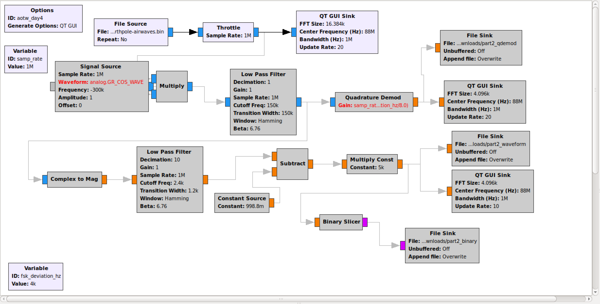
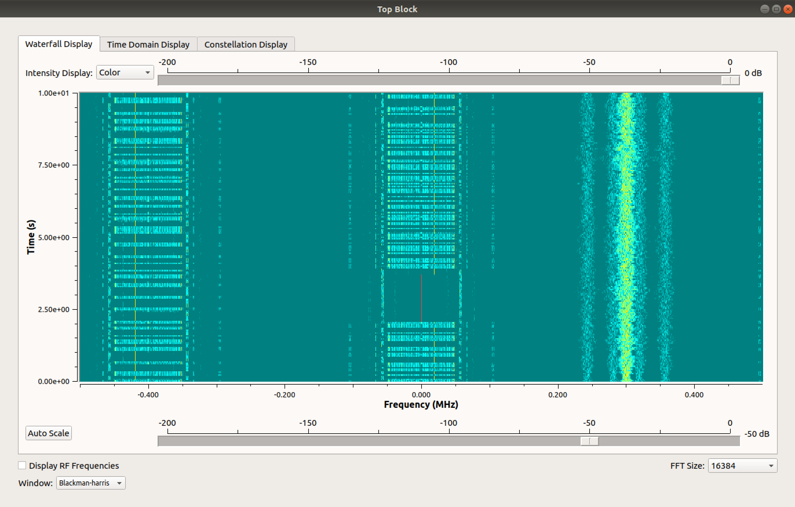
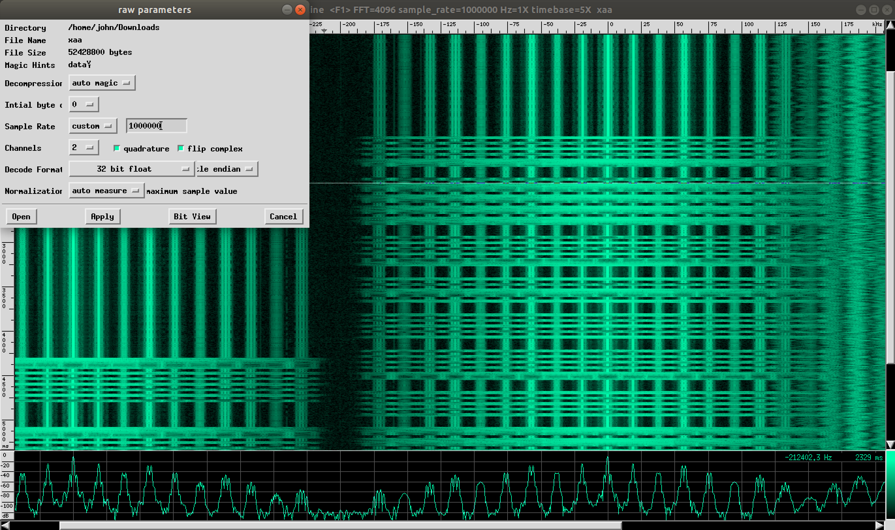
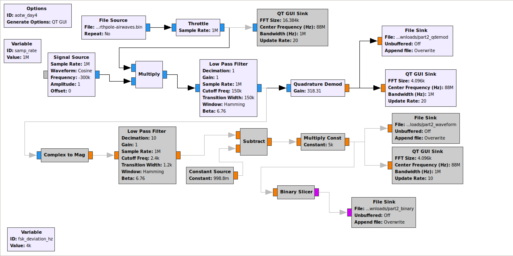
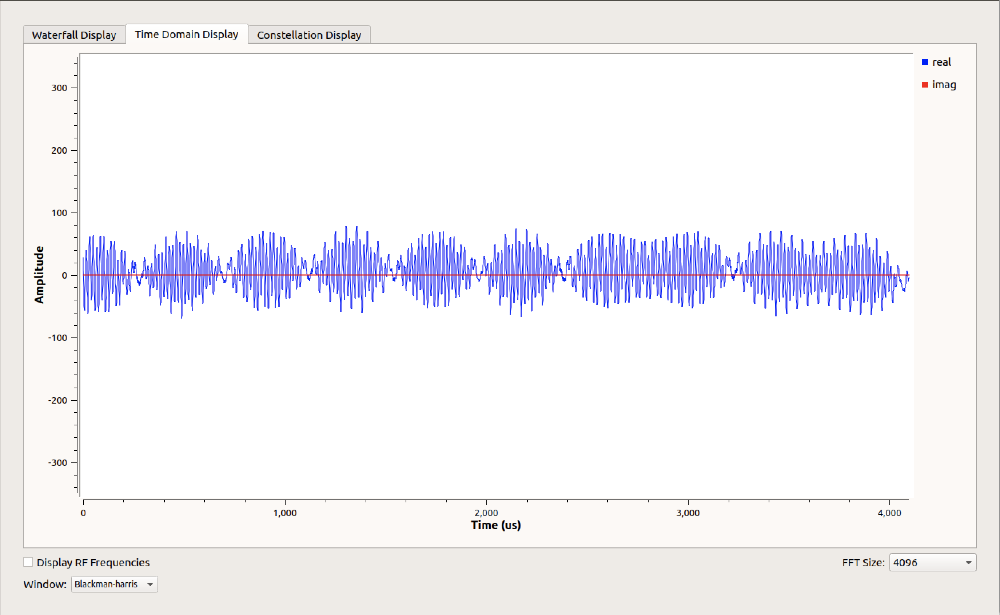
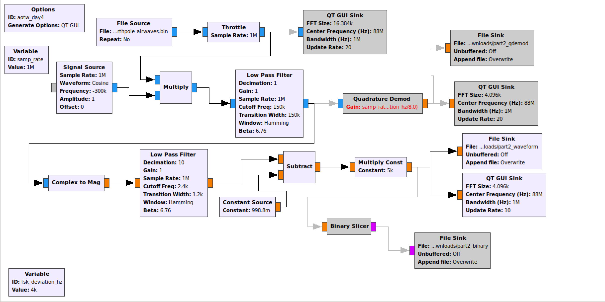
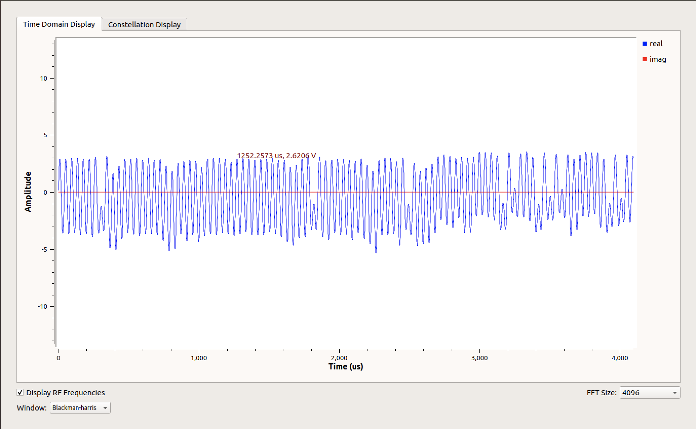
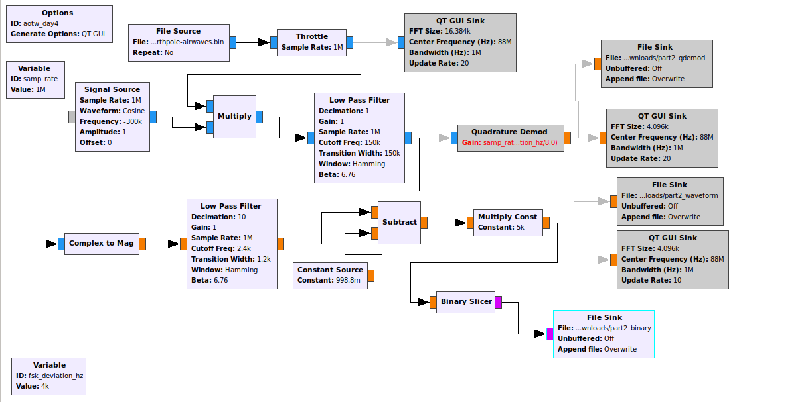

# Day 3 - Northpole Airwaves - forensics, gnuradio

> During our latest expedition to the north pole, one of our scientists tuned her radio to 88Mhz and captured a slice of 1MHz (samplerate = 1M/s) to a GNURadio file sink. Surprisingly, there was more than just silence. We need your help to figure out what's going on.

Download: [d6d0f728ac3ff4848f849b8cf222fb38a14aee870184cc22f2efe01336b2ec17-northpole-airwaves.bin](https://advent2019.s3.amazonaws.com/d6d0f728ac3ff4848f849b8cf222fb38a14aee870184cc22f2efe01336b2ec17-northpole-airwaves.bin)

Mirror: https://drive.google.com/file/d/1EGMEIW-e975_QDpxX76rMdy7NkzFVu--/view?usp=sharing

## Initial Analysis

As the description states, this challenge provides us with a raw signal file we can load into gnuradio. The first thing I did for this challenge was load it up with a pretty basic configuration and look at the waterfall plot. Note: Only pay attention to the active boxes - the greyed-out ones will come into play later.





Looking at the waterfall plot we can see that there are three signals in this file. One in the dead center at 88.0 MHz (the given frequency in the challenge description), one to the left at 87.6 MHz, and one on the right at 88.3 MHz. The first two signals look pretty block-like and in fact we can recover part of the flag from each of them. By adjusting the sample rate and creating a screen recording (to rewind and playback), you can pull out two sets of blocks. Alternatively, we can `split` the original file and open it with [baudline](https://www.baudline.com/) to get a plot we can scroll through:



Representing the large blocks as `-` and the short blocks as `.` the center signal has:

```
....-
.----
....-
..-.
.....
....-
.....
--...
--...
-...
.....
....-
-....
---..
...--
...--
.....
..-.
-....
..---
-....
.....
...--
.....
--...
....-
.....
..-.
--...
--...
-....
.----
--...
----.
.....
..-.
--...
....-
...--
-----
.....
..-.
```

As you might guess, this decodes as morse code to `414f54577b5468335f626535745f7761795f74305f`, which you can hex decode to get `AOTW{Th3_be5t_way_t0_` which looks like part of the flag for the challenge.

Looking now at the left most part of the signal, the pattern is slightly different and contains one large block followed by a bunch of small blocks then a break. If you count up the number of small blocks between large blocks, these counts are all in the range 0-15, so we can represent these as hex as well to get the string `6e67696e675f6c3075645f345f2a5f325f686561727d`. Again, hex decoding this we get `nging_l0ud_4_*_2_hear}` which looks like another part of the flag for the challenge.

Now, while it looks like you could concatenate these two strings to get a flag, there appears to be a part missing in the middle missing. Since we've only looked at 2 of 3 signals in the file the last part is probably in the third signal.

## Part 2

The "Part 2" signal does not contain the same block-like structure, but it does look like its oscillating in the frequency domain. I first chose to center the signal by multiplying it by a Cosine waveform at -0.3 MHz. Next I added a "Low Pass Filter" to focus only on the signal at the center, and finally I ran a "Quadrature Demod" to convert the complex signal into a single waveform. Doing all of this and looking at the signal in a Time Domain Display, we can see the graph below. The Time Domain display scrolls by pretty fast in gnuradio, but the screenshot has a pretty good view of what the signal looks like now.





After researching around a bit, we can see that this looks like [an amplitude modulation signal](https://en.wikipedia.org/wiki/Amplitude_modulation). With this in mind, I backed up a step from the Quad Demod, and instead did a "Complex to Mag" operation. After this, the signal looks like a very clean waveform, but has values almost entirely around 1.0. I added a subtract and multiply operation to re-center it around zero and output it to a file.





Finally, after tweaking the subtract and multiply values, I used a binary slicer to convert it to 1s and 0s and output it to a file:



Looking at the binary file we get a hex dump which looks like:

```
00000000: 0000 0000 0000 0000 0000 0000 0000 0000  ................
00000010: 0000 0000 0000 0000 0000 0000 0000 0000  ................
00000020: 0000 0000 0000 0000 0000 0000 0000 0000  ................
00000030: 0000 0000 0000 0000 0000 0000 0000 0000  ................
00000040: 0000 0000 0000 0000 0000 0000 0000 0000  ................
00000050: 0000 0000 0000 0000 0000 0000 0000 0000  ................
00000060: 0000 0000 0000 0000 0000 0000 0000 0000  ................
00000070: 0000 0101 0101 0101 0101 0101 0101 0101  ................
00000080: 0101 0101 0101 0100 0000 0000 0000 0000  ................
00000090: 0000 0000 0000 0000 0000 0000 0101 0101  ................
000000a0: 0101 0101 0101 0101 0101 0101 0101 0101  ................
000000b0: 0100 0000 0000 0000 0000 0000 0000 0000  ................
000000c0: 0000 0000 0101 0101 0101 0101 0101 0101  ................
000000d0: 0101 0101 0101 0101 0101 0101 0101 0101  ................
000000e0: 0101 0101 0101 0101 0101 0101 0101 0101  ................
000000f0: 0101 0101 0101 0101 0101 0101 0101 0101  ................
00000100: 0101 0101 0101 0101 0101 0101 0101 0101  ................
00000110: 0101 0101 0101 0101 0101 0101 0101 0101  ................
00000120: 0101 0101 0101 0101 0101 0101 0101 0101  ................
00000130: 0101 0101 0101 0101 0101 0101 0101 0101  ................
00000140: 0101 0101 0101 0101 0101 0101 0101 0101  ................
00000150: 0101 0101 0101 0101 0100 0000 0000 0000  ................
00000160: 0000 0000 0000 0000 0000 0000 0000 0000  ................
00000170: 0001 0101 0101 0101 0101 0101 0101 0101  ................
00000180: 0101 0101 0101 0101 0000 0000 0000 0000  ................
00000190: 0000 0000 0000 0000 0000 0000 0000 0000  ................
000001a0: 0000 0000 0000 0000 0000 0000 0000 0000  ................
000001b0: 0000 0000 0000 0000 0000 0000 0000 0000  ................
000001c0: 0000 0000 0001 0101 0101 0101 0101 0101  ................
000001d0: 0101 0101 0101 0101 0101 0101 0000 0000  ................
000001e0: 0000 0000 0000 0000 0000 0000 0000 0000  ................
000001f0: 0000 0000 0000 0000 0000 0000 0000 0000  ................
00000200: 0000 0000 0000 0000 0000 0000 0000 0000  ................
00000210: 0000 0000 0000 0000 0101 0101 0101 0101  ................
00000220: 0101 0101 0101 0101 0101 0101 0101 0000  ................
00000230: 0000 0000 0000 0000 0000 0000 0000 0000  ................
```

As might be clear, this is a little oversampled, so I wrote a [python script](./solutions/day3_solver.py) to convert the large stretches of 1s and 0s into single bits. After staring at this a while, I found a pattern which appeared to repeat every 2704 bits. This pattern didn't repeat exactly but was close enough that I attributed any mismatches to errors in converting the signal cleanly to binary. The repeating pattern is shown below:

```
0x0000 b'9e6ce37e8de911ee8576be78ee9e6ce37e8db281ee8576362fa29e6ce37e8d5e31ee85777f37ee9e6ce37e8c3071ee857743331a9e6ce37a8fe997f1f1fbfffe4b9e6ce3768fe3dc8cce53233d839e6ce3768fb84c8cd8b7272bbb9e6ce3768f54fc9ce0eb272e029e6ce3768f0f6ca99d032b1f389e6ce3768ed60cb9b3bb2f395e9e6ce3768e8d9cacc8b32a679c9e6ce3768e612c9ccd23271e5c9e6ce3768e3abcccc3933330389e6ce3768dd3ec8cd8b73278c29e6ce3768d887ca99d032333489e6ce3768d64ccccee5b7f7f239e6ce3768d3f5dfdffff7f7f239e6ce3768ce63dfdffff7f7f239e6ce3768cbdadfdffff7f7f239e6ce3768c511dfdffff7f7f239e6ce3768c0a8dfdffff7f7f239e6ce3728bec9ff99120cae4369e6ce3768be899d7f924dae5369e6ce36e8face3cb7f249dfc3a9e7ce3de9d02d6ac3d8753c14c9e6ce3528de42dfc7d0eeeac7b'
0x0152 b'9e6ce37e8de911eec776be7beebeeeeb7e8dbaa1ee9d76362fa29e6ce37e9d5f39eec77f7ff7eebeece37e8c3071ee8d77c7331a9e6ce37a8feb9741f1fbfffe4b3eeee3648febfc8c8a43233dc39e6ce3768bb84c8cd8b7272bba9a6ce3768f54fc9ce0eb272e029a6ce37e8f8f6ca99d032b9f381ceee37686c40cb9b32b2f395e9a68a37eae8d9cacc8b228e79cdd6cf3768e612c9ccd23271e5c9e6ce3768e3abcccc39333b038ff6ce3768dd3ee8cd8b73278c29e6ce376ad8e7ca99d03233358de6cf3768d64ccccee5b7f7fa39e6ce3768d3f5dfdffff7f7f239e6ce3768cf67ffdffff7f7f239e6de776ecbdadfdffff7f7f23df6ce3768c511ffdffff7f7f239e6ce376cc0e8dfdffff7f7f239e6ce3728be89ff99120cae4369e6ce772cbe899d7f834caec36de6de76ecfacc75b7fb6dffc3a9e6de7de8d6bd6ac3d8753cd4c9e6ce3d69de5adff7dbeeeed7b'
0x02a4 b'9e6ce37e9de997fec576be78ee9e6feb7ecdf383fec576b62fa29eedeb7ecf5eb5fec5777f37ee9e7ce37e8c3071fec57753331a9e6ce37a8fe9b7f1f1fbfffe4b9e6ce3768fe3dc8cce53233d83be6feb768fb96c8ed8b7a7abffbeeeeb768f55fc9ce0eb27ae0abefeeb768f0f6ca99d032b1f789e7ce3768ede6cb9b3bb2fb95e9e7ce3768e9dfcacc8b32ae79c9e6ce3768e796c9ecd23271e5c9efce37e9ebafcccc39333b078ffece3768dd3ec8cd8b732f8daffecfb76af9a7ca99d03233358fffceb768d64ccccee5b7fff7b9e6ce3768dbf5dfdffff7f7f239fecf3768ce63dfdffff7f7f239e6cf3778cbdeffdffff7f7fe39e6ce3768c511dfdffff7f7f239e6ce3768c3acffdffff7f7f33df6cf37aaff8dffdb1e2cae4b69e6ce3728bee99f7fc34cae4b69e6cf3ef8fbcdb497f345df53a9e6ce3df8d12d6ec3d9753cdce9e6ce7538de4affc7d1eefac7b'
0x03f6 b'9e6de37e8de911ec8576be78ee9e6ce37e8db691ee8576362fa29e6ce3fe8d7eb1ee85777f77ee1e6de37e0c3071ea0d774b3b1a9e6ca73a9fed97fbfdfbffff4f9e6ce776dfe3de8cce53233d839e6def76cfb84c8cd8b7272bbb9e6fe7768f5cfc9ee0eba72e029e6ceb76cf6f6ca99d032b1f7cbeffeff68ed60cb9b3bbafb95e9e6ce3768eed9cacc8b32a679c9e6ce3768e612c9ccd23271e5c9e7ce3769e7abcccc39333b03cbeeee3769dd3ec8ed8b732f8c2beeeeb769ddb7cab9d03233348beeeeb768d64ccceee5b7f7f63be6ce3768d3f7dfdffff7f7f239e7efb7e9efe3dfdffff7fff2bbfeee3768cbdadfdffff7f7f2bbeeef3768c511dfdffff7f7f239e6ce376ac8a8dfdffff7f7f239feef3738fe8dffd9161cef4f69e6efb738ff8d9f7fa7feee67ffeecf36eafbcdb497f241df43abf6cf35e8c02d6ac3d875ec1cc9e6ce3520de62dfd7dce6ea4f3'
0x0548 b'1e6cf37f8deb19ef8537be78ee9e6cf37e8d3293eea576362fa29a6cf3ff8d3691ef85736f37fedf6ce3ff8c3071ee857143171a9e64e37a8fe906f1f1ebfafe4b9e6ca3f68fe3d80cce520325839e64e2768fb84884d8b725222b9e6c63368b74f49820aba72e12de6ce3f40f0f6ea999032b1f3c9e6de3768ed60cb9b3bb2f395e9e6ce3768fed9caec8b32a679c9e6ce7f6de61ae9ccd23271e5c9e6de3768e3abccec3933330389e6ce3768dd3ec8cd8b73278c29e6ce336cd887cab9d032333489e7ce3f68d64ccccee5b7fff2b9e6ce3769d7f7dffffffff7f2f9eede3768eee3dfcf7ff7f7f679efeeb768cbdadfdffff7f7f239e6ce3768c593dffffff7fff2b9e7ce3768e1aadffffff7fff239e7ce376bbe9dffddb60fae43ebe6ee37ebbeb99d7f825cef43fbffefb6ebfedcf6f7f651df43afe6cfb5eaf42dfac3dc757d14e9f6efb738de42dfc7d0eeeb47b'
0x069a b'9e6ce37e8dab19ee977ebe38ef9e6cfb7f8d92c1ce8456362faadfeceb6e8d5e21eea5777f37ee9e6ce37eacb679ee857743331a9f6ce37b8fe997f1f1fbfffe5bdf6cf3778ff3dc8cce53233d83de6ce3768fb85e8cd8b7272bbb9e6ce37fef76fe9ce0eb272e929f6cf3fe8f0f6ca99d032b1fb89e6ce3768ef68eb9b3bb2f395e9e6de776ef8d9eacc8b32a679c9e6ce376ef652c9ccd23271e5cde6ce3768e3abcccc3933330389e6de776cdd3fc8cd8b73278c29e6de776cd8cfea99d03a333dc9e6ce3768d65ceccee5b7f7f239e6de776cd3f5d7dffff7f7f239e6ce776ccee3dfdffff3f7f239e6ce376cf9dbdffffff7f7f2f9e7ce3768d5d3dffffff7f7f23be6ce3768c0a8dfdffff7f7f239e6eeb72cbe8bffb9920caf4779e6ce3728be899d7fb24cae73e9e6ce36e8fedc3c97f2c3df63a9e6ce35e8d0ad6ac3d8753c14cbe6ce3529de42dfc7d0efea67b'
0x07ec b'9eece27e8de901ee8576ae78ee9c6ce37eadb2a1ee8576362fa2be6eeb7e8d5a31ee85777f27ee9e6ce37e8c3071ee857743231a9e6ce37a8fe997f1f3fbfffe5bde6ce3728be3dc80ce53231d929eeefb768fb84c8cd8b727abbb9e6ce3768f54fc9ce0eb272e02de6ce3768f0f6ca99d032b9f389e6ce3768ed64cb9b3bb2f395e966ce3778e8d9cacc8b32a679c9e6cf3768e616c9ccd23270e5c9e6ce3768e3abeccc3933330389f6df3768dd3ee8cd8b73278c29e6de3768d987ea99d03233348966ce376cd64ccccee5b7f7fa39f6da334e53f5dfdffff7f7f239a6ce376ace63ffdf7d77f7f279a6ce3768cbdadfdffff7f7f339e6ce3768c511dfdffff7f7f239e6de3768d0e8dfdffff7f7f239e6ce372cbe89ff99130caed369e6de3728be899d7f824cae4369e6ce26edfacc7497f241df42a9e6cefde8d02d6ac1d8753c14c9e6ca3528d202df87d0ea02478'
0x093e b'9c08e13689e800cc8050b8484c804c03460990014000202405aa9e2c61388d1e31ce85777732ea9a60e23e8c30202e873743131a9c64e36a8fe996f1f1fbffff6bbe6ce1768bc1808cca512315028844a2040ab00c8440a00120900a24426000404c00c049250002142ce3778f5f6cab1d032b1e388e68d3728e560c39a3b82f395e9e6ca9768e8d9cacc8b32a659c9e64e376aee32c9ccd23271e5c9e7ce35e8e3afcccc39333b0789e6ce3368dd3ec8cd8a73058c29e64e37689887ca99d032333489e6ce376a5e4ccccee5b7f7f23966ce3768d3fddfdfff77f7f339f6cf37e8ce6fffdffff7f7fa39e6ce37eacbdadfdfffd7f7f238a6ca3568c1155fdffff5f7f221e2ce3768c0a8dfdffff7f7fa39e65e772abe89ff99530cae4369e6ce3728be899dff824cae4369e6ce76ecdacc3497f241df53a9f6ce3de8d02d6ac3d8753cd4c9e6ce752cde42dfc7d0eeea47b'
0x0a90 b'9e6ce37e8de911ee85f6be78ee9e6ce37e8db280ee8576360f829e6ce37e8d5eb3efcd777f3eee9e6ce3fe8c30f7ee857743333a9e7deb7a8fe997f1f1dffffe4b9e6ce376cfe3dc8cce53233d829e6ce3768fb8448cd8b7272bbbbe6ce3768f50fc9ce0eba7ae469e6ce3768f0f6ca99d032b9f389eeca3768e960cb9b3982f395c9e7ce376868d8cacc8b32a679c966ce3768e602c9ccd23271c5cbe6ceb768ebafccec393b330389eece3769dd3ec8cd8b73278ca9e6ce3768d887ca99d032333489e6ce3769d6dccc8ee1b7f7f239eece3768d3f5dfdffff7f7f239e6ce3568ce63dfdffff7f7f639e6ce3768cbdadfdffff577f231e6ce2768c511d7d27f86d3f239c6ca172841a8dfdf6ff6f7f239c6ce372abf09ff99020c2e4169a4c62728be899d7f8e44ae4369e2cf36f8facd3497f341df43a9e6ce3df8d32d6ac3d8753e14e9e6de3538de42dfd7d0eeea47b'
0x0be2 b'9e6ce37e8de911ea8572f278fa9a4cf35e8db281ce8556162ea29c6ce07c8d5e118e85173f37ee926ce37e8d3071ee857743231a9e6ce3fa8fe997f1d5faffeecf9a6de3760de3d4888e53a33d839e6ce3768fb8ae8cd8b7a72bbb9e6de7768f75bc9ce0eb272e029e6de3768f0e6ca90d022b1f389e6ce3f68ed60cb8b3bb2f395e9e6ca3768e8d9cacc0b32a679c9e6ce376de692c9ecd23271e4c9eefe2768e3abcccc3933330389e6ce3768dd3ec8cd8b73278c29e6ceb768f887c299d032333489a6ce3768f6cccccee5b7f7f239e6ee3768d3f5dfdffff7f7f239e6ce3768ce61dfdfffd7f7f239a6ce3768ebdadfdffff7f7f63beeceb768e517dfd7fff7f7f638e6ce3668c0a8dfdffff7f7f239e6ce1728fe8dffd9120cae4369e6ce376bbe899d7f8246ae636df6ce34e8bacc3497f241df42a9e6ce35ead82deac3d8753c15c9e6ce3528dc42df47d0eeea4fb'
0x0d34 b'9e6ce37eade919ee8576be68ea9e6ce37f8db281ee8566362fa29e6ce37a895e39fc85597d12660e24616306106022003200008b0e34e11003600000a03072ae008004611007e08c0406000010800e2420ab42c022466843128559c10211920582140050601117014b36703a6787be54ce81d58f1c4b1630d94768464c598d1788a70e3450bb0642ce0224189513ce4f3671bb4730d60e6690938f2e4f3651bb471d5e6621c999981c4f3671b946e9f6466c5b993c614f3671bb46c43e54ce819119a44b3671bb46b26666772dbfbf93cf3771bb469faefe7fbfbfbf91cf3671bb46731efeffffbfbe91cf3675bb465ed6deffffafbfb1cf3e71ba06288efeebfdbabf108f162193420546feffbf9fa781cb3671b945b447fcc89065721b4f3671b945f04cebfc10653213c73e71f74ff7e7b4ff961efa9d4f6671bf478979561ec3a9e4a6c73e71ab46f2169e378677523d'
0x0e86 b'cf3775bb47fc98f74ebb5f3c774f3671bf4ed940f742bb1b17d14f3671bf46af18f742bbbf9bf74f3671bf46183af742bfa1d98d5f3671bd47f4cbf8f8fdffff25cf3e71bf5ff1ef3a679c98cf40e7b3309d63ce31e34c79c18cfcc71a719f0be1ae26703699c3843ff33cb94387b2064640868f8c071230990363063c68cc838c073df33cf9e30246222039c699e7c71230998311cf3f73cf64e3cb93cd9e7ef1c75799886266661773cdbc6ed5ba7d99bb57fe3f8809c48e2660d60fcb99d030223003ce9c774ebec98c9ce7bff7e639e4ce2e70c3f9ff9ffff7e7f871c69c67489c639fbfffefe7e031c68e3661c798ff9fffe7e7e031c48c264081019f9fffe7e7e239e5ce3ee18638ff9fffe7eff8f3cc9c26187c83ff3086186c8659e5ce3e61be019b7f10c90e02e3ce9c26c0f0882007f0019e0301c4cc31c080084087b8e33c38c9c4cc2008fec39fc7c0ecca07'
0x0fd8 b'39e7ce3fe9de915fec776befbeebeeee37e8db2b1ee8576363fe39e7ce37e8d7f35fec77f7fb7ee9e6ce37f8e3871ee857743331b9e7ce3fe8ff08bf8f9ffffff4fff2461b247fdffc74e73239c818f3cf1bf3ffd2404481313e79ddf7771bb47aa7e4e70759397014f3671bf57c7b654cf8395ef9c4f7771bb476b065cd9dd979caf4f3671bb5747ce5e65df9573ce4f7671bb4730b6cf66b1938f6e4f3671bf5f5fde7361ec9ccd8e3ff7bef9a274fa023e79cc1e70071b30d93a639e38e7c2d8edd627fbbefde3dd33733b96dfdfe8e79f38ddab6fd77f7fffffffc47ffd9c4ed198877fbfffefefe4738d9c6f91b7e7bfbfffefcfe677cd9c5ec18203bf3fffefefe467ddb8ced9e1d33fffffffefe67bed9e7e71ff1bffb62c595cb6d3cdbc6f557d533aff86997c86dbed9e6dd3fdb86b2ff4c3be9753cdbdebd1a05ad587b2fa792993cd9c6a51bcb5ff8fb1ddd48'
0x112a b'f73cdfdefddfdc11ec84643f7cffdf7ce3bf06d103fe71fb1f37d14f3671bf66af98f7a0599f8dfb679e38ffa2081c7b81df90fdc78e3b739e23e609f9fc7effff98e79c30db87f0e70633e3808fe3cf33f19d63ce0602342981cedee79638db87f97f0e307b89c180871a3099038392004600c08688071210098339c30e59ef9fd8c79f73bebd63877e432438c19ff6479f30db07b8c72e324b8dc78f37f33cdd638e9e7320e0cd8c3e671e38d90274f322262d889c202792389923601f086650c18cb2e79e38df0671e33e73879fdfc0e793bebde3cffeffffffdfdffce78f9c6fd59cc7bfbfffefefe77ffddf6ed1d7b5bfbfffefeff473cd9c6ed18a23bfbfffefefe57fcd9c6ed18151bfbfffefefe473cd9c6e517d13ff32e5195c86d3cd9c7e79ff1d7dff0a6dae1f79e6de77eefaedb497f2c7df63affecf3df8d12e3ce3cc3a9f0e65f34e3ad75e71efeff8f7be'
0x127c b'b1ef79238ffa77a647ba1190fbc7b8f3af19f2368a07be39f9d83e8a792389fe31fb8f72059df89fbaf3a799f330c1873011df0c98e679738fdc7f8e3fe78ffffffc3efbbf3df73fbfe73f39cf8cf6473cb9c7fd3ff39911b14c4c477f79d78eec1ea1f833b9f7ce5ce53cd9c6ed1edfdd73fa06563e713ddfdeed9fac19736777de7afd3cf9c6ed1d1b3d79d36e74c79c1e4ce3778e78699ccd03271ef99e78e36e9c7bbc98c31673e03cbcedc6758fbbe98ef8e7a678c39e78e3edb9e97eb9dd0723b348beefeb768f64ccceee5b7f7f239e6ce37ebdff5dfdffff7f7f2bbeece3768ee63dfdffff7f7f639e6ce3768cfdadfdffff7f7f239e6eeb768e511dfdffffff7ef3cf3cf3bf56438efcffffbfff9dfff679b945f44ffed8f1e7721b4f3671bf7df5cefbfc1265721f7ff7bebbe3eb30d25fd9c77d3ee79b38d7ab71f7bf37e7e8702183cdbebee3fe9dbf8fa1dd'
0x13ce b'd69f73cf9c6fd1bd223dd0efd7dfdddbdddd6ff1b6583dd0aec6c5f453cd9c6dd1abc43dd0aeeee6fddafd9e7ff1861e7ddebee9667da9e6ce37a8fe99ff1f7fdfffe218e2479f38f79dc8e6629911fc39e74f73247d80446ce3f678fb98f26713a0f38fe1e70659316014f36f3bb47c7b674ce89d58f9c4f3679bb476b075cd9dd979cef4f36f1bb4746ce76e6599533ce4f3671bb4730974e6691938f2e4f3671bb471d5e6661c999981c4fb671fb4ee9f6466c5b9d7ce75f77f5bb66c43e75ce99b199a44f3e71bb46b2e76e77efbfbfc9ef3b739963cf9e7fffffffdfc8e7cf9c7ed39ce7ffbfffefefe5f3cd9c6ed197b5bfbfffefefe473cd9c7ed18a23bfbfffefefe5f7cdbc6ed18151bfbfffefefe473cd9c6e517d33ff3224195c87d7dcfdaf38ff8f38ff8678ce4f79c79c34c2f88c0017f2c7bcf38fbecea7e8d0af7ac3de783c14c8e6ce346bde72dfc7f0e'
0x1520 b'fee679ffeefb7e06a080e70073df3ce60e36613a14d304f6c0001217801e766dbfc60c10e640333f1be6062461be041030e740b2219b8c5f2671fdc7f0e3eef8fde7ff65c73271bf77f3863a2300880e4effe310f983ce00020c79c798edc71a789f81f3be28f3be818b00a79b3cfde3cfdb2a6740cac7ee279b78dfa3b5832e6ceeebcfd7a79b3cdda3a3672b323cca9de7279b38ddab99cb3f7348c9c79727db3cdda38eaf3330e4cccc0e279b78ddb377fb23362ddc9f3cb7db38fda36a3faa6740c8ccd2279b7bddab59b3327b96dfdfccf79b38dda34fd77f7fffdfdfe8e79b38dda3398f7f7fffdfdfc8e79b38dca32f6bff3fffefeff5f7ddfdeed9eba7bffffffff7f639e5ce3ee3ceb8ffdffff7f7f2f9eefe772cbe89ffb9161cee4779e6ce3728be99dd7fb24dae5369eeeeb6e8facc3497f241ffc3a9e7ce35e8d02debcff8f79e1ae1f74e1b9c7e634fc3c8'
0x1672 b'6770079cf3c71bf4cf186fe42be1e787e0e06413e079800e704121207000f3c63af1e6f1436433f3f93ef3f7659bfc71838f742aba1998dcf3e71bd47f4cbf8f1ffffffd2e7bb38dda3f8ff213394c8cf60e79f38dda3ee1323362dcdcaeee79b38dda3d73f67383ac9cb80a79b38dfbff3db2a6740cac7ce37db3cdde3bdb3ae6ceecbce77e79f38dda3a3672b33aecaf9e73fbb3cdda39e7be73f48c9c797279f79dfadf7c79938e35c77871fed1c4e91b07de39e3ce78e38e38d38ef9b639f2a6740c8cdd23fdb38dde35933733b96dfdff8e79b38dda34fd77f7fffdfdfc8e69b38d5a3398fff7effdfdfe9e79d79ef9d6fefbfffffffefccf7db9e6ed18a23ffbfffefefe473cd9c6fdde1d7bfffffefefe47bed9e7e717d13ff32345b5cb6d3cd9c6e517d933aff04995c86d3cd9c7dd3f598692fe483beb553cdbc6bd9a0dad5c7b4fa79a993cd9c6ad3bcb5ff8fa'
0x17c4 b'1dfdcbf73ddfcefd9bd263df0aed7cf1dd3cd9c6fd1b6503dd0aec6c5f453cdfdefd9ebc71ee0c77fe27ce1c4ce3fe1860e7ec80660222109c4ce2708fe117f1e1f3fffc039e78e36e8fe39808ce06327b071c48e3640f38498c98660623b31c78e36e1ec0fc18e0c2074e0abeece3768f0f6ca99d032b1f389e6ce3768ed60cb9b3bb3f3b5e9e6ce3768e8d9cacc8b32a679c9e6ce3768e612cbccf2b371e5cbe6ce3768e3abcccd3933330389e6ce3768dd3ec8cd8b73278c29e6ce3768d887ca99d432333499e6ce3768d64ccccee5b7f7f239e6ceb768f3f5dfdffff7f7f239e6ce3769ce63dfdffff7f7f2bbeece3768cbdadfdffff7f7f239e6ce3768c511dfdffff7f7f239e6ce3768c0a8dfdffff7f7f239e6ce3728be89ff99120cae4369f6ce3728be89bd7f824cae436966ce36aafacc3697f245df43a9e6cf35e8d02d6ac3d8753414c9868e3428de42df82d'
0x1916 b'0cee845b1664c1548de110ee8176ba08cc8e6de37eadb081ee0454362ea29f2ce34e0d4a21ae81677d366e1e6ce27e8c3030e684754310129e2ce3fa8fe997f0d1fabff44a9e6ce3760be09884ca51630d028a6ce3760fb04e8c50a6252298122c42724714fcdce4ebe72e029e6ce3768f0f6ca9bd073b5f389e6ce3768fd62cb9b3bb2f395e9e6ce3f68e8d9cbcc8b73a679c9e6ce3768e692c9ccd23271e5c9e6ce3768e3abcccc3933330389e6c63768d53ec8cd8b73278c29e6ce3768d887ca99f0f33734c9e6ce3768d64ccccee5a7f7f239e6ce3768d7f5dfdffff7f7f2b9e6ce3768ce63dfdffff3f7f239e6ce3728cbdadfdffff7f7f239e6ce37684511dfdfffd7f7f239e6ce376bc0a8dfdffff7f7f239e6ce3728be8fffd9160cae4369e6ce3728be899d7f824cae4369e6ce36e8facc3497f241df43a9e6ce3568d02d6ac3d8753c14c9e6ce3528de42dfc7d'
0x1a68 b'0eeea47b9e6ce37e8de911ee8576be78ee9e6ce37e8db281ee8576362fa29e6ce37e8d5e31ee85777f37ee9e6ce37e8c3071ee857743331a9e6ce37a8fe997f1f1fbfffe4b9e6ce3768fe3dc8cce53233d839e6ce3768fb84c8cd8b7272bbb9e6ce3768f54fc9ce0eb272e029e6ce3768f0f6ca99d032b1f389e6ce3768ed60cb9b3ab2f395e9e6ce3768e8d9cacc8b32a679c9e6ce3768e612c9ccd23271e5c9e6ce3768e3abcccc3933330389e6ce3768dd3ec8cd8b73278c29e6ce3768d887ca99d032333489e6ce3768d64ccccee5b7f7f239e6ce3768d3f5dfdffff7f7f239e6ce3768ce63dfdffff7f7f239e6ce3768cbdadfdffff7f7f239e6ce3768c511dfdffff7f7f23966ce3768c0a8dfdffff6f7f239e6ce3728be89ff99120c2e4369e6c83700be819d3f824cae4329a6063428f8043496f040c441a1a48435a8d005680108012804c964400500464253435'
0x1bba b'04a684618664a124052105248534343064042401708110010001101029209e3ce33e8c1e20ac81757707cc98e0c266843841ee056201220800084122000804508150a2d402144ef3778debc888ca51273d839e3cc37e89ba4cacc0b723a383966ce2768e54c49c80e3073c829c64e37e8b0f6c281f0b290f38fb6cf3778e564db9b3bb2f185e9e6ce376a88d9cacc2b36a46989f2cc2768a612c9cc803211e4c9e6ce1768e12a4ccc2923392309e6c22568d90e48cd0b43278c2986ce334ac883ca99d132337089e6863768d64cfcce25b7d77239c68e37ead3f4d7dffff7f7f02966ca1768c24257ddffb7f2f839c74e33a045c04e8fffe2baf110e2461120430c7fcffff3f3f839c74e332448000d4faffffbf11c70c611001c00f78c21061e61a1fe6717187f849e7fc13e1440b4b2071a746d761acbf9204fa1d7f377baf66016b561ed3aff4e24f1671a846f256fe3e'
0x1d0c b'c777423c4b36713f463080d742035f38774e3671bf46f1422302390b13c31d70b5990085081502b986919600042094061000d440808000800a26108d47f44bc050f15f2d61cd34200805002c020508818001482430a9069c02064c010215414d3051bb4fa8de4a4051830100092221b0860182540a118288100900000142010608411c018405020040000002ce5e74d99123400c31f1b347b0965a6690938f2e5f4711b303055e6661cb9998504f3071ba42e976566d5b893421473770bb46c03e54cc819399a5ce3671bb06a27666730c3bb90188063182428f2efcff3f97bb91c33471bf56631efad7febdbf91470651bb065ad43eb977af9fd1c73271be50688edbedd6bbbd908f2671b3421546eeb6ff3fbf93cf3671b905f45dfcc8106572194f0661a141f44ccbf81265731b5fb77db775c729a4bf9a26fe1d6fb671afc6816b5016c3a8e0a64e3671a946f21efaae'
0x1e5e b'8777523dcf3631b746f488f742bb5f3c774f3661bf46d940f742b91b17d14f3671bf46ef1cf742bfbf9bf74fb679af461e18f546bba119854f3671bd4ff2ca38e8f9ff75254f36713b47f14e466729849ac18f3671b202482602690b9191058f1671fb47aa7e4b74749396014f3e71ab4d079454ce81948f8c4f2641bb47621644d995d79caf4f3e71bb4f64ce4664499533ce4f3671ab4730130e3291130d2e0f3671bb6f1f1e6c61cd99c80c4d2471b346f9f6c66c79993c614d36f1bb56e43e54ce8191d9a45f7771bb46b266ee372dbfb7918736d19b469f8ef6f7f7b7b791c73671bbc7573eeeefff8f9f91cf3671bb565ed6feffffbbbf9ddf3679bbc6288efefdf5949491462661aa460546f2f7bfb3bf11c33671b901300f9cc89005101b0d14109855e44ce8c80261421a473671b64242212033920a7b194f36712f16813bd71e83a9e2ae4fb671a946f217fe3e'
0x1fb0 b'877f533dcf7671bf76f6bcf746bbffbe7f6fb671bf56d944f742bb1f17d75fb6fbbf76ef1cf7c2bbbf9bf74f3671bf461838f742bba1998d4f36f3bd77f6cbf8f8fdffff3defb671bb47f1ee46676b999ec9cfb671bb67dc2e66ee5bf39759ef3671ff47ab7e0e707593b7476fb6fbbbe787be75cef9979f9d4f3671bb476b065cd9dd979caf4f3671bb67c6ce7664599533cfcf3e71bb4730964e66d39bafae4f3671bb471d5e6765c999981c4f3671fb4ef9f6466c5b993c614f3671bb46d43e54de81919db4cf3ef1bb66b2666ef7adbfbf91cf3671bb479faeffffffffbf91cf3e71bb4e731efeffffbfbf93cf3671bb465ed6feffffbfbf91cf3671bb66288efeffffffbf95df7675bb460576feffffbfbf91cf3e71b965f64ffcc99075771b4f3671b947fc6cebfc126d729b4f3671b77fd661a4bf920efa1d4f3671af46816b561ec3a9e8e6cf3e71a946f216ff3e'
0x2102 b'8f77533dcf3671bfc6f4a8f75afbdf3c77cf3e71bf56d940f742bf1bd7dd4fb678bfc6af18f75afbbf9bf74f3671bf56183cf742bfa39b9d6fb679bd47f4cbf8f0fdddfb25ce2651bb47b1c6464739919ec94d1631bb47dc26466c4b8091ccc536f1bf57aa2c0e5071f3970163b470b94585b61c5f81958f9c4d2673bb656b0e58d95d979caf4f3671bb4746ce5264599533cf4f3671ab673096466691b3873eef32719a435d5e6661c999881c4f3673bb66eff6466c5b993c716f3671bb46c53e54ce819199a44f3671bb46b26666772dffbf91cf3671bb4ebfeffeffffbfbf91cf7675bb67f35efeffffffbf91cf3e71bf4e7ed6fefff7bebb91cf3677bb66aa9effffffbfbfb1cf3671fb460546feffffbfbf91cf2671b945f44ffcd8f1e77efbcf3673b965f5cefbff9665761b4f3775b747d661a4bf920ffe3d4f3671af46816b5e5fc3a9e0ae4f3671a946f216fe3e'
0x2254 b'c777523dcf3673bf7ff78eff42bb5f7d775f7775bfc7d940f742bb9b1ff1cf3e71bf5eef1cf743bfbf9bf74f367dbfc71838f742bba199edcf3ef1bd47f4dbf9fffdffff25cf3671bb47f1ee46672b919ec1cf3671bb47de3e566f5f9395ddcf3679fbc7aa7e4e70759bb743cf3671bb4787b675ceb9958f9c4f3671bbc76b66dc59dd979cef4f37f1bf4746ce576459d53bce4f3671bb4730964e6691979f6f4f3675bb471d5e76e3f9bb983c4f3679fbc6e9f6466d5b993ce14f36f1bb47cc3e54ce89b19da54f3661bb46b26666772dbfbf91cf3671bb469faefeffffbfbf91cf3671fb46731efeffffbfbfd1cf3673bb66ded6feffbfffbf91cf3671bb5e2a8ffeffffbfbf98df3679bb461546feffffbfbf91cf3671f94df44ffcd89a7d729b4f3671b945f44debfc1265761b4f3671f767d6e1a4bf920efa9f6f76f3af46816bd71ec3ede4a44f3671a946f216fe3e'
0x23a6 b'8777523dcf3671bf46f488f742ba5f3c774f3e71ff4ed9c2ff62bf1b77c15b2771af46bf18f74abbaf9bf74e36719f4418b07640b8a1918d69a664354184010838fdcd7c25cc04610941e1ca406109001640431650534250024240439211d14010119210221e1050101293015b7771ab45839054cca0878d8c4d32d01344638258c8d8039c014576203bc644c61400199511cfcf3670ba4610824e4691938f2ecc167193401d506661c995980c4d2471ab54e9a4444458116949493679bb06c43e1408819099a54f3461bf76b26e76672dbfbd91cf0671bb469faefef9fbbfbb918f3661bb46731ef0cffdff8f91ef3671bbc65ed6fcfbdfbfaa11cf3651bb46088694c4339eb611cdb631bbc61d46fefbfbbcb6d1ce2671b945244ffcc89861721b4f1671b904f54cebe81265720b4fb2f0b347d661a4bf9227fa1d4d30112346816b561e83a9e0a64f1661a946d216d612'
0x24f8 b'8675523ccf3670ab06f48aff72bb5f3dd64f3631bf465958f75abb9b17d14f3670bf06a71a35429b3b19c74c3271bf461a38e742baa199ad4f36f1bd4ff4cbb8fafdffff258d36513b47f0ee467529919e81cf34413b43dc2046241b9395ddcf367023442866066474c39401093031330681821082009400940a2260b8010800180010831c27402200a343c24e516059152148450631c305308046608181820e4a1011be570d5e4661c181911c5fb755bb06c9e2446c538b3c610e00619242c41e504200108800482640a90680400204008a100081123099020f86733c6799d388c35338b8e33806df7ffdcf8f80830020890263ce7fefffffdf88e79f38ffc630c67e7df7df9df1c61230c963079e7ffffedf1f80e78738b8c6d803b840482eb105a299389ca23e2671f60930b90d378b38db83ea30d21d49075d0e87993896a940858b0b41d0f052250b08d0a35009751c'
0x264a b'01bb281ea71a39de327a0433e14dbc9e32a699389f8360a07b21058d89e8278b14deb3578c7ba55ddfcdfbb79b38ffa3288e7ba17dc6dce7add338de81fb04bc5e7effff92e39b18dda3f8f72a3194c8df61e79b20ccb3ee1523362de9caeee78b38dda3d43f27382ac9ca80a59b38cdb2c3cb226740eac7cea79f78f5a3b5832e65ef4bc6d7afbbbafda3a36729322cc2996727933855a219cf263348894797263b3b99a38ea32330e4cccc0e679b38dda334fb23362dc89e20a6bb38dda3621d6a6650c8cc92279a388da21133331396dfdfc8e79b30dda30d977f7ff9ddddc8e79968cda9398f6d6b4d59cbc869fbbaf9a32d69597bfbdfdfd8e79b3a9d2314475f7fdfdfdfc8e79b38dda30ae37f7fffdfdfc8e79b3bdfb6faa7ec644832bb0cbd99bc5ca2fa2675fe3972b90da79b38dba2eb36d25cc8057d1eaf9b3c77e340b5ab1f61d4f053279b38d4a379097f1f'
0x279c b'400a091ee78a38c7a32200232111ad1033279330918100a07981198989c8818808df80548c08a004c6c4e32793200222001033a111908486a313305aa3ba61fc7c7ef5ff92e79b38dda3f8f7233394c8cf60e79b38dda3ee132336adc9ebeeffdb38dda3d53f67383ac9cb80a79b38dfa3e3db2a6740cac7ce27db3cdde3b5832e6ceecbce57a79b38dda3a3672b322cca99e7279b38dda3984b273348c9c797279b38dda38eaf3330e4cccc0e279b38dda37cfbe33e2dcf9e30a79b78dfb3639f3a6740c8ccd227db38dda35933333b96dfdfc8e79b38dda34fd77f7fffdfdfc8e79b38fda339af7f7fffdfdfc8e79b38dda32f6b7f7fffdfdfc8e79b38dda314457f7effdfdfc8c71b389da302a37777ffdfdfc8e79b38fca2fa27fe7c68b6b90da79b38dc22fa2675ef0d32990da59b20dba3eb70d65fc9077d0ea79b3897a340b5ab0f28d0f01b279a38d4a3790b5f1f'
0x28ee b'41b3a91ee79b3847a37a447ba15daf9e3ba79b30df216ca07ba15d8989e8a39b28dea1578c7ba15cdecd7aa79f38dfa70c1d7fb1dfdcfcc6bffbbadea3fa65fdfc7effff9ae79b38dfa7f8f72f33d7c8efe6e7fb3edda3ee13233625c9ceeee79f38dda3d53f2738fe99eb86bf9b38dda3c7db6bef50cbcfdee79f38dfafb5832e6ceecbefd7bffb3cdde3a777eb3e3ccb99e7279b38dfafb9e71fb1c60ce3c79ff99e7ce18617119278e7ce16438d38ef9d78ff9d3b86c40e101ff99c5ef1b10f85338061ee7863cd18cf99799b9199824fefc673c99c6c8127c33fbfffefcfe06289184c9139873d7feecfcd4013c19c6ee187bcbf9ffcefaf70f3cd1c62c00a83bdbdfccfa16413c5946e518151b39efccfcfe473cd1c465069133b322409448610cd1c24516c1222fc04995c80d248804851618848298400ac010181840191a410d586b0e21820828c10c25838840803'
0x2a40 b'a101400e30cd8c69c18520019024d70c34d3041040d0c2501840ae00419041c90c66c3abc6bdd0aeefe6fdd3cd9c6fd9860e3dd0aee8e76f53cf9c6f51fd32ff3e3fffffc973ccfc6ed9fdfbb199ca6467bc73cd9c6ed1f709939b77e6fd7777dddd6ef1ea9fb3df1d64e5c053cd9c6ed1e1ed9533a06563e713cd9f6ef1dacd97367765e72bf3cd9c6ed1d9b3979977675cf393cd9c6ef1cf2db9c8802061ed99e79e37c1c30b888c71e73a0381e68e3660f93e90cb8273c70c39e79c77c79827c619e1a63e3183ec8c2e70d70cf8cfcd77f7fc71e69c67c083e59f9ffbeff3e231e68c2640ce4dffdfffe7e7e031c69c67469bf1df9fffe7f7e039f4ce2e708101bdd7bfe7a7f031c61c63c418619f9fffeffbe239e4c422209619f7961c2c8e5361e6ce27ac9c499539820cae432da6c636e8facc3497da51cf432946ce31e8506d6a01c8643804c9e6c63420d600de80'
0x2b92 b'd0cc424af9c74e11e44e018e78638dbbc720000413f0ef0c36e41920005830a75a73a4082106342b9f39fff6f1661bf461838d652bba0998d4e36f1bd47e4cbf8fcfdffff25cf36718b4731ce462528919cc1df33e6bb65dc26006c5b93857dc92671b9472ade4e70f79317814f32f1bb4787be55ce81d58e9c4f3671bb4769c65cf9df979daf5f37f3bb45c6ce566459d53ffa4f1671bb4530965e629091870c456670bb471c54e660c1911814cf3271b242e9f6426c5b993c614d3671bb46c43e57cca0939db4cb2c71df0e31c72e33878fbf80cf813419e38f9666647fd79c98e11a38d302110f7e77ef010e80c5133039010e02627f429e8c00c31010910200025346268449c800933015a10022400f78c79e80648830c808f8828e30051d54c20000880c306003388000080482438410698430900821848000071008040841001875860030001041c20c30000c00800'
0x2ce4 b'00024020000828a37e8de911ee85f6be78ee9e6ce37e8db699ef8576362fa29e6cf27f8d7e31e681777f77ee9e6de77eedb679ef857f43371a9f6ce37a8fe997fdf1fffffecf9e6de77ecfe7dcacce53233d939f6ce3768fb84c8cd8b73f6bbf9e6ce3748f56fcfdee79e306014f3671fb879bf30066408a9fef8f3a7b9d23e70a7ccfdcf3ce1f071238f9873ae7de64e98e39e70f3af39d639002062318d1c71e07123099031c6f2630e08cfcce2f9bf8ddb374fb23362dcd9e38a79b38dda66217ae7f40c8c492271b385c23482101399647cf08e618289ca344d30c5398db9cc004131851a2210f634e3f431808248238e5a222636f1ee79c1acac4b92b1d61864d676f3c5d8e98e50a38910202831c3293c6d8c80212185820c220684040202901218c38c588302624f0033230838c130050800b10c04f19432000048a280380a05204020048080100c99d6a51bc85bf'
0x2e36 b'8f29ddd68f73cd9c6fd1bd223dd0aed7cf1dd3eddf6ff1f65c7dd6bee6c7fc73cf9c6fd7bbc73dd0aeeff6ffdffd9e6ff1861e7dd6bee9e67353cd9c6f5dfdf3fe3eff7fffcb7ffd9e7ed1fc3dc08fcc71e79871ce9c67ecfbe18ebdc37460bb31f4ce2e78e40f898c0e22f6e861c68c274cf0e78eb1c33e31e719e5ce3e40cc4083133be3e719e1c48c2648f0d38ed88220847189c5ce3f61c614d1ce9073e7fde3ce9c67ccf3c38c987322220301c48e3c619e3c818d12630718418c1c024030870c30c004220008618e3a618408c08484b3841071c618236841454d49c39ca1f20880061100062010d2d290c65219004a336869ca4d0d5c6595a239e08634200400068638f3567010020a134850cb1c79e32c65c21961863921ae08f59000040602408e00470830889973820c2043096004200848002086b041100029e6ce65f8308f084208410016d9e3ce3409dc40cf'
0x2f88 b'c390ee6a45b366ce3728de951ee8576b678ca9e2ce37e3df281ee8556342fa2906ce33c8d5631ee8175cf37ef8e68e36e30d37c6a877f63b3128e2ce37a8ff9f3f5f1fbfff64b9e7ce37eafe05c8cca5223a79bf66cc1748fb8698cd8f7272bbb9e6ce33ebf56fc9c40e2050e028e0ce3248c076ca195012316389e64e37626560c3833b92f3d1c1644a0268e05920cd893204780906de1748ee52c1ccd38279e5c5f0cf3f78e3ab68ce1c31300389c20e33a85c22c8440350078c00a64a0160d0074003c00033000984887340160004cc602ef0d238228810604235d807bc41d70031c00075005e6185d0011600720024c00120800ad08bfc60f72021c000170014000fc0023400031842c804600020c10f3840a41021640853003a808600000820430022c20020020800028000a40069e6cc30e8facc3497f241df47a9e7ce35e1d63d6ac7d8753c14c9eeceb528de42de'
0x30da b'c7d2eeeac7b9e6ce37e8de995fee77ebe78ee9e6cef7e8fbee1ee8576362fa29e6ce37e8d7e31ee85776f37ee9e6ee37e8c3071ee0577c3335b9e3ce37e1feb97f1f3fbfbf64b9e6eeb768febf58cde53233dc39e6ce3768fb94cbcdbbf37e39d9e66613bc79c7dce70718712018e3ce1a70f07a6188c01010f1c1265613a064a04189979871ceb8e3c613a16c79cb4c31830228c0a437c73872c200c0400070e6f8638c13006180e64c20c31d0100e0400320651e006480100280000040130040016508800009180430651b9462240602405af39918f30718e22d7acfac3dc3a9f91c912013146392bca2c250c38c18f30e1b802141236b7de3087104706582bc608efce1bf8082d818c30418f20850430f3be3187106606102040804194000165721b4f3673b965f44cebfe1a65f61b6fb679f747d663acbfd30efa1d4f3673af76877f779edba9e6b66fb671a946f2d6f'
0x322c b'e3e877f5037ce3675bb46f698f7423a5f3c774f2671bf46d900f742bb1b17d14f3671bf46af18f746bbbf9ff74f3671ff4e18faff62bba1998d4f76f5bd47f4dbf8fcfdffff35cf3e71bb47f1ee4e67af99ffc7df77f1bb47dc26c66c5b9395ddcf3e71bb4faafe5e71779bd7034f3661bb4787b654ce91958f9c4f3671bb476b065cd9dd979caf4f3675bb4746fe566459953beecf3e71bb4730964e6791918b2e473671bbc71d7e6661c999981c4f3671bb4ee9f6466c5b993c614f3671bb46c43e54ce819799e5cf3671bb46a06676772db7ff904f3661bbc69faabefff7bfbef1ce3671a946711efebfffb3ff954f3661bb441ec6b2fffb3fbf81cf3671ba46298efeffbfbfa799efb6793bc60946fe9fffbbbfd1cf3671bd65f74ffcc99865f21b4f3671b945fc6debfc1265721b4f36e1b777d661a4bf9a2efa1d4f3671af46816b561ec3a9e0a64f3671a946f21ef'
0x337e b'ebe0777423dcd3671bfc6f089f742bb4f34774e3651af42d94071463b1316d14f16619946bb189e42339d32774e36f18c661818f702bba1198d4f3651bd45f4cbf8f8f5ffffa7cf36f1bb47f1ee476739f19ec1cf3671bb4ffce74e6c5b9395ddcf77f7bb67ae7e6ff675d39711cf3671bb4787f75cee839daf9e5f77f7bb67ef065cd9dd979caf4f3671bb4746ce5664599533ce5f77f7bb6734964f6eb1d38f3e4f3671bb4f3dde7e61cf99f99e5f7775bb47e9f6466c5bdb3c71cf3e71bb5ee5be5cef879999a44f3675bbc7be76e77f3dffbfb1cf3e71bb469faefeffffbfff95dff77dbbc77f3effffffbfbf91cf3671bb465ed6feffffbfbf91cf377dbbc72c8efeffffbfbff1cf3e71bb460546feffffbfff91cf3671b9c7fc6ffec89065721bcf3e71bd45f44ce3fc1265721b4f3671b747d661a4bf938efa7dcf3671af46816f76dfcfb9e0a64f3679a9c6fa77f'
0x34d0 b'e3ee7f75a7dcf3671bf46f488f7c3bf7fbf7f4f3671bf46d940f742bb1b17d14f3671bf46af18f742bbbf9bf74f3671bf461838f742bba1998d4f3671bd47f4cbf8f8fdffff25cf3671bb47f1ee466729919ec1cf3671bb47dc26466c5b9395ddcf3671bb47aa7e4e70759397014f3671bb4787b654ce81958f9c4f3671bb476b065cd9dd979caf4f3671bb474'
```

From here, I combined all of these repeats into one by taking the most common bit value among them and found that this 2704-bit pattern had some similarities every 104 bits. These 104-bit chunks look very structured, but sadly I missed the obvious decoding here and didn't finish the problem before the competition ended :(

```
b'9e6ce37e8de911ee8576be78ee' b'\x9el\xe3~\x8d\xe9\x11\xee\x85v\xbex\xee'
b'9e6ce37e8db281ee8576362fa2' b'\x9el\xe3~\x8d\xb2\x81\xee\x85v6/\xa2'
b'9e6ce37e8d5e31ee85777f37ee' b'\x9el\xe3~\x8d^1\xee\x85w\x7f7\xee'
b'9e6ce37e8c3071ee857743331a' b'\x9el\xe3~\x8c0q\xee\x85wC3\x1a'
b'9e6ce37a8fe997f1f1fbfffe4b' b'\x9el\xe3z\x8f\xe9\x97\xf1\xf1\xfb\xff\xfeK'
b'9e6ce3768fe3dc8cce53233d83' b'\x9el\xe3v\x8f\xe3\xdc\x8c\xceS#=\x83'
b'9e6ce3768fb84c8cd8b7272bbb' b"\x9el\xe3v\x8f\xb8L\x8c\xd8\xb7'+\xbb"
b'9e6ce3768f54fc9ce0eb272e02' b"\x9el\xe3v\x8fT\xfc\x9c\xe0\xeb'.\x02"
b'9e6ce3768f0f6ca99d032b1f38' b'\x9el\xe3v\x8f\x0fl\xa9\x9d\x03+\x1f8'
b'9e6ce3768ed60cb9b3bb2f395e' b'\x9el\xe3v\x8e\xd6\x0c\xb9\xb3\xbb/9^'
b'9e6ce3768e8d9cacc8b32a679c' b'\x9el\xe3v\x8e\x8d\x9c\xac\xc8\xb3*g\x9c'
b'9e6ce3768e612c9ccd23271e5c' b"\x9el\xe3v\x8ea,\x9c\xcd#'\x1e\\"
b'9e6ce3768e3abcccc39333b038' b'\x9el\xe3v\x8e:\xbc\xcc\xc3\x933\xb08'
b'9e6ce3768dd3ec8cd8b73278c2' b'\x9el\xe3v\x8d\xd3\xec\x8c\xd8\xb72x\xc2'
b'9e6ce3768d887ca99d03233348' b'\x9el\xe3v\x8d\x88|\xa9\x9d\x03#3H'
b'9e6ce3768d64ccccee5b7f7f23' b'\x9el\xe3v\x8dd\xcc\xcc\xee[\x7f\x7f#'
b'9e6ce3768d3f5dfdffff7f7f23' b'\x9el\xe3v\x8d?]\xfd\xff\xff\x7f\x7f#'
b'9e6ce3768ce63dfdffff7f7f23' b'\x9el\xe3v\x8c\xe6=\xfd\xff\xff\x7f\x7f#'
b'9e6ce3768cbdadfdffff7f7f23' b'\x9el\xe3v\x8c\xbd\xad\xfd\xff\xff\x7f\x7f#'
b'9e6ce3768c511dfdffff7f7f23' b'\x9el\xe3v\x8cQ\x1d\xfd\xff\xff\x7f\x7f#'
b'9e6ce3768c0a8dfdffff7f7f23' b'\x9el\xe3v\x8c\n\x8d\xfd\xff\xff\x7f\x7f#'
b'9e6ce3728be89ff99120cae436' b'\x9el\xe3r\x8b\xe8\x9f\xf9\x91 \xca\xe46'
b'9e6ce3728be899d7f824cae436' b'\x9el\xe3r\x8b\xe8\x99\xd7\xf8$\xca\xe46'
b'9e6ce36e8facc3497f241df43a' b'\x9el\xe3n\x8f\xac\xc3I\x7f$\x1d\xf4:'
b'9e6ce3de8d02d6ac3d8753c14c' b'\x9el\xe3\xde\x8d\x02\xd6\xac=\x87S\xc1L'
b'9e6ce3528de42dfc7d0eeea47b' b'\x9el\xe3R\x8d\xe4-\xfc}\x0e\xee\xa4{'
```

## RDS

After the competition I got a hint that this final signal was a [RDS or Radio Data System](https://en.wikipedia.org/wiki/Radio_Data_System#Group_Type_2_-_Radio_Text) signal. This encoding uses 104-bit blocks organized as 4 sections with 16 bits of data and 10 bits of check. Immediately after realizing this, I saw that the blocks I identified above were indeed RDS, so pulling out 16 bits of every 26 gave and hex decoding gave:

```
0x6193 0x5c8 0xe117 0x5061 b'\xe1\x17' b'Pa'
0x6193 0x5c9 0xe117 0x7274 b'\xe1\x17' b'rt'
0x6193 0x5ca 0xe117 0x2032 b'\xe1\x17' b' 2'
0x6193 0x5cf 0xe117 0x2f33 b'\xe1\x17' b'/3'
0x6193 0x15c0 0x80e0 0x0 b'\x80\xe0' b'\x00\x00'
0x6193 0x25c0 0x3733 0x3730 b'73' b'70'
0x6193 0x25c1 0x3732 0x3635 b'72' b'65'
0x6193 0x25c2 0x3631 0x3634 b'61' b'64'
0x6193 0x25c3 0x3566 0x3538 b'5f' b'58'
0x6193 0x25c4 0x3464 0x3431 b'4d' b'41'
0x6193 0x25c5 0x3533 0x3566 b'53' b'5f'
0x6193 0x25c6 0x3633 0x3638 b'63' b'68'
0x6193 0x25c7 0x3333 0x3313 b'33' b'3\x13'
0x6193 0x25c8 0x3732 0x3361 b'72' b'3a'
0x6193 0x25c9 0x3566 0x3733 b'5f' b'73'
0x6193 0x25ca 0x3331 0x2020 b'31' b'  '
0x6193 0x25cb 0x2020 0x2020 b'  ' b'  '
0x6193 0x25cc 0x2020 0x2020 b'  ' b'  '
0x6193 0x25cd 0x2020 0x2020 b'  ' b'  '
0x6193 0x25ce 0x2020 0x2020 b'  ' b'  '
0x6193 0x25cf 0x2020 0x2020 b'  ' b'  '
0x6193 0x35d0 0x66 0xcd46 b'\x00f' b'\xcdF'
0x6193 0x35d0 0x6280 0xcd46 b'b\x80' b'\xcdF'
0x6193 0x45c1 0xcb68 0xf882 b'\xcbh' b'\xf8\x82'
0x6193 0x85cb 0x953c 0x2b0f b'\x95<' b'+\x0f'
0x6193 0xb5c8 0x2038 0x4456 b' 8' b'DV'
```

Finally, reading the text off we have: `Part 2/3`, `7370726561645f584d41535f63683333723a5f7331`, which obviously decodes to the final part of the flag `spread_XMAS_ch33r:_s1`

