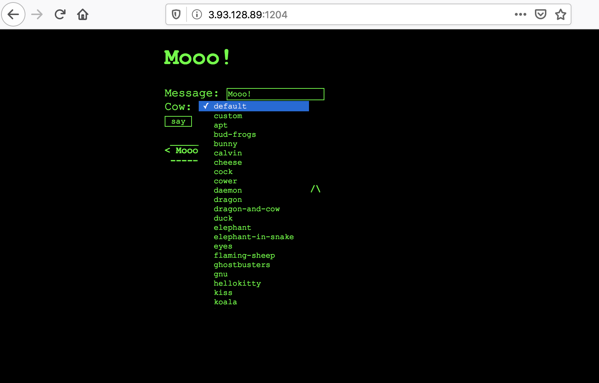
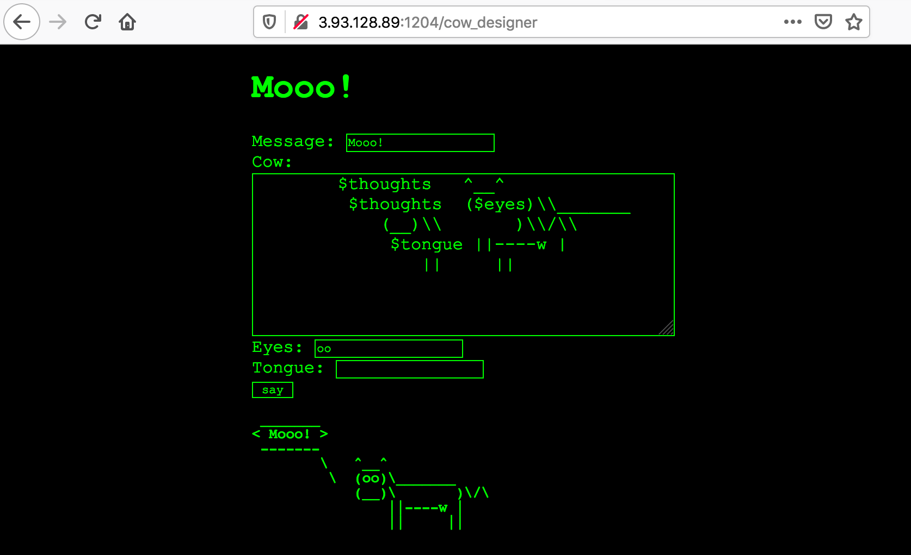
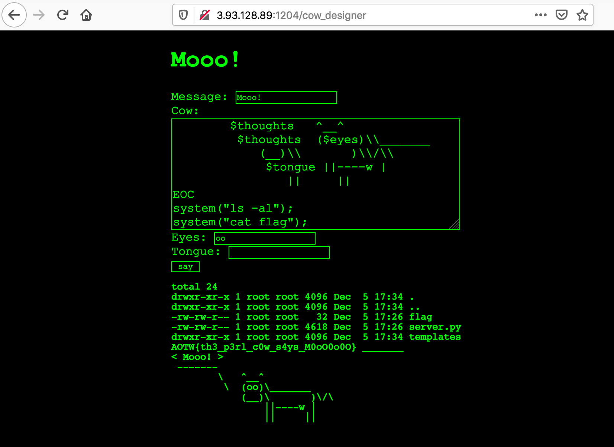

# Day 4 - mooo - web

> 'Moo may represent an idea, but only the cow knows.' - Mason Cooley

Service: http://3.93.128.89:1204

## Initial Analysis

Going to the main page gives you a prompt with a message and a type of "cow". Inputting any text, and then selecting a cow will call the `cowsay` Linux utility with one of the cow types included in the package.



I tried for a while with various command injection attempts both in the cow type (via manual query crafting), and also in the message, but had no luck. Without any success I pulled the `cowsay` ubuntu package source to see if I was missing something in the 

```
$ docker run -it ubuntu
root@f7e8a2ab666c:~# apt install cowsay
root@f7e8a2ab666c:~# apt-get source cowsay
root@f7e8a2ab666c:~/cowsay-3.03+dfsg2# ls -al
total 68
drwxr-xr-x  5 root root 4096 Dec 27 16:25 .
drwx------  1 root root 4096 Dec 27 16:25 ..
drwxr-xr-x 22 root root 4096 Dec 27 16:25 .pc
-rw-r--r--  1 root root  931 May 29  2000 ChangeLog
-rw-r--r--  1 root root  385 Aug 14  1999 INSTALL
-rw-r--r--  1 root root 1116 Aug 14  1999 LICENSE
-rw-r--r--  1 root root  445 Nov 12  1999 MANIFEST
-rw-r--r--  1 root root 1610 May 28  2000 README
-rw-r--r--  1 root root  879 Nov 12  1999 Wrap.pm.diff
drwxr-xr-x  2 root root 4096 Dec 27 16:25 cows
-rwxr-xr-x  1 root root 4664 Dec 27 16:25 cowsay
-rw-r--r--  1 root root 4693 Dec 27 16:25 cowsay.6
drwxr-xr-x  4 root root 4096 Nov 22  2017 debian
-rwxr-xr-x  1 root root 2275 Nov  1  1999 install.sh
-rw-r--r--  1 root root  631 May 27  1999 pgp_public_key.txt
root@f7e8a2ab666c:~/cowsay-3.03+dfsg2# ls -al cows
total 212
drwxr-xr-x 2 root root 4096 Dec 27 16:25 .
drwxr-xr-x 5 root root 4096 Dec 27 16:25 ..
-rw-r--r-- 1 root root  115 Dec 27 16:25 apt.cow
-rw-r--r-- 1 root root  584 Aug 14  1999 beavis.zen.cow
-rw-r--r-- 1 root root  286 Aug 14  1999 bong.cow
-rw-r--r-- 1 root root  310 Aug 14  1999 bud-frogs.cow
-rw-r--r-- 1 root root  123 Aug 14  1999 bunny.cow
-rw-r--r-- 1 root root 1127 Dec 27 16:25 calvin.cow
-rw-r--r-- 1 root root  480 Aug 14  1999 cheese.cow
-rw-r--r-- 1 root root  181 Dec 27 16:25 cock.cow
-rw-r--r-- 1 root root  230 Aug 14  1999 cower.cow
-rw-r--r-- 1 root root  569 Aug 14  1999 daemon.cow
-rw-r--r-- 1 root root  175 Aug 14  1999 default.cow
-rw-r--r-- 1 root root 1284 Nov  3  1999 dragon-and-cow.cow
-rw-r--r-- 1 root root 1000 Aug 14  1999 dragon.cow
-rw-r--r-- 1 root root  132 Dec 27 16:25 duck.cow
-rw-r--r-- 1 root root  357 Dec 27 16:25 elephant-in-snake.cow
-rw-r--r-- 1 root root  284 Aug 14  1999 elephant.cow
-rw-r--r-- 1 root root  585 Aug 14  1999 eyes.cow
-rw-r--r-- 1 root root  490 Aug 14  1999 flaming-sheep.cow
-rw-r--r-- 1 root root 1018 Aug 14  1999 ghostbusters.cow
-rw-r--r-- 1 root root 1054 Dec 27 16:25 gnu.cow
-rw-r--r-- 1 root root  257 Dec 27 16:25 head-in.cow
-rw-r--r-- 1 root root  126 Aug 14  1999 hellokitty.cow
-rw-r--r-- 1 root root  637 Aug 14  1999 kiss.cow
-rw-r--r-- 1 root root  162 Aug 14  1999 koala.cow
-rw-r--r-- 1 root root  406 Aug 14  1999 kosh.cow
-rw-r--r-- 1 root root  226 Dec 27 16:25 luke-koala.cow
-rw-r--r-- 1 root root  756 Aug 14  1999 mech-and-cow
-rw-r--r-- 1 root root  814 Dec 27 16:25 mech-and-cow.cow
-rw-r--r-- 1 root root  439 Aug 14  1999 milk.cow
-rw-r--r-- 1 root root  249 Dec 27 16:25 moofasa.cow
-rw-r--r-- 1 root root  203 Aug 14  1999 moose.cow
-rw-r--r-- 1 root root  201 Aug 14  1999 mutilated.cow
-rw-r--r-- 1 root root  305 Dec 27 16:25 pony-smaller.cow
-rw-r--r-- 1 root root 1623 Dec 27 16:25 pony.cow
-rw-r--r-- 1 root root  252 Aug 14  1999 ren.cow
-rw-r--r-- 1 root root  234 Aug 14  1999 sheep.cow
-rw-r--r-- 1 root root  433 Aug 14  1999 skeleton.cow
-rw-r--r-- 1 root root  283 Dec 27 16:25 snowman.cow
-rw-r--r-- 1 root root  384 Dec 27 16:25 sodomized-sheep.cow
-rw-r--r-- 1 root root  854 Aug 14  1999 stegosaurus.cow
-rw-r--r-- 1 root root  364 Aug 14  1999 stimpy.cow
-rw-r--r-- 1 root root  229 Dec 27 16:25 suse.cow
-rw-r--r-- 1 root root  293 Aug 14  1999 three-eyes.cow
-rw-r--r-- 1 root root 1302 Aug 14  1999 turkey.cow
-rw-r--r-- 1 root root 1105 Aug 14  1999 turtle.cow
-rw-r--r-- 1 root root  215 Nov 12  1999 tux.cow
-rw-r--r-- 1 root root  365 Dec 27 16:25 unipony-smaller.cow
-rw-r--r-- 1 root root 1718 Dec 27 16:25 unipony.cow
-rw-r--r-- 1 root root  213 Aug 14  1999 vader-koala.cow
-rw-r--r-- 1 root root  279 Aug 14  1999 vader.cow
-rw-r--r-- 1 root root  248 Aug 14  1999 www.cow
root@f7e8a2ab666c:~/cowsay-3.03+dfsg2# cat cows/default.cow 
$the_cow = <<"EOC";
        $thoughts   ^__^
         $thoughts  ($eyes)\\_______
            (__)\\       )\\/\\
             $tongue ||----w |
                ||     ||
EOC
```

Looking at the source carefully there weren't any command injections (which is what I assumed would be the result of this challenge given that some command line calls were being made), so I was a bit stumped.

## Custom Cow

Going back to the page again, I finally noticed that yes, all of the cows in the dropdown menu are in the `cowsay` package, **except** the `custom` cow. Clicking this page takes you to the `/cow_designer` page. This has similar functionality except that it lets you specify how the cow looks.



At this point, I remembered that all of the cow files were actually perl scripts with text assigned to a variable. If we could escape this text assignment, then we can execute arbitrary perl commands. Perl is a pretty rich language and has the `system()` function for direct use. With this it was easy to get the flag:



