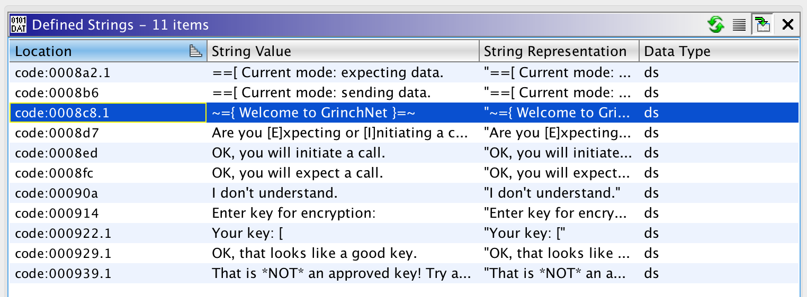
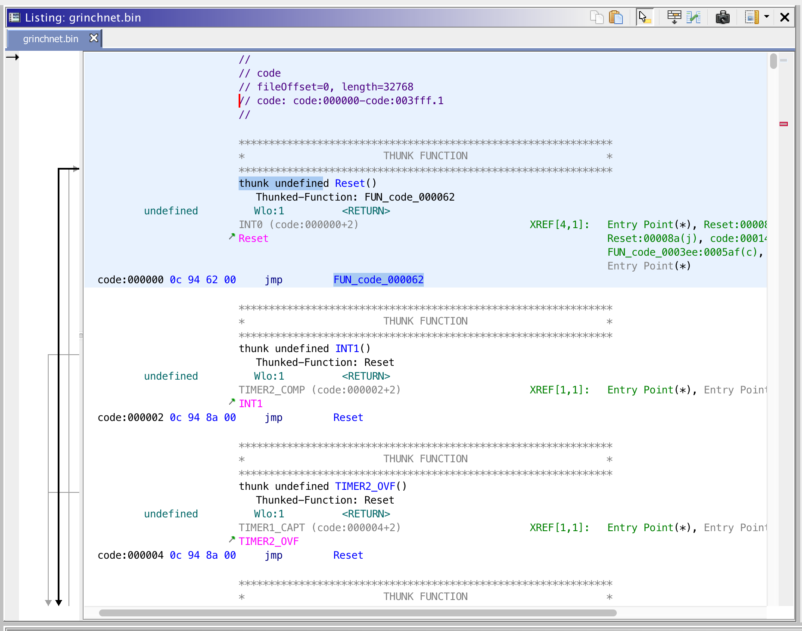
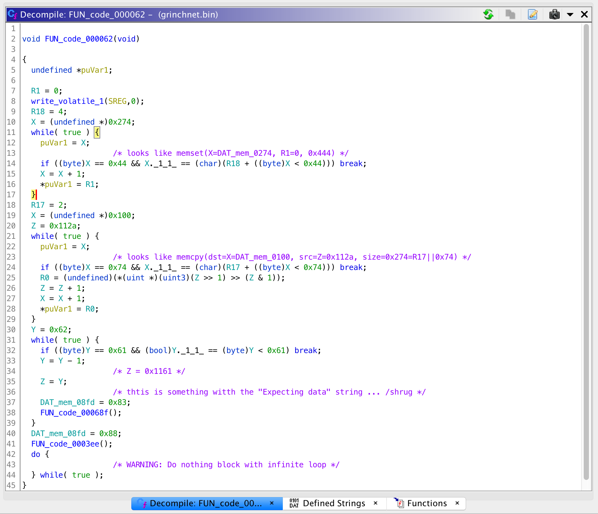
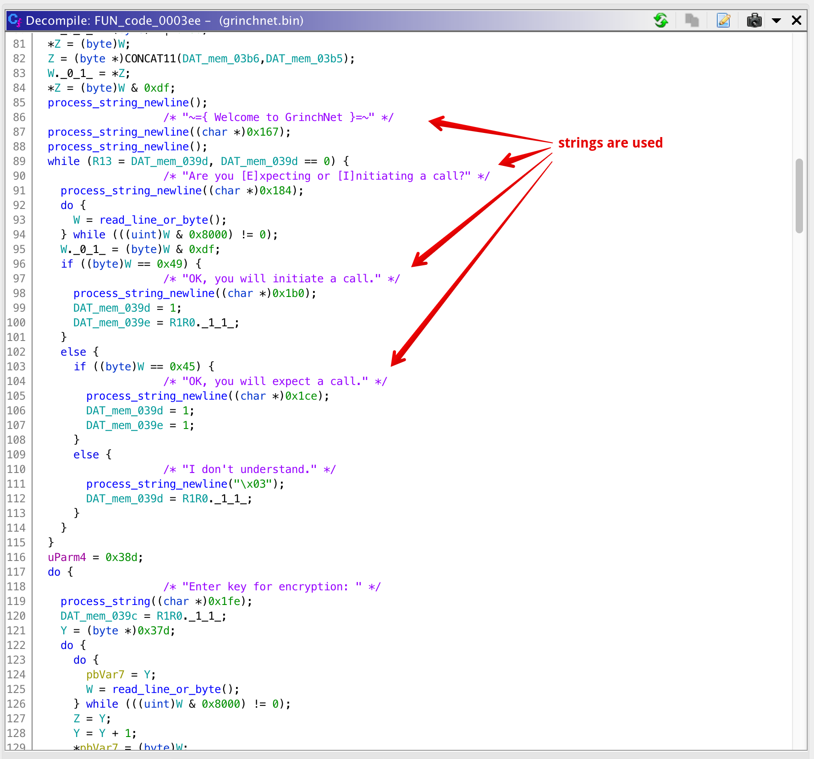
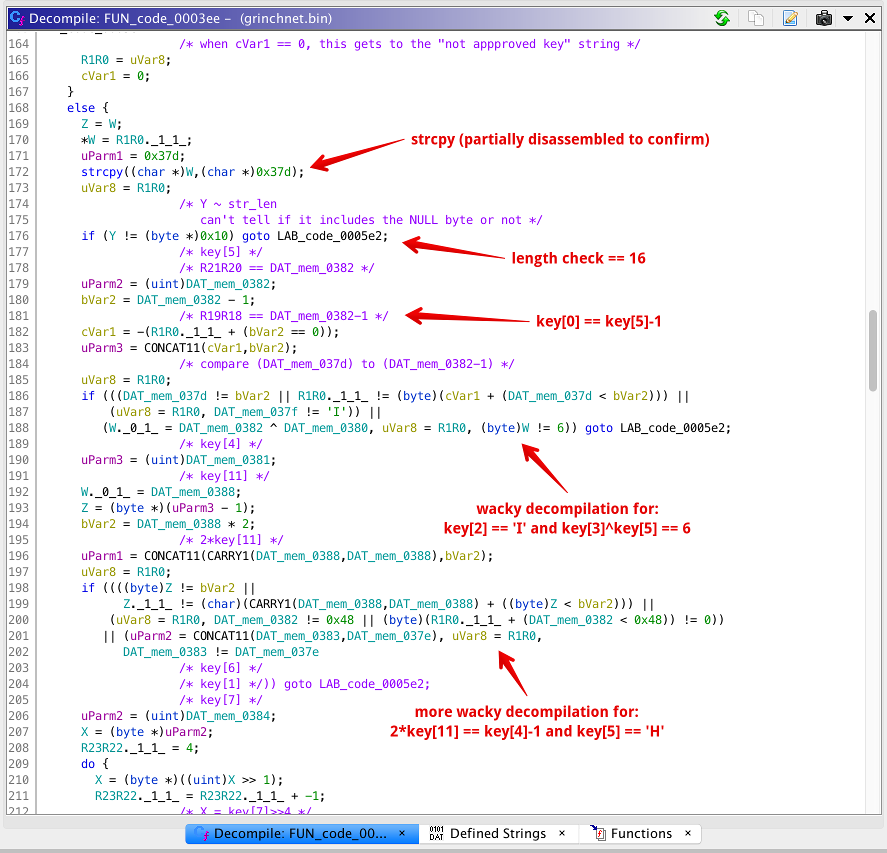
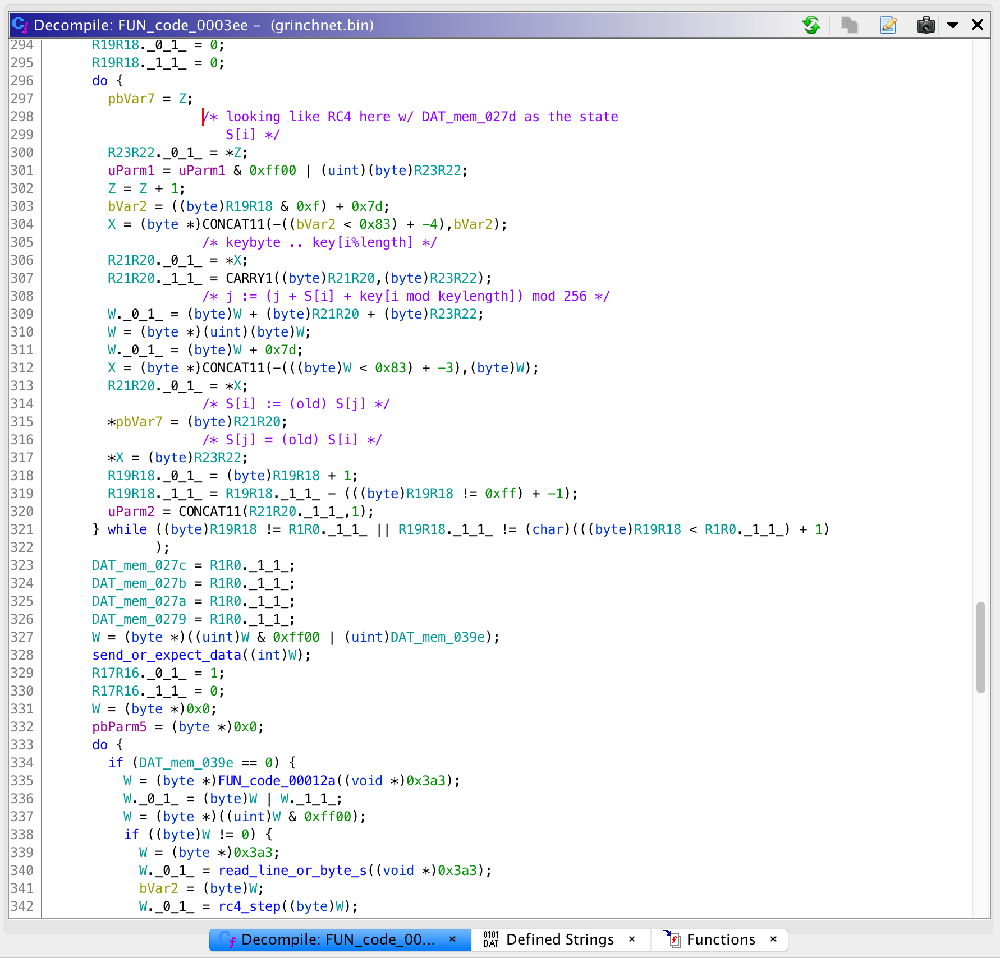
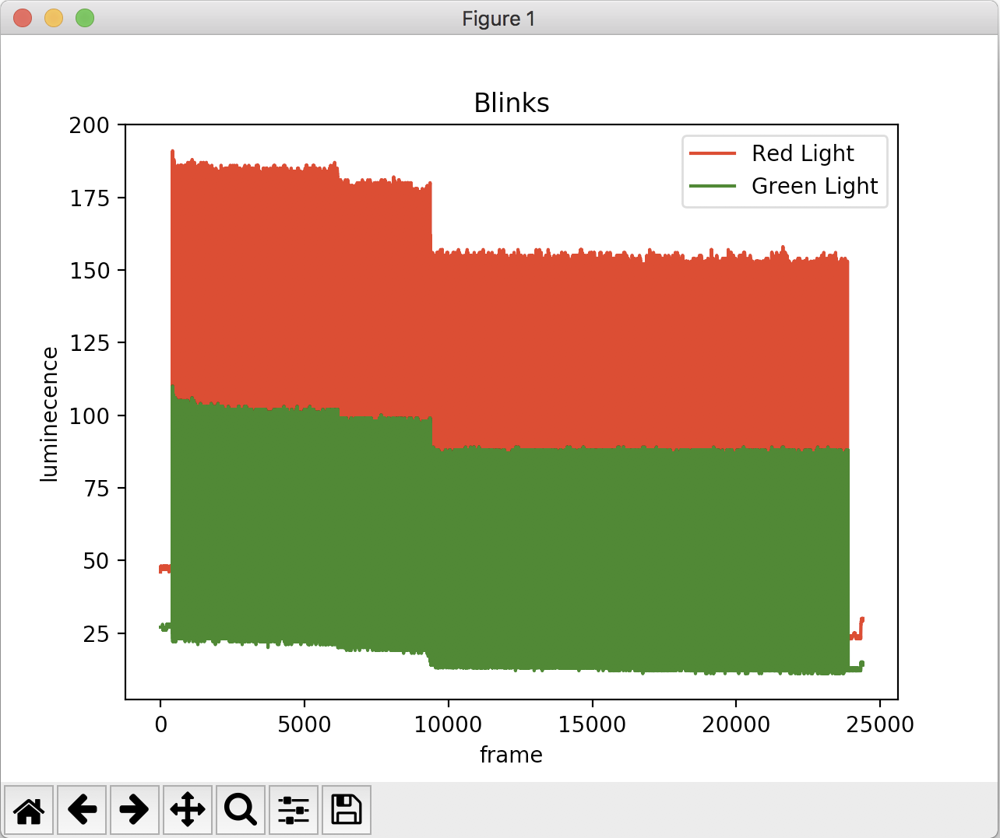
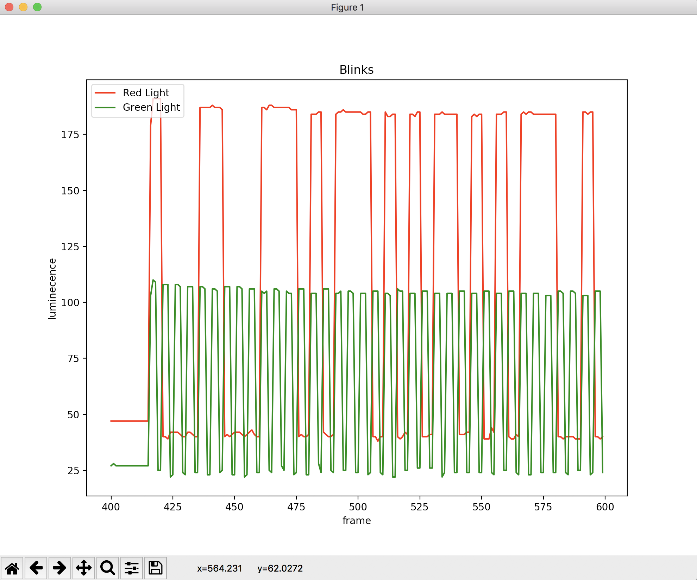
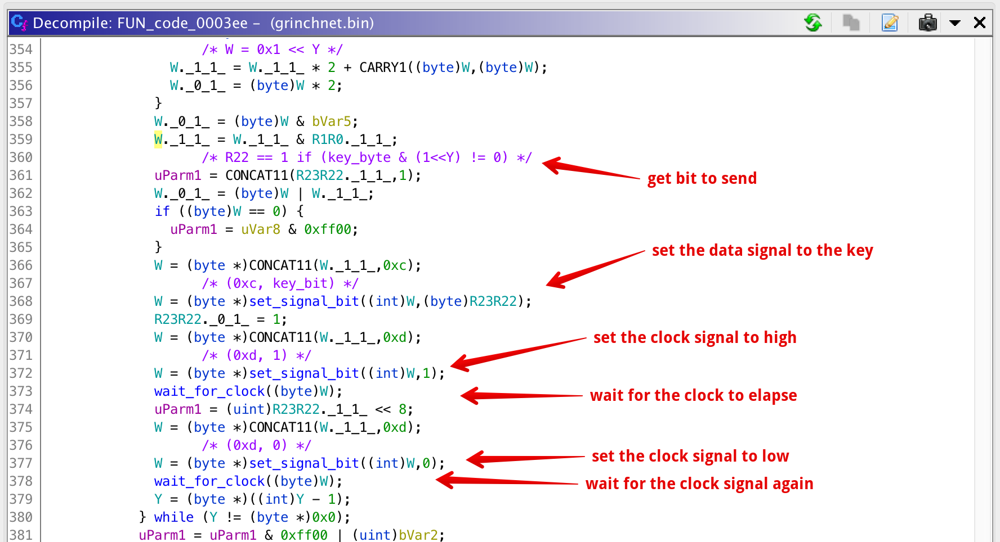
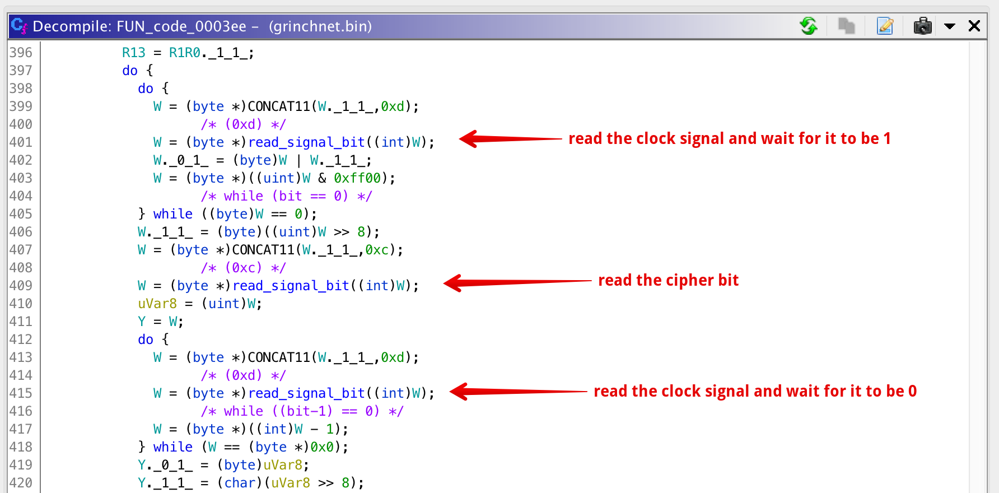

# Day 9 - GrinchNet - re, crypto

> A smart elf at NICE (the North-pole's Intelligence Community of Examiners) noticed that the lights in Santa's Christmas tree were blinking in a weird pattern and made a recording (See https://www.youtube.com/watch?v=xGRTiTubviU). By pulling on the wires really hard, we were able to recover 2 identical micro-controllers, with ATmega328 written on them, operating the lights. We fear that NAUGHTY (the Network of Aides/Urchins of the Grinch Hoping to Terminate Yule) is up to something, but we need your help to investigate.

Download [grinchnet.bin](https://advent2019.s3.amazonaws.com/db7ba8f4c14667f0fe53e6079cee74e474fbc9f7768b329d8a81d7821c7bffe3-grinchnet.bin)

## Initial Binary Analysis

This was one of the lengthier problems. The main binary provided is an ATmega328 microcontroller image. Looking up the architecture for this chip I found that it was avr5 so I loaded it up in [Ghidra](https://ghidra-sre.org/) with an architecture that was close for the majority of my reversing. Personally, I've never reversed avr before and learned a couple things that were important for understanding the instruction set

* The main address space is 16-bit.
* Registers are R0 to R31, each 1-byte long.
* R1 is often assumed to be zero :shrug:.
* Consecutive registers are often paired to make a 16-bit address, and some have special names like `Z` for `R31:R30`, `Y` for `R29:R28`, `X` for `R27:R26`, and `W` for `R25:R24`.
* Arithmetic operations (plus, minus, etc) and comparisons (equals, less-than, greater-than, etc) are often done with two instructions - once for each byte in one of two registers with a "carry" in one of the instructions.
* Ghidra is often good at decompilation, but all of the above wreaks havoc with the disassembler. Often variables are mislabeled (`Wlo` and `R24` are used interchangeably), and the double-instruction operations do not translate well. This just means I had to learn more about the instruction set than would have otherwise been necessary.

Pulling up the binary, I always go to the strings first. Obviously, there is no service to connect to or output to look at, but the binary did have some promising strings:



However, it turns out none of these strings are referenced directly in the binary so we can't use them yet.

Next, my strategy was to look for the entry point. Fortunately, all of the functions at the beginning of the binary all jumped to `Reset` which jumped to an unlabeled function `FUN_code_000062`. This jumptable is below.



## AVR Reversing

What follows is a lot of reversing so hold on. Looking at `FUN_code_000062` from the last section, we can see what looks like a long decompilation. However, after carefully reading the decompilation and the instructions, it actually looks like a couple of standard `memcpy` and `memset` calls followed by another function call. I've labeled these in the disassembly below, but needless to say doing the work to look up each instruction and understand how the registers worked took some time, only to find out that I was looking at simple functions like `memcpy` and `memset`. 



As it turns out, the large data chunk being copied from actually contains all of our strings from the initial analysis. This is helpful as we now know a second location in memory where all of those strings can be found. Calculating the now-copied locations of each string, I looked up references to several memory locations and found that I could trace to many points in the function `FUN_code_0003ee` where they were used. After a lot more disassembly and time, I figured out that these strings were likely used in a rudimentary string-output function, sometimes with a newline, sometimes not - so I labeled them as such. Again, we don't have any interaction with the program so I couldn't run it live to see this, but it was a pretty good assumption.



I soon began to see that this `FUN_code_0003ee` function was actually the main part of the logic on the device, and the strings suggested it was reading in a key (from somewhere?) and doing a bunch of "stuff" with it.

So, I kept decompiling this "stuff".

Many hours later, this "stuff" started to make sense. First, I started seeing that the key was copied to a new location and individual bytes were referenced. The key was checked against a length of 16 and then there turned out to be a bunch of arithmetic checks on the key, given below. These were a pain to read at first, but after a couple I got the hang of it.



**Key Byte Checks:**
```
len(key) == 0x10 (i think without NULL?)
key[0] == key[5]-1
key[2] == 'I' 0x49
key[3]^key[5] == 0x6
2*key[11] == key[4]-1
key[5] == 'H' 0x48
key[1] == key[6]
(key[7]>>4)*(key[7]&0xf) == 0x19 (25)
key[8] == 0x4c ('L')
key[4]+2 == key[9]
key[10] == key[7]-2
0x12 == (key[11]<<4) | (key[11]>>4)
key[12] is hex 
key[13] is hex
key[14] is hex
key[15] is hex
```

Solving the equations we get a string that we know is `G?INCH?ULES!????` so we can infer that since `key[1]` and `key[6]` are equal its likely `GRINCHRULES!????` with four bytes `????` unknown. The last four bytes are all checked with a weirdly-decompiled function which I had to re-implement, only to find that it just checked if a character was hexadecimal or not. So, if we're right, we now know the program reads a key with a specific format, and we'll likely have to guess four hex characters at some point.

Finally, following the arithmetic checks, there is a short loop which iterates over the key bytes. Knowing my common crypto algorithms, I recognized this as RC4 initialization, and it was indeed doing everything the standard way (no screwups in indexing or initialization).



After the initialization, a string is either read from input and encrypted, or read from another location and decrypted. All of this is to say, we're looking for two sets of messages which look encrypted going back and forth between two devices.

## Blinking Lights

Somewhere in the middle of reversing I kept coming back to the youtube video referenced in the challenge description. It is a still frame video focused on a christmas tree with green and red blinking lights. I began by thinking it was morse code or something simple, but after some failed attempts at reading morse code I gave up on that idea.

To process the youtube a little more easily, I first had to download it. After searching for a while, I found the [youtube-dl](https://github.com/ytdl-org/youtube-dl) package which I needed to install manually in my Ubuntu docker image. After installing it I was able to download the full movie with a few minutes download.

Next, I had to find a way to pull out the pattern of each blinking light. Since I had already been looking at morse code, I stumbled on a [video-morse-decode project on Github](https://github.com/matja/video-morse-decode.git). This didn't quite do what I wanted, but with a one-line modification, I could use it to log the luminance of certain portions of a frame to standard out and redirect the output to a file. I chose a simple CSV-style output so that I could pull it in more easily later.

```
video-morse-decode$ git diff
diff --git a/video-morse-decode.cpp b/video-morse-decode.cpp
index 5a68dd6..13db943 100644
--- a/video-morse-decode.cpp
+++ b/video-morse-decode.cpp
@@ -342,6 +342,8 @@ void VideoMorseDecode::processFrame(
        f.time = frame_index;
        f.luminance = t;
        m_frames.push_back(f);
+       //printf("frame_index=%d, t=%d\n", frame_index, t);
+       printf("%d,%d\n", frame_index, t);
 }
 
 void VideoMorseDecode::calculateHistogram()
```

To pull out the red and green bulbs, I measured approximately the bounding box for each, and ran the modified `./video-morse-decode` program to get a CSV log of each.

```
$ ./video-morse-decode ../xGRTiTubviU.mkv aa.json 0 -1 0.71 0.14 0.76 0.21 > red_light.csv
$ ./video-morse-decode ../xGRTiTubviU.mkv aa.json 0 -1 0.33 0.24 0.38 0.32 > green_light.csv
```

Next, I wrote a [short python script using numpy](./solutions/day9_plot.py) to plot both lights and later pull out the data. Below are two graphs - one of the full plot from the entire video, and another a zoomed in version of one segment. As you can see, the green light looks like its alternating pretty regularly - like a clock signal - and the red light is set to high or low pretty much in sync with the green one - likely indicating an on or off bit at each clock. Furthermore, what isn't shown in the images is that the blinks are broken up into segments with "long" pauses between them.





To wrap up this section, I continued my script to extract bit values from the clock and data signals, and then printed them out:

```
$ ./plot.py 
128 0 10001100011101011101010110101011100101111011011110000010010011100101111001100111010101000111011000110000101011111100100011111010
186703751890552250045376977718708521210 b'\x8cu\xd5\xab\x97\xb7\x82N^gTv0\xaf\xc8\xfa'
================================================================================ 1050 1094
104 0 01000100100000011101101111101001011000100001010111100010100001011010100100001001010110111011100000011110
5427704474112172471647202949150 b'D\x81\xdb\xe9b\x15\xe2\x85\xa9\t[\xb8\x1e'
================================================================================ 1608 1651
408 0 111111111111101010010000111011111011110111101111110100110011000111110011010101111001000000111000111011011011001011100011010011010011010100001001100101100011101110110000011111100001100100110110101100010010100010000110101101111010011111110101110011000101000010101001110110001001100001110010010110101010101001110011100100111011110110000001101000001001110011010111111000111001101101000011100101110110101000011011
661001158097285063757078013257228233244805221448782947258110720681980384618356382442449178308905637586169090818145997253147 b'\xff\xfa\x90\xef\xbd\xef\xd31\xf3W\x908\xed\xb2\xe3M5\t\x96;\xb0~\x196\xb1(\x86\xb7\xa7\xf5\xccP\xa9\xd8\x98rZ\xaas\x93\xbd\x81\xa0\x9c\xd7\xe3\x9bC\x97j\x1b'
================================================================================ 3684 3725
104 0 11100100001110000110110111101000111110001010100011010001101000111111000000111001001010110001000001110000
18081485086892583530114960789616 b'\xe48m\xe8\xf8\xa8\xd1\xa3\xf09+\x10p'
================================================================================ 4239 4281
368 0 10010001111001000000111100110011111110011111000010111100100001101110101011101100100101001000000010101110101110011110110011111110011011110000101010001101000011001001110110011100000110001101101100000100000100100111100100100001110101101001010100110000111111101010010110110111010110000110011111011010010110011011011100010001000011000111010010000000110100000111111000100101
342630890054583819146482666449601410384054403736277080361606966596912245976583851264999666825958723156486159909 b'\x91\xe4\x0f3\xf9\xf0\xbc\x86\xea\xec\x94\x80\xae\xb9\xec\xfeo\n\x8d\x0c\x9d\x9c\x18\xdb\x04\x12y!\xd6\x950\xfe\xa5\xb7Xg\xdaY\xb7\x11\x0ct\x80\xd0~%'
================================================================================ 6114 6158
632 0 00000111100010010011100011010110000100110100010011001010101000010000111110100011101110111000001101110111111010010101010100010110100100010100101101000110011010100011000000101010001010100101011001100010011001001010010000001001101101100111010110111110011001001100010111000100000111100001110010110000000000100010110101101001100010011100011101101011011100001001111011101101111110100101100000001001111011000011110101001100001100010100110101110000010001011011111100010000000111111101010000100101110111111000010001110110101000110000110011010110001001000011100001101010000011111110111010100110000111001000100001101100000110000000010101110010
524637752093349112538606824171907757407404714179059670538652979780213691955026340109393259164641881272702119110207813899711825740927369643236787247806329769212183163630458152935190013937010 b'\x07\x898\xd6\x13D\xca\xa1\x0f\xa3\xbb\x83w\xe9U\x16\x91KFj0**Vbd\xa4\t\xb6u\xbed\xc5\xc4\x1e\x1c\xb0\x02-i\x89\xc7kp\x9e\xed\xfaX\t\xec=L1MpE\xbf\x10\x1f\xd4%\xdf\x84v\xa3\x0c\xd6$8j\x0f\xee\xa6\x1c\x88l\x18\x05r'
================================================================================ 9309 9351
920 0 01101101110101101101110000111111010011000110100001100100011010001101010110010110010000111110010101001101000110001100010100110101110011110001110011001101110000010011100110001000011100101101001011000001101000111010001100111010011100100110001011011110001000001000111001010110110010010100101011011001011100000110011111001010100011011000011101000100010110010010001111010000100111110011001101100101001101010010010011010110100110000101010001010101101000110000101001111110100001010010111000000100111111001011000000100001110001111001011010010101001111100101100001001101100010001101010100110100101010101000111010010000000001110010111100100101010011111110000110011110000011111011010101001110111001110110110101000010101111010110101101111001111000000010110010001101001101000001111110000101110101010110110101110110101000010110010010000001110111101001011011001111011101001100001101111101011001111011000100011111110101100000100100000111
3802890275799760212165484393760355540404358787431101902287289402198449519620956353315511692026454870489052290316093653640560690889943640847655279648465555375621666261895106126523967868562407031839443491700981118768159130290340720772217379837241242860942580379439621855662967047 b'm\xd6\xdc?Lhdh\xd5\x96C\xe5M\x18\xc55\xcf\x1c\xcd\xc19\x88r\xd2\xc1\xa3\xa3:rb\xde \x8eV\xc9J\xd9pg\xca\x8d\x87DY#\xd0\x9f3e5$\xd6\x98TU\xa3\n~\x85.\x04\xfc\xb0!\xc7\x96\x95>XM\x88\xd54\xaa\x8e\x90\x07/%O\xe1\x9e\x0f\xb5N\xe7mB\xbdky\xe0,\x8d4\x1f\x85\xd5mv\xa1d\x81\xde\x96\xcft\xc3}g\xb1\x1f\xd6\t\x07'
================================================================================ 13940 13981
472 0 1011010111000001100110110000101001111111111110010011111010010111000010101010011100100111110110000110011100100110000000100010010001010110000101100100101110001111010000010011100100011001011010010010100100011101000100010110111010010010101010111001100000100000010100001110101011010010100000100110101101010001001010000101001110100001011000111000011110100111100010011110010010001110011011000001100110001111000011111001001101000011100001110011010001111101100011101101111110010010
8657796914517792712289127349789410454060871162531889502863365031168696237928544353931068158306164893041962973415519143130339653805054870085522 b"\xb5\xc1\x9b\n\x7f\xf9>\x97\n\xa7'\xd8g&\x02$V\x16K\x8fA9\x19i)\x1d\x11n\x92\xab\x98 P\xea\xd2\x82kQ(S\xa1c\x87\xa7\x89\xe4\x8el\x19\x8f\x0f\x93C\x874}\x8e\xdf\x92"
================================================================================ 16334 16375
768 0 111101011001010011110010110101011001000101101001001010001111110110111101011001011010111001111111100010010010011001000000000110001100101001110011000001110001000101100010110101001111001000010110011101111111110001110010111011100010101000111101110100101010001101100100010101111011100001011111100010001000010010100101010111001001111111011100110100001100000111100111001111101110001101111011110000111101111111111011110010001101100010101100010111110010010110001000111101001000010111010000011011111101011101110011011110010100111100100110101011001010110000000000111011001110011100011101111101100010010010111100011101111010101001101011000000111101000010110010001111100001001000000110100100100000000101000100011001100110111001100001111110101001101100100100100100110100010011000110
1489336854566182453691515548272152505406888422833210784792806760339495533057262494227122947689194093543096424335560966963309436728783064796468684577056246477255199464061054548257346775679410582553602314523257727263791055442560632006 b'\xf5\x94\xf2\xd5\x91i(\xfd\xbde\xae\x7f\x89&@\x18\xcas\x07\x11b\xd4\xf2\x16w\xfcr\xee*=\xd2\xa3dW\xb8_\x88\x84\xa5\\\x9f\xdc\xd0\xc1\xe7>\xe3{\xc3\xdf\xfb\xc8\xd8\xac_%\x88\xf4\x85\xd0o\xd7syO&\xac\xac\x00\xec\xe7\x1d\xf6$\xbcw\xaak\x03\xd0\xb2>\x12\x06\x92\x01Dfna\xfa\x9b$\x93D\xc6'
================================================================================ 20206 20249
648 0 010010011010111000111001101101001111001100000011100111000111110011110110111001000110111000101100100111011010100111111111110111010010011010111111000101110000011101011001010111101100011111101100000010110001000110101011100100011000101110010001100011101100111001000010000000000011110101000010001001101100101010001111001111011110011111011110101100111001010100011001111111110100011001011010101000111011111001000111011111011000101001101111000111001001111011101011001011110010100111111001111000111100101100110101011000010111010001110000110011100001000111101100000000110111000111010001100111010100010100000100011101101100101110100001001100010100000011100111
336163216338718489665695079305649433699834641200978849428856497817773343146374529975600168660899478688273576210024959520853979225745633510437397598830933285310947522950990219259962101561283395815 b'I\xae9\xb4\xf3\x03\x9c|\xf6\xe4n,\x9d\xa9\xff\xdd&\xbf\x17\x07Y^\xc7\xec\x0b\x11\xab\x91\x8b\x91\x8e\xceB\x00=B&\xca\x8f=\xe7\xde\xb3\x95\x19\xffFZ\xa3\xbeG}\x8ao\x1c\x9e\xeb/)\xf9\xe3\xcb5atp\xce\x11\xec\x03q\xd1\x9dE\x04v\xcb\xa11@\xe7'
================================================================================ 23481 23522
b"\x8cu\xd5\xab\x97\xb7\x82N^gTv0\xaf\xc8\xfaD\x81\xdb\xe9b\x15\xe2\x85\xa9\t[\xb8\x1e\xff\xfa\x90\xef\xbd\xef\xd31\xf3W\x908\xed\xb2\xe3M5\t\x96;\xb0~\x196\xb1(\x86\xb7\xa7\xf5\xccP\xa9\xd8\x98rZ\xaas\x93\xbd\x81\xa0\x9c\xd7\xe3\x9bC\x97j\x1b\xe48m\xe8\xf8\xa8\xd1\xa3\xf09+\x10p\x91\xe4\x0f3\xf9\xf0\xbc\x86\xea\xec\x94\x80\xae\xb9\xec\xfeo\n\x8d\x0c\x9d\x9c\x18\xdb\x04\x12y!\xd6\x950\xfe\xa5\xb7Xg\xdaY\xb7\x11\x0ct\x80\xd0~%\x07\x898\xd6\x13D\xca\xa1\x0f\xa3\xbb\x83w\xe9U\x16\x91KFj0**Vbd\xa4\t\xb6u\xbed\xc5\xc4\x1e\x1c\xb0\x02-i\x89\xc7kp\x9e\xed\xfaX\t\xec=L1MpE\xbf\x10\x1f\xd4%\xdf\x84v\xa3\x0c\xd6$8j\x0f\xee\xa6\x1c\x88l\x18\x05rm\xd6\xdc?Lhdh\xd5\x96C\xe5M\x18\xc55\xcf\x1c\xcd\xc19\x88r\xd2\xc1\xa3\xa3:rb\xde \x8eV\xc9J\xd9pg\xca\x8d\x87DY#\xd0\x9f3e5$\xd6\x98TU\xa3\n~\x85.\x04\xfc\xb0!\xc7\x96\x95>XM\x88\xd54\xaa\x8e\x90\x07/%O\xe1\x9e\x0f\xb5N\xe7mB\xbdky\xe0,\x8d4\x1f\x85\xd5mv\xa1d\x81\xde\x96\xcft\xc3}g\xb1\x1f\xd6\t\x07\xb5\xc1\x9b\n\x7f\xf9>\x97\n\xa7'\xd8g&\x02$V\x16K\x8fA9\x19i)\x1d\x11n\x92\xab\x98 P\xea\xd2\x82kQ(S\xa1c\x87\xa7\x89\xe4\x8el\x19\x8f\x0f\x93C\x874}\x8e\xdf\x92\xf5\x94\xf2\xd5\x91i(\xfd\xbde\xae\x7f\x89&@\x18\xcas\x07\x11b\xd4\xf2\x16w\xfcr\xee*=\xd2\xa3dW\xb8_\x88\x84\xa5\\\x9f\xdc\xd0\xc1\xe7>\xe3{\xc3\xdf\xfb\xc8\xd8\xac_%\x88\xf4\x85\xd0o\xd7syO&\xac\xac\x00\xec\xe7\x1d\xf6$\xbcw\xaak\x03\xd0\xb2>\x12\x06\x92\x01Dfna\xfa\x9b$\x93D\xc6I\xae9\xb4\xf3\x03\x9c|\xf6\xe4n,\x9d\xa9\xff\xdd&\xbf\x17\x07Y^\xc7\xec\x0b\x11\xab\x91\x8b\x91\x8e\xceB\x00=B&\xca\x8f=\xe7\xde\xb3\x95\x19\xffFZ\xa3\xbeG}\x8ao\x1c\x9e\xeb/)\xf9\xe3\xcb5atp\xce\x11\xec\x03q\xd1\x9dE\x04v\xcb\xa11@\xe7"
```

## Decrypting

To close the loop on how these two pieces are related, it might be obvious that each burst of transmission is either a send or receive from one microcontroller to the other, encrypted with RC4. Going off of the assumption that the key was `GRINCHRULES!xxxx` with `x` being a hex byte, I banged my head against the wall for hours with the following assumption that the hex characters were all the same case - upper or lower. As it turned out, I should not have made this assumption, as it turned out the final key was `GRINCHRULES!bBad`. Using my [python solver script](./solutions/day9_solver.py) you can see my initial key brute force followed by the correct one and finally the full decryption with the flag:

```
$ ./solutions/day9_solver.py 
binary is 16 long
progress 0 / 65536
progress 10000 / 65536
progress 20000 / 65536
progress 30000 / 65536
progress 40000 / 65536
progress 50000 / 65536
progress 60000 / 65536
binary is 16 long
b'8c75d5ab97b7824e5e67547630afc8fa'
progress 0 / 65536
progress 10000 / 65536
progress 20000 / 65536
progress 30000 / 65536
progress 40000 / 65536
JACKPOT! b'GRINCHRULES!bBad' b'Knock, knock...\n'
progress 50000 / 65536
progress 60000 / 65536
JACKPOT! b'GrINCHrULES!eaFF' b'^\x01,\x02\x1bfKO7OG\x06dv\x0f\n'
b"Knock, knock...\nWho's there?\nNo, there are no Whos here! Hahahaha!! :D Get it??\nI HATE WHOS!\nOh, we didn't realize it was you, mr. Grinch!\nWho did you expect?? Santa?! How are the plans coming along to ruin Christmas?\nRight on track, they don't suspect a thing! We even routed our communication lines through Santa's Christmas tree!\nYou did what!? I hope this doesn't come back to bite us...\nNo worries, everything will be fine! Oh, we need the activation code for the Steal-Gifts-O-Tron\nAh right, the code is AOTW{Th3y_w1ll_n3v3r_s33_1t_c0m1ng}. Now get back to work!\n"
```

## Addendum

In the process of banging my head against the wall with RC4, I took a lot closer look at the AVR binary. I thought I might have missed something (which I did, just not where I thought), so I looked at the way the signal was being sent. I found the code in the main function pretty interesting which read and wrote bits in the clock and data wires. This is known as [self-clocking signal](https://en.wikipedia.org/wiki/Self-clocking_signal), and a pretty basic way to implement sending a signal over a physical medium from scratch, something I often don't take the time to fully reverse engineer. Each of the `set_signal_bit` and `read_signal_bit` functions I've labeled reads and writes from some volatile memory on the chip - likely according to the chipset. Anyways, enjoy!





