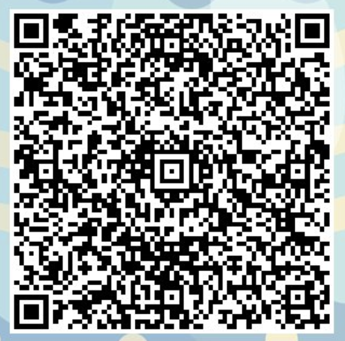
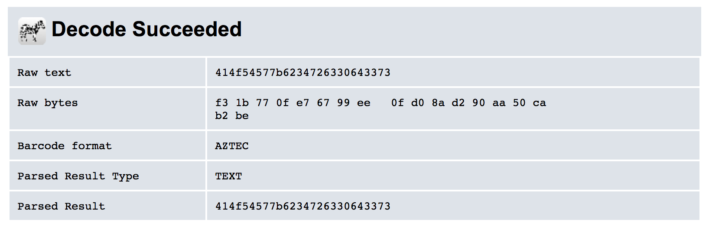

# Easter Eggs

This year there were three easter eggs. I ended up finding the second one easily, but struggled with the other two.

## Easter Egg 1

The hint first for the first easter egg was `make clean`. This ended up being a good clue in retrospect, but I overthought it. For last year's competition, going to the `/robots.txt` page gave a trail to the flag. However, this year it was a bit more cryptic:


However, if you instead navigate to `/robots.txt~`, then you get the same clue as last year and can eventually navigate to the flag:


## Easter Egg 2

Egg two was fairly easy for me. I simply ran the site through Burp, filtered on "egg", and found that many pages contained the `X-EasterEgg2` header. Taking this header contents, reversing it, and base-64 decoding we get close:

```
In [6]: base64.b64decode(''.join(reversed([x for x in '==QftRHdz8VZydmZuNzXhJ3MxcGMltnSHJkT'])))
Out[6]: b'NBGJ{e0g13ra_3nfgre_3ttm}'
```

Next, we can simply rot-13 the string to get the flag:

```
In [9]: codecs.encode('NBGJ{e0g13ra_3nfgre_3ttm}','rot_13')
Out[9]: 'AOTW{r0t13en_3aster_3ggz}'
```

## Easter Egg 3

For easter egg 3, the hint was a [tweet](https://twitter.com/OverTheWireCTF/status/1204370177237954565). In this tweet is an image and putting this through an online decoder gives you the QR code contents. Cropping the images and putting a slightly smaller portion into the decoder gives you an AZTEC code. Decoding both of these contents as octal and hex characters gives you the two halves to the easter egg.





```
In [3]: bytes([int(x,8) for x in '137:64:137:154:171:146:63:175'.split(':')])
Out[3]: b'_4_lyf3}'
```

```
In [5]: binascii.unhexlify('414f54577b6234726330643373')
Out[5]: b'AOTW{b4rc0d3s'
```

